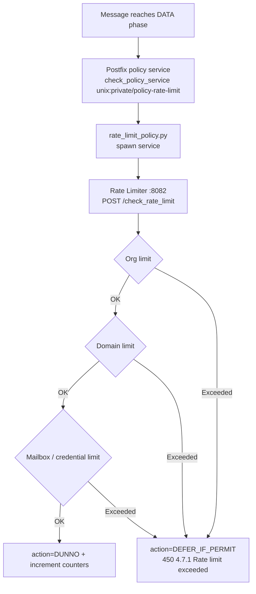

# Rate Limiting

**Prevents any single sender, credential, domain, or organization from monopolizing the mail server.**

The rate limiter is a standalone FastAPI service (port `8082`) backed by Redis (DB 1). It enforces sending and receiving limits at three levels — organization, domain, and individual mailbox — plus per-SMTP-credential limits, across six windows (per-second, per-minute, hourly, daily, monthly, and burst). When a limit is hit, Postfix receives a `DEFER_IF_PERMIT` policy answer and the sending server retries later.

## How it works



The check is hierarchical: organization first, then domain, then mailbox (or SMTP credential). If any level says no, the message is deferred with `450 4.7.1`, so nothing is lost — the sender's queue retries.

### Exactly one counting point

The Postfix policy check runs **only** in `smtpd_data_restrictions` (once per message, at DATA). It must never be added to the sender/recipient/client restriction lists as well — each policy call records usage, and multiple calls per message double- or triple-count. That misconfiguration once deferred essentially all inbound mail; the reasoning is documented inline in `mailer/postfix/config/main.cf`.

Direction is inferred from authentication: a session with a SASL username is counted as **outbound** against that identity (mailbox address or SMTP credential username); an unauthenticated session is counted as **inbound** against the envelope sender.

### Fail-open design

If Redis, the database, or the rate limiter itself is unreachable, the policy script answers `DUNNO` and mail flows. A broken rate limiter must not become a mail outage; you'll see errors in the logs instead.

## Configuration

### Service settings

| Variable | Default | Description |
|----------|---------|-------------|
| `RATE_LIMITER_HOST` | `0.0.0.0` | Service bind address |
| `RATE_LIMITER_PORT` | `8082` | Service port |
| `RATE_LIMITER_URL` | `http://rate_limiter:8082` | Where the Postfix policy script reaches the service |
| `REDIS_HOST` / `REDIS_PORT` / `REDIS_DB` | `redis` / `6379` / `1` | Counter storage |
| `RATE_LIMIT_CACHE_TTL` | `300` | Rate-limit rule cache TTL (seconds) |
| `ORG_MAPPING_CACHE_TTL` | `600` | Email→org mapping cache TTL |

### Default limits

Every level has per-second, per-minute, hourly, daily, monthly, and burst windows, for both directions. Environment variables follow the pattern `{ORG|DOMAIN|MAILBOX}_{INBOUND|OUTBOUND}_{SECOND|MINUTE|HOURLY|DAILY|MONTHLY|BURST}_DEFAULT`. The defaults:

| Level / Direction | second | minute | hourly | daily | monthly | burst |
|-------------------|--------|--------|--------|-------|---------|-------|
| Org outbound | 20 | 200 | 10,000 | 100,000 | 1,000,000 | 2,000 |
| Org inbound | 10 | 100 | 5,000 | 50,000 | 500,000 | 1,000 |
| Domain outbound | 5 | 40 | 2,000 | 20,000 | 200,000 | 500 |
| Domain inbound | 2 | 20 | 1,000 | 10,000 | 100,000 | 200 |
| Mailbox outbound | 2 | 10 | 200 | 2,000 | 20,000 | 100 |
| Mailbox inbound | 1 | 5 | 100 | 1,000 | 10,000 | 50 |

Per-entity custom limits (set via `/set_limits` or the platform API at `/api/v1/rate-limiter/`) override these defaults. [SMTP API-key credentials](smtp-credentials.md) can additionally carry their own `hourly_limit` / `daily_limit`, enforced against the credential's username.

### Alert thresholds

| Variable | Default | Description |
|----------|---------|-------------|
| `RATE_LIMIT_WARNING_THRESHOLD` | `80` | Percentage at which a warning webhook fires |
| `RATE_LIMIT_CRITICAL_THRESHOLD` | `95` | Percentage at which a critical alert fires |

## API endpoints

### Check rate limit

```bash
curl -X POST http://localhost:8082/check_rate_limit \
  -H "Content-Type: application/json" \
  -d '{"email": "sender@example.com", "direction": "outbound"}'
```

### Postfix policy protocol

```
POST /policy
```

Speaks the plain-text Postfix policy delegation protocol over HTTP — the body is the raw `key=value` request, the response is `action=DUNNO` or `action=DEFER_IF_PERMIT 4.7.1 ...`. This is what `mailer/postfix/scripts/rate_limit_policy.py` can forward to directly.

### Other endpoints

```
POST /increment_usage                          # count usage explicitly
GET  /get_usage/{entity_type}/{identifier}     # entity_type: organization|domain|mailbox
POST /set_limits                               # per-entity custom limits
POST /reset_counters
GET  /health
GET  /metrics                                  # Prometheus
```

Example — custom domain limits:

```bash
curl -X POST http://localhost:8082/set_limits \
  -H "Content-Type: application/json" \
  -d '{
    "type": "domain",
    "identifier": "bigclient.com",
    "direction": "outbound",
    "hourly_limit": 5000,
    "daily_limit": 50000,
    "monthly_limit": 500000
  }'
```

## Webhook events

Dispatched through the [centralized webhook dispatcher](webhooks.md):

| Event | When |
|-------|------|
| `rate_limit.threshold_breach` | Usage crosses the warning (80%) or critical (95%) threshold |
| `rate_limit.exceeded` | A limit is hit and a message is deferred |
| `rate_limit.reset` | An admin updates or resets rate limit configuration |

## Things to know

- **The Postfix hookup is a spawn service, not a port.** `master.cf` defines `policy-rate-limit` as a `spawn` service running `rate_limit_policy.py`, referenced from `main.cf`'s `smtpd_data_restrictions` (and, on the submission ports, via the named restriction class `submission_rate_limit_check`). There is no separate "policy port 10030".

- **SMTP API keys are rate limited too.** A credential's SASL username (no `@` in it) is checked as an authenticated identity — an earlier guard that skipped usernames without `@` exempted every API key and has been fixed.

- **Redis is the source of truth for counters.** If Redis data is lost, counters reset to zero and limits are effectively unenforced until usage re-accumulates. Enable Redis persistence in production.

- **Caches introduce a small propagation delay.** Rules are cached 5 minutes and org mappings 10 minutes; a limit change can take up to that long to apply everywhere.

- **Burst limits are separate from the time windows.** The burst window catches short floods independent of the hourly/daily/monthly counters.
