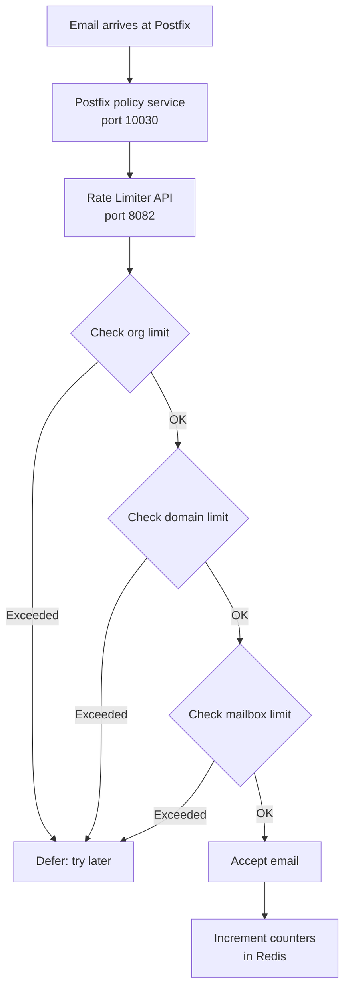

# Rate Limiting

**Prevents any single sender, domain, or organization from monopolizing the mail server.**

The rate limiter is a standalone Flask service (port `8082`) backed by Redis. It enforces sending and receiving limits at three levels -- organization, domain, and individual mailbox -- across multiple time windows (per-second, per-minute, hourly, daily, monthly). When someone hits a limit, the service returns a "defer" response to Postfix, which tells the sending server to try again later.

## How it works



The check is hierarchical: organization limits are checked first, then domain, then mailbox. If any level says "no," the email is deferred. This means an org-level limit can cap the total output of all domains and mailboxes under it.

### Sliding window counters

Counters are stored in Redis using a sliding window approach. Instead of resetting at the top of each hour, the window slides forward continuously. This prevents the "burst at boundary" problem where someone could send double their hourly limit by timing sends around the reset point.

### Fail-open design

If Redis goes down or the rate limiter service is unreachable, the system **fails open** -- emails are allowed through. This is a deliberate choice: a broken rate limiter shouldn't bring email delivery to a halt. You'll see errors in the logs, and the health monitor will try to restart the service.

## Configuration

### Service settings

| Variable | Default | Description |
|----------|---------|-------------|
| `RATE_LIMITER_HOST` | `0.0.0.0` | Service bind address |
| `RATE_LIMITER_PORT` | `8082` | Service port |
| `RATE_LIMIT_ENABLED` | `true` | Master switch |
| `RATE_LIMIT_REDIS_URL` | `redis://redis:6379/0` | Redis connection URL |

### Default org limits

| Variable | Default | Description |
|----------|---------|-------------|
| `ORG_OUTBOUND_HOURLY_DEFAULT` | `10000` | Outbound emails per hour |
| `ORG_OUTBOUND_DAILY_DEFAULT` | `100000` | Outbound emails per day |
| `ORG_OUTBOUND_MONTHLY_DEFAULT` | `1000000` | Outbound emails per month |
| `ORG_OUTBOUND_BURST_DEFAULT` | `2000` | Max burst size |
| `ORG_INBOUND_HOURLY_DEFAULT` | `5000` | Inbound emails per hour |
| `ORG_INBOUND_DAILY_DEFAULT` | `50000` | Inbound emails per day |
| `ORG_INBOUND_MONTHLY_DEFAULT` | `500000` | Inbound emails per month |

### Default domain limits

| Variable | Default | Description |
|----------|---------|-------------|
| `DOMAIN_OUTBOUND_HOURLY_DEFAULT` | `2000` | Per domain per hour |
| `DOMAIN_OUTBOUND_DAILY_DEFAULT` | `20000` | Per domain per day |
| `DOMAIN_OUTBOUND_MONTHLY_DEFAULT` | `200000` | Per domain per month |

### Default mailbox limits

| Variable | Default | Description |
|----------|---------|-------------|
| `MAILBOX_OUTBOUND_HOURLY_DEFAULT` | `200` | Per mailbox per hour |
| `MAILBOX_OUTBOUND_DAILY_DEFAULT` | `2000` | Per mailbox per day |
| `MAILBOX_OUTBOUND_MONTHLY_DEFAULT` | `20000` | Per mailbox per month |

### Alert thresholds

| Variable | Default | Description |
|----------|---------|-------------|
| `RATE_LIMIT_WARNING_THRESHOLD` | `80` | Percentage at which to send a warning webhook |
| `RATE_LIMIT_CRITICAL_THRESHOLD` | `95` | Percentage at which to send a critical alert |

## API endpoints

### Check rate limit

```bash
curl -X POST http://localhost:8082/check_rate_limit \
  -H "Content-Type: application/json" \
  -d '{
    "email": "sender@example.com",
    "direction": "outbound"
  }'
```

Response when allowed:

```json
{
  "allowed": true,
  "message": "Rate limit check passed",
  "email": "sender@example.com",
  "direction": "outbound",
  "details": {
    "checks": {
      "organization": { "hourly_count": 42, "hourly_limit": 10000 },
      "domain": { "hourly_count": 12, "hourly_limit": 2000 },
      "mailbox": { "hourly_count": 3, "hourly_limit": 200 }
    }
  }
}
```

Response when exceeded (HTTP `429`):

```json
{
  "allowed": false,
  "message": "Domain rate limit exceeded: Hourly limit (2000) exceeded"
}
```

### Set custom limits

```bash
curl -X POST http://localhost:8082/set_limits \
  -H "Content-Type: application/json" \
  -d '{
    "type": "domain",
    "identifier": "bigclient.com",
    "direction": "outbound",
    "hourly_limit": 5000,
    "daily_limit": 50000,
    "monthly_limit": 500000,
    "warning_threshold": 80,
    "critical_threshold": 95,
    "description": "Increased limits for BigClient"
  }'
```

### Get usage stats

```bash
curl http://localhost:8082/get_usage/domain/bigclient.com?direction=outbound
```

### Health check

```bash
curl http://localhost:8082/health
```

Returns the status of all sub-services (config, cache, database, usage, alerts, webhooks).

## Webhook events

The rate limiter fires webhooks when limits are approached or exceeded:

| Event | When |
|-------|------|
| `rate_limit.threshold` | Usage crosses the warning (80%) or critical (95%) threshold |
| `rate_limit.exceeded` | A rate limit is actually hit and an email is deferred |
| `rate_limit.reset` | An admin updates rate limit configuration |

## Things to know

- **Postfix integration is via the policy service.** Postfix talks to the rate limiter through a policy delegation service on port `10030`. This is set up automatically in the Docker deployment -- you don't need to wire it manually.

- **Custom limits override defaults.** If you set a limit for a specific domain, it takes precedence over the default. Same for org and mailbox levels. Limits set to `0` mean "no limit for this window."

- **Redis is the source of truth for counters.** If Redis data is lost (restart without persistence), counters reset to zero. This isn't catastrophic -- it just means limits won't be enforced until usage accumulates again. Enable Redis persistence (AOF or RDB) in production.

- **The cache has TTLs.** Rate limit configuration is cached for 5 minutes (`RATE_LIMIT_CACHE_TTL=300`) and org mappings for 10 minutes (`ORG_MAPPING_CACHE_TTL=600`). If you change limits via the API, there's a brief window before the change takes effect across all workers.

- **Burst limits are separate from time-window limits.** The `burst_limit` caps how many emails can be sent in a very short burst, independent of the hourly/daily/monthly windows. Think of it as a short-fuse rate limit to prevent sudden floods.
