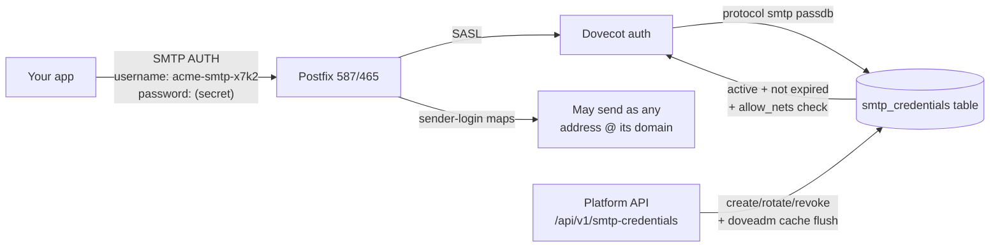

# SMTP API Keys

**Domain-scoped SMTP credentials for applications — separate from mailbox passwords, revocable, IP-restricted, and rate-limited.**

SMTP API keys let an application send mail over standard SMTP (587/465) without holding any mailbox's password. A key is scoped to one domain, may send as **any address at that domain**, authenticates **only over SMTP** (IMAP/POP3 logins never accept it), and can be rotated or revoked instantly. Shipped and verified end-to-end in production on 2026-08-27.

## How it works



- **Authentication** happens in Dovecot via a dedicated SMTP-protocol passdb (`mailer/dovecot/config/dovecot-sql-smtp.conf.ext`). The SQL query itself enforces `active`, `expires_at`, and the per-key IP allowlist (emitted as Dovecot `allow_nets`, CIDR-capable, checked on every AUTH attempt).
- **Sender identity**: `smtpd_sender_login_maps` lets the key send as any address at its domain, and `reject_sender_login_mismatch` on 587/465 stops it from sending as anything else.
- **Instant revocation**: every auth-affecting mutation (revoke, rotate, disable, expiry/allowlist change) also flushes Dovecot's auth cache for the username via the doveadm HTTP API — without the flush, a revoked key would keep authenticating from cache for up to an hour.
- **Rate limiting**: keys are counted as authenticated identities by the [rate limiter](rate-limiting.md), and can carry their own `hourly_limit` / `daily_limit`.

## API

All routes live on the platform API under `/api/v1/smtp-credentials` (authenticated with `X-API-Key`; org-scoped keys manage only their own org's credentials).

### Create a key

```bash
curl -X POST https://api.yourdomain.com/api/v1/smtp-credentials/ \
  -H "X-API-Key: <key>" -H "Content-Type: application/json" \
  -d '{
    "domain_id": "<domain-ulid>",
    "name": "Production mailer",
    "allowed_ips": ["203.0.113.10", "10.0.0.0/8"],
    "ip_allowlist_enabled": true,
    "expires_at": "2027-01-01T00:00:00Z",
    "hourly_limit": 1000,
    "daily_limit": 10000
  }'
```

The server generates the username (`{domain-slug}-smtp-{random}`) and the secret, and returns the secret **exactly once** in this response. Only a bcrypt hash and a short display prefix are stored — a lost secret means rotating the key.

### Lifecycle

```
GET    /api/v1/smtp-credentials/                    # list (org-scoped)
GET    /api/v1/smtp-credentials/{id}                # details (never the secret)
PATCH  /api/v1/smtp-credentials/{id}                # name, allowlist, expiry, limits
POST   /api/v1/smtp-credentials/{id}/rotate         # new secret, returned once
POST   /api/v1/smtp-credentials/{id}/revoke         # deactivate (auth dies on next attempt)
POST   /api/v1/smtp-credentials/{id}/enable         # re-activate
DELETE /api/v1/smtp-credentials/{id}                # remove entirely
```

### Reports

```
GET /api/v1/smtp-credentials/{id}/events   # append-only audit trail (created/rotated/revoked/...)
GET /api/v1/smtp-credentials/{id}/usage    # delivery counts for mail sent with the key
```

Usage attribution works because the [log ingestor](analytics.md) maps each message's SASL username back to the credential and stamps its last-used timestamp.

## Using a key

Point your application at the submission port with the generated credentials:

```
Host:     mail.yourdomain.com
Port:     587 (STARTTLS) or 465 (implicit TLS)
Username: acme-smtp-x7k2m9
Password: <the secret returned at create/rotate time>
From:     anything@acme.com   (the key's domain)
```

## Things to know

- **The secret is shown once.** Store it in your secret manager at creation time. `GET` endpoints return only the display prefix.

- **IP allowlists are enforced by Dovecot itself** (`allow_nets`), on every attempt including cached ones. An *enabled but empty* allowlist would deny all networks — the API rejects that state, and the passdb query guards against a bad row locking authentication out.

- **Revocation takes effect on the next AUTH attempt.** The doveadm cache flush closes the auth-cache window; an already-open SMTP session finishes its current transaction.

- **Keys are SMTP-only by design.** The passdb is mounted under `protocol smtp` in Dovecot's config; IMAP/POP3 logins never consult the table, so a leaked sending key cannot read mail.

- **Auto-suspension exists but is off by default.** The log ingestor can suspend a key whose recent outbound mail is mostly failing (`AUTO_SUSPEND_ENABLED`, default `false`, with `AUTO_SUSPEND_MIN_MESSAGES`/`AUTO_SUSPEND_FAILURE_RATIO`/`AUTO_SUSPEND_WINDOW_HOURS` tuning); as of 2026-08-30 it is not enabled in production.

- **Mailbox-password SMTP auth is untouched.** Keys are additive — users can still authenticate with their mailbox credentials.
