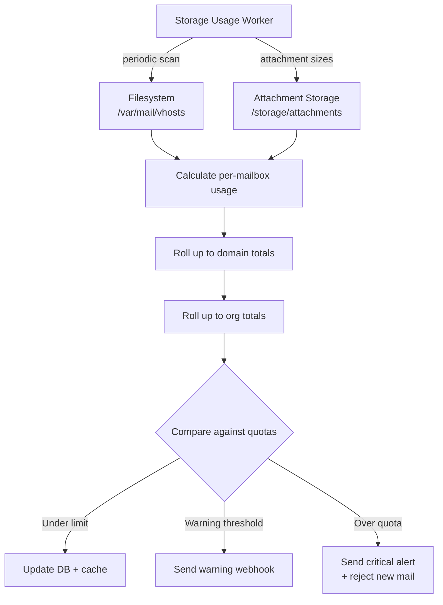

# Storage & Quotas

> **Enterprise Edition** — This feature is available in [Mailyte Enterprise](https://mailyte.com). The Community Edition does not include this functionality.


**Track how much disk space each mailbox, domain, and organization is using -- and enforce limits before things get out of hand.**

The Storage Usage service (port `8084`) periodically scans the mail filesystem, calculates real disk usage per mailbox, rolls it up to domain and org totals, and compares everything against configured quotas. When usage crosses a threshold, it fires webhook alerts so you (or your dashboard) can respond.

## How it works



### Why not just use Dovecot quotas?

Dovecot has built-in quota support, and Mailyte does use it at the IMAP level. But the Storage Usage service adds a layer on top that gives you:

- **Organization-level totals.** Dovecot only knows about individual mailboxes. The service aggregates across all mailboxes in a domain, and all domains in an org.
- **Webhook integration.** Get proactive alerts before a mailbox fills up, not after delivery starts bouncing.
- **Dashboard-friendly API.** Query usage stats programmatically for billing, reporting, or admin dashboards.
- **Attachment tracking.** Counts storage used by attachments stored in S3/filesystem, not just maildir size.

## Configuration

### Service settings

| Variable | Default | Description |
|----------|---------|-------------|
| `STORAGE_USAGE_SERVICE_URL` | `http://localhost:8084` | Service URL |
| `STORAGE_DATA_PATH` | `/storage/mail_data` | Path to mail data |
| `STORAGE_ATTACHMENT_PATH` | `/storage/attachments` | Path to attachment storage |
| `STORAGE_TEMP_PATH` | `/tmp/storage_calculations` | Temp directory for calculations |
| `STORAGE_CALCULATION_INTERVAL` | `3600` | Seconds between recalculations |
| `STORAGE_BATCH_SIZE` | `1000` | Mailboxes to process per batch |

### Quota defaults

Quotas are set per-mailbox in the database (via the API). There's no single env var for "default mailbox quota" because quotas are managed through the organization and domain setup in the admin API.

### Webhook URLs

| Variable | Default | Description |
|----------|---------|-------------|
| `STORAGE_ALERT_WEBHOOK_URL` | *(empty)* | URL for storage threshold alerts |
| `STORAGE_REPORT_WEBHOOK_URL` | *(empty)* | URL for periodic storage reports |
| `QUOTA_EXCEEDED_WEBHOOK_URL` | *(empty)* | URL for quota-exceeded notifications |

If these are empty, alerts go through the default webhook system.

## API endpoints

The storage service runs on port **8084**.

### Get mailbox usage

```bash
curl http://localhost:8084/usage/mailbox/user@example.com
```

```json
{
  "mailbox": "user@example.com",
  "usage_mb": 245.7,
  "quota_mb": 500,
  "usage_percent": 49.14,
  "attachment_mb": 82.3,
  "last_calculated": "2026-03-25T10:00:00Z"
}
```

### Get domain usage

```bash
curl http://localhost:8084/usage/domain/example.com
```

### Get organization usage

```bash
curl http://localhost:8084/usage/organization/org_123
```

### Trigger recalculation

```bash
curl -X POST http://localhost:8084/recalculate
```

Forces an immediate storage recalculation instead of waiting for the next scheduled run.

## Quota enforcement

Quotas are enforced at two points:

1. **Dovecot (IMAP delivery):** Dovecot checks per-mailbox quotas at delivery time. If a mailbox is full, the message bounces with a "Mailbox full" error.

2. **Storage Usage service (proactive):** The service monitors usage percentages and sends alerts at configurable thresholds:

| Threshold | Action |
|-----------|--------|
| 80% | Warning webhook |
| 90% | Critical webhook |
| 95% | Alert + flag in dashboard |
| 100% | Delivery rejected by Dovecot |

## Things to know

- **Storage calculations are eventually consistent.** The service recalculates every hour by default (`STORAGE_CALCULATION_INTERVAL=3600`). Between runs, the displayed usage might lag behind reality. If you need up-to-the-minute accuracy, trigger a manual recalculation via the API.

- **Attachment storage is counted separately.** When emails have attachments stored externally (S3 or filesystem), those sizes are tracked under `attachment_mb` and added to the mailbox total. This prevents the classic surprise of "my maildir is only 100MB, why is my quota at 400MB?"

- **Batch processing prevents I/O storms.** The service processes mailboxes in batches of 1,000 by default. On a server with 50,000 mailboxes, a full recalculation takes multiple batches with pauses between them, so you don't spike disk I/O.

- **Quotas are per-organization.** In a multi-tenant setup, each org gets its own quota pool. An org with a 10GB total quota can distribute that across its domains and mailboxes however it wants.

- **Users don't see quota errors until Dovecot enforces them.** The webhook alerts are for administrators. End users only discover they're over quota when email delivery starts bouncing. Set up proactive notifications in your application to warn users before they hit the wall.
