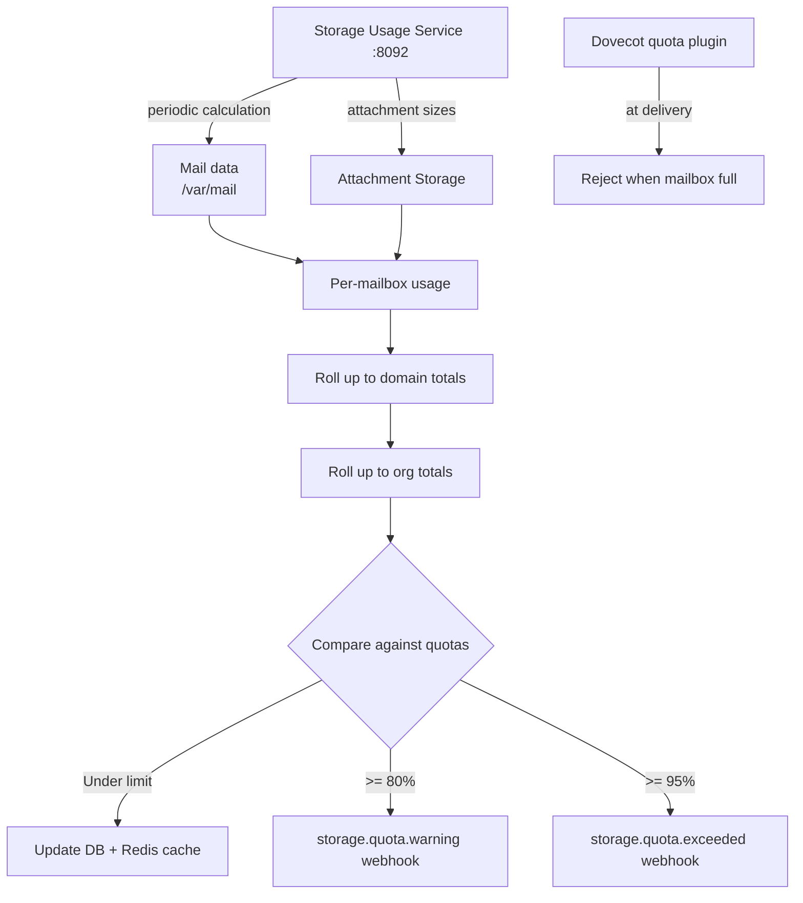

# Storage & Quotas

**Track how much disk space each mailbox, domain, and organization is using — and enforce limits before things get out of hand.**

The Storage Usage service (port `8092`) tracks disk usage per mailbox, rolls it up to domain and organization totals, compares everything against configured quotas, and fires webhook alerts when thresholds are crossed. Hard enforcement at delivery time is done by Dovecot's quota plugin.

## How it works



### Why not just use Dovecot quotas?

Dovecot enforces per-mailbox quotas at delivery time (and its `quota-warning` script fires as usage grows). The Storage Usage service adds:

- **Organization-level totals.** Dovecot only knows individual mailboxes; the service aggregates across domains and orgs.
- **Webhook integration.** Proactive `storage.quota.warning` / `storage.quota.exceeded` events through the [centralized dispatcher](webhooks.md), before delivery starts bouncing.
- **Dashboard-friendly API.** Query usage programmatically for billing, reporting, or admin dashboards.
- **Attachment tracking.** Separately counts externally stored attachment sizes.

## Configuration

| Variable | Default | Description |
|----------|---------|-------------|
| `MAIL_DATA_PATH` | `/var/mail` | Path to mail data |
| `ATTACHMENT_PATH` | `/var/attachments` | Path to attachment storage |
| `TEMP_PATH` | `/tmp/storage_calc` | Temp directory for calculations |
| `STORAGE_CALC_INTERVAL` | `3600` | Seconds between recalculations |
| `STORAGE_CLEANUP_INTERVAL` | `86400` | Seconds between cleanup runs |
| `STORAGE_BATCH_SIZE` | `1000` | Mailboxes to process per batch |
| `MAX_CALC_TIME` | `300` | Max seconds for a calculation run |
| `STORAGE_WARNING_THRESHOLD` | `80` | Usage % that triggers a warning |
| `STORAGE_CRITICAL_THRESHOLD` | `95` | Usage % that triggers a critical alert |
| `STORAGE_ALERT_COOLDOWN` | `3600` | Seconds between repeat alerts for the same entity |
| `REDIS_DB` | `2` | Redis database used for caching |

Quotas themselves are set per-mailbox, per-domain, and per-org in the database, via the platform API (`/api/v1/domains/{id}/quotas`, mailbox `storage_quota`, org caps). There is no single "default quota" env var.

Alert webhooks go through the centralized dispatcher by default; the service's webhook config can also carry dedicated `STORAGE_ALERT_WEBHOOK_URL` / `QUOTA_EXCEEDED_WEBHOOK_URL` destinations.

## API endpoints

The service runs on port **8092**. The platform API proxies storage management under `/api/v1/storage/`.

### Get usage

```bash
curl http://localhost:8092/storage/usage/mailbox/user@example.com
curl http://localhost:8092/storage/usage/domain/example.com
curl http://localhost:8092/storage/usage/organization/org_123

# Full hierarchy roll-up for an entity
curl http://localhost:8092/storage/usage/domain/example.com/hierarchy
```

### Trigger recalculation

```bash
curl -X POST http://localhost:8092/storage/calculate/mailbox/user@example.com
curl -X POST http://localhost:8092/storage/filesystem/scan
```

### Other endpoints

```
POST /storage/increment                          # count added/removed bytes
GET  /storage/quota-check                        # check headroom before an operation
POST /storage/alerts/{entity_type}/{identifier}  # force an alert evaluation
GET  /storage/config/{entity_type}/{identifier}  # read quota config
PUT  /storage/config/{entity_type}/{identifier}  # update quota config
POST /storage/cleanup                            # prune old usage records
GET  /storage/stats
POST /storage/webhook/test
GET  /health
GET  /metrics
```

## Quota enforcement

Quotas are enforced at two points:

1. **Dovecot (hard enforcement).** The `quota` plugin checks per-mailbox quotas at LMTP delivery time. A full mailbox rejects the message ("Quota exceeded"), and Dovecot's `quota-warning` script (`mailer/dovecot/scripts/dovecot-quota-warning.sh`) fires as usage crosses warning levels.

2. **Storage Usage service (proactive).** Monitors usage percentages and dispatches webhook events:

| Threshold | Event |
|-----------|-------|
| 80% | `storage.quota.warning` |
| 95% | `storage.quota.exceeded` |
| 100% | Delivery rejected by Dovecot |

## Things to know

- **Storage calculations are eventually consistent.** Recalculation runs hourly by default (`STORAGE_CALC_INTERVAL`); between runs, displayed usage can lag reality. Trigger a manual recalculation when you need current numbers.

- **Attachment storage is counted separately** and added to the mailbox total, so externally stored attachments don't hide from quota accounting.

- **Batch processing prevents I/O storms.** Mailboxes are processed in batches of 1,000 with a per-run time cap, so a full recalculation doesn't spike disk I/O.

- **Alerts are rate-limited.** The same entity won't re-alert within the `STORAGE_ALERT_COOLDOWN` window (1 hour by default).

- **Users don't see quota errors until Dovecot enforces them.** The webhook alerts are for administrators and integrations — surface warnings to end users in your application before they hit the wall.
