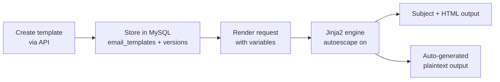

# Templates

**Create reusable email templates with dynamic variables, version history, and automatic plaintext generation.**

The Templates service (container port `8089`, published on host port `8095`) manages email templates through an API. Templates use Jinja2 syntax for variable substitution, automatically generate plaintext from HTML, and keep a full version history.

!!! warning "No A/B testing"
    A/B testing is **not implemented** — there is no variant splitting, no traffic allocation, and no `TEMPLATE_AB_TESTING_ENABLED` flag in the code. Template CRUD, rendering, versioning, duplication, the built-in library, and usage stats are all functional.

## How it works



Templates are stored per-organization in MySQL (`email_templates`, `email_template_versions`, `template_render_log` — created automatically on service startup). Each template has:

- A **name** and **description**
- A **subject template** and **HTML content**, both supporting Jinja2 placeholders like `{{ first_name }}`
- **Version tracking** — every content edit writes a new row to the version history
- **Usage stats** — render counts and a per-render log

The service strips HTML to produce a plaintext version automatically; you can also supply explicit plaintext content.

## Configuration

The service reads only database connection settings (`DB_HOST`, `DB_PORT`, `DB_NAME`, `DB_USER`, `DB_PASSWORD`) and `PORT` (default `8089`). There are no `TEMPLATE_*` tuning variables.

## API endpoints

All examples use the host-published port `8095` (inside the compose network the service is `templates:8089`).

### Create a template

```bash
curl -X POST http://localhost:8095/templates \
  -H "Content-Type: application/json" \
  -d '{
    "name": "Welcome Email",
    "description": "Sent when a new user signs up",
    "organization_id": "org_123",
    "subject_template": "Welcome, {{ first_name }}!",
    "html_content": "<h1>Welcome, {{ first_name }}!</h1><p>Thanks for joining {{ company }}.</p>"
  }'
```

Jinja2 syntax is validated on create/update — syntax errors are rejected with a `400`.

### List / get / update / delete

```bash
curl "http://localhost:8095/templates?org_id=org_123"
curl http://localhost:8095/templates/42
curl -X PUT http://localhost:8095/templates/42 -H "Content-Type: application/json" \
  -d '{"html_content": "<h1>Welcome aboard, {{ first_name }}!</h1>"}'
curl -X DELETE http://localhost:8095/templates/42
```

Updating content creates a new version; previous content is preserved in the version history.

### Render a template

```bash
curl -X POST http://localhost:8095/templates/42/render \
  -H "Content-Type: application/json" \
  -d '{"variables": {"first_name": "Alice", "company": "Acme Corp"}, "format": "both"}'
```

Response includes the rendered `subject`, and `html` and/or `plaintext` depending on `format` (`html`, `plaintext`, or `both`). Each render increments the template's counter and logs a row in `template_render_log`.

### Duplicate, versions, library, stats

```bash
curl -X POST http://localhost:8095/templates/42/duplicate
curl http://localhost:8095/templates/42/versions
curl http://localhost:8095/templates/library      # pre-built starter templates
curl http://localhost:8095/templates/42/stats
```

## Template syntax

Templates use [Jinja2](https://jinja.palletsprojects.com/):

```html
<p>Hello, {{ first_name }}!</p>


  <p>Thanks for being a premium member!</p>


<ul>

  <li>{{ item.name }} - ${{ item.price }}</li>

</ul>

<p>{{ signup_date | default("unknown") }}</p>
```

!!! tip "Autoescape is on"
    HTML content is autoescaped by default, so `{{ user_input }}` won't create XSS vulnerabilities. Use the `| safe` filter for raw HTML — carefully.

## Things to know

- **Templates are scoped to organizations.** Listing filters by `org_id`; templates carry an `organization_id` column.

- **All versions are kept.** There is no automatic version pruning — the full history stays in `email_template_versions`.

- **Plaintext generation is automatic but basic.** The HTML-to-plaintext converter handles common tags well but won't produce perfect results for complex layouts. Provide explicit plaintext when precision matters.

- **Missing simple variables render as empty strings.** Jinja2's default undefined behavior applies: a missing `{{ first_name }}` produces nothing rather than an error. Only operations that can't proceed on an undefined value (like looping over a missing list) fail, returning a `400` with `Missing variable: ...`; template syntax problems in stored content return a `500`. Use `| default("...")` filters for values that may be absent.

- **Rendering does not send email.** The templates service renders content; sending happens through your normal submission path (SMTP with a mailbox password or an [SMTP API key](smtp-credentials.md)).
