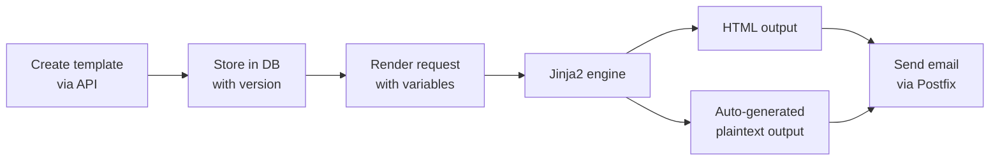

# Templates

**Create reusable email templates with dynamic variables, version history, and automatic plaintext generation.**

The Templates service (port `8087`) lets you manage email templates through an API. Templates use Jinja2 syntax for variable substitution, automatically generate plaintext versions from HTML, and keep a version history so you can roll back changes.

!!! warning "Under Construction"
    **A/B testing** is currently in development. The template CRUD, rendering, versioning, and library features described below are functional and available.

## How it works



Templates are stored per-organization. Each template has:

- A **name** and **description** for humans
- **HTML content** with Jinja2 placeholders like `{{ first_name }}`
- **Version tracking** -- every edit creates a new version
- **Usage stats** -- how many times the template has been rendered

The service automatically strips HTML tags to produce a plaintext version, so you don't have to maintain both formats manually.

## Configuration

| Variable | Default | Description |
|----------|---------|-------------|
| `TEMPLATE_SERVICE_PORT` | `8087` | Service port |
| `TEMPLATE_SERVICE_DEBUG` | `false` | Enable debug mode |
| `TEMPLATE_SERVICE_URL` | `http://localhost:8087` | Service URL for internal calls |
| `TEMPLATE_CACHE_TTL` | `3600` | Template cache duration in seconds |
| `TEMPLATE_VERSION_RETENTION` | `10` | Number of old versions to keep |
| `TEMPLATE_AB_TESTING_ENABLED` | `true` | Enable A/B testing features *(in development)* |

## API endpoints

### Create a template

```bash
curl -X POST http://localhost:8087/templates \
  -H "Content-Type: application/json" \
  -d '{
    "name": "Welcome Email",
    "description": "Sent when a new user signs up",
    "organization_id": "org_123",
    "html_content": "<h1>Welcome, {{ first_name }}!</h1><p>Thanks for joining {{ company }}.</p>",
    "category": "onboarding"
  }'
```

### List templates

```bash
curl "http://localhost:8087/templates?org_id=org_123"
```

### Get a template

```bash
curl http://localhost:8087/templates/tpl_abc123
```

### Update a template

```bash
curl -X PUT http://localhost:8087/templates/tpl_abc123 \
  -H "Content-Type: application/json" \
  -d '{
    "html_content": "<h1>Welcome aboard, {{ first_name }}!</h1><p>We are glad to have you at {{ company }}.</p>"
  }'
```

This creates a new version. The previous content is preserved in the version history.

### Render a template

```bash
curl -X POST http://localhost:8087/templates/tpl_abc123/render \
  -H "Content-Type: application/json" \
  -d '{
    "variables": {
      "first_name": "Alice",
      "company": "Acme Corp"
    }
  }'
```

Response:

```json
{
  "html": "<h1>Welcome aboard, Alice!</h1><p>We are glad to have you at Acme Corp.</p>",
  "text": "Welcome aboard, Alice!\nWe are glad to have you at Acme Corp.",
  "template_id": "tpl_abc123",
  "version": 2
}
```

### Duplicate a template

```bash
curl -X POST http://localhost:8087/templates/tpl_abc123/duplicate
```

Handy for creating variations without starting from scratch.

### View version history

```bash
curl http://localhost:8087/templates/tpl_abc123/versions
```

### Browse the template library

```bash
curl http://localhost:8087/templates/library
```

Returns a set of pre-built templates (welcome emails, password reset, invoice, etc.) that you can use as starting points.

### Template usage stats

```bash
curl http://localhost:8087/templates/tpl_abc123/stats
```

Shows how many times the template has been rendered, when it was last used, and which versions were most popular.

## Template syntax

Templates use [Jinja2](https://jinja.palletsprojects.com/) syntax. Here's a quick primer:

### Variables

```html
<p>Hello, {{ first_name }}!</p>
```

### Conditionals

```html

  <p>Thanks for being a premium member!</p>

  <p>Upgrade to premium for more features.</p>

```

### Loops

```html
<ul>

  <li>{{ item.name }} - ${{ item.price }}</li>

</ul>
```

### Filters

```html
<p>{{ description | truncate(100) }}</p>
<p>Joined on {{ signup_date | default("unknown") }}</p>
```

!!! tip "Autoescape is on"
    HTML content is autoescaped by default, so `{{ user_input }}` won't create XSS vulnerabilities. If you need to insert raw HTML, use the `| safe` filter -- but be very careful with user-supplied data.

## Things to know

- **Templates are scoped to organizations.** Org A can't see or use Org B's templates. This is enforced at the database level.

- **Version retention is capped.** By default, only the last 10 versions of a template are kept (`TEMPLATE_VERSION_RETENTION=10`). Older versions are pruned automatically.

- **Plaintext generation is automatic but basic.** The HTML-to-plaintext converter handles common tags (paragraphs, divs, links, lists) but won't produce perfect results for complex HTML layouts. If you need precise plaintext, provide it explicitly when creating the template.

- **Rendering is fast but not free.** Jinja2 compilation is cached in memory for `TEMPLATE_CACHE_TTL` seconds. For high-volume sends, the first render of a new template version is slower (compilation step), then subsequent renders are fast.

- **Missing variables don't crash the render.** If a variable in your template isn't provided in the render request, Jinja2 will raise an error that the service catches and returns as a `400` response with a helpful message telling you which variable is missing.

- **A/B testing is coming.** The plan is to let you create template variants and automatically split traffic between them, tracking which version gets better open/click rates. The `TEMPLATE_AB_TESTING_ENABLED` flag exists but the underlying functionality is still being built.
