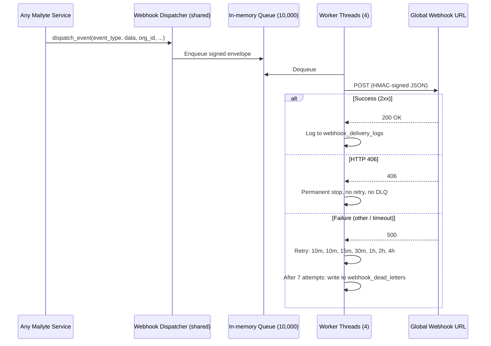

# Webhooks

**Get HTTP notifications when something happens to an email — delivered, bounced, opened, clicked, or when platform objects change.**

All events in Mailyte flow through one shared dispatcher (`shared/webhook_dispatcher.py`). Every service imports `dispatch_event()` and fires events into it; the dispatcher signs, queues, delivers, retries, logs, and dead-letters them.

!!! warning "One global webhook URL"
    The dispatcher delivers **every event to a single globally configured URL** (`WEBHOOK_URL`, mapped from the `WEBHOOK_URLS` env value in docker-compose). If that variable is unset, `dispatch_event()` is a silent no-op and **no webhooks are delivered anywhere**.

    The API's webhook *endpoint management* routes (`/api/v1/webhooks/endpoints`) store per-organization endpoint registrations in the `webhook_urls` table, but as of 2026-08-30 the dispatcher does not fan events out to those registered endpoints — delivery goes to the global URL only. Even "test endpoint" fires a `webhook.test` event to the global URL, not to the endpoint being tested. Treat per-endpoint delivery as not yet implemented.

## How it works



### Event flow

1. A service calls `dispatch_event()` with a dotted event type, a data payload, and optional org/domain context, tags, and user variables.
2. The dispatcher builds a standard envelope — unique `id`, `event`, `timestamp`, `source`, `org_id`, `domain`, `tags`, `user_variables`, `data`, `metadata`, and an inline `signature` block.
3. The envelope is queued in-memory (max 10,000 events) and delivered by a pool of 4 worker threads. Services without their own worker pool (e.g. Postfix scripts) can publish via Redis pub/sub (`mailyte:webhooks` channel) for the webhooks container's dispatcher to pick up.
4. Failed deliveries follow a Mailgun-style retry schedule: immediate, then 10m, 10m, 15m, 30m, 1h, 2h, 4h — **7 retries over roughly 8 hours**.
5. An endpoint that responds `HTTP 406` permanently stops delivery of that event (no retry, no dead letter).
6. Every attempt is logged to the `webhook_delivery_logs` table; events that exhaust all retries land in `webhook_dead_letters` for operator triage and replay.

### Verifying a webhook

Every request carries two complementary mechanisms:

**1. `X-Webhook-Signature` header** — HMAC-SHA256 of the full JSON body:

```python
import hmac, hashlib


def verify_webhook(payload_bytes, signature_header, secret):
    expected = hmac.new(secret.encode("utf-8"), payload_bytes, hashlib.sha256).hexdigest()
    return hmac.compare_digest(f"sha256={expected}", signature_header)
```

**2. Inline signature block** in `payload["signature"]` for replay protection:

```json
{"timestamp": 1756500000, "token": "<hex nonce>", "signature": "<hmac>"}
```

Verify `hmac(secret, str(timestamp) + token) == signature`, and reject payloads whose timestamp is more than 15 minutes old.

Requests also carry `X-Webhook-Id`, `X-Webhook-Event`, `X-Webhook-Source`, `X-Webhook-Timestamp`, and `User-Agent: Mailyte-Webhook/2.0`.

## Configuration

### Dispatcher (read by every service)

| Variable | Default | Description |
|----------|---------|-------------|
| `WEBHOOK_URL` | *(unset — mapped from `WEBHOOK_URLS` in compose)* | The single global delivery URL. **Required for any delivery to happen** |
| `WEBHOOK_SECRET` | *(empty)* | HMAC signing key. Without it, signatures are empty strings |
| `WEBHOOK_TIMEOUT` | `15` | Seconds per delivery attempt |
| `WEBHOOK_MAX_RETRIES` | `7` | Delivery attempts before dead-lettering |
| `WEBHOOK_WORKERS` | `4` | Dispatcher worker threads per process |
| `WEBHOOK_QUEUE_SIZE` | `10000` | In-memory queue capacity; full queue drops new events |

### Cleanup (webhooks service, port 8081)

| Variable | Default | Description |
|----------|---------|-------------|
| `WEBHOOK_CLEANUP_ENABLED` | `true` | Auto-cleanup old delivery records |
| `WEBHOOK_CLEANUP_SCHEDULE_HOURS` | `4` | Run cleanup every N hours |
| `WEBHOOK_SUCCESSFUL_RETENTION_HOURS` | `24` | Keep successful deliveries for N hours |
| `WEBHOOK_FAILED_RETENTION_HOURS` | `72` | Keep failed deliveries for 3 days |
| `WEBHOOK_CLEANUP_BATCH_SIZE` | `1000` | Records to delete per cleanup batch |

## Management API

These live on the platform API (`/api/v1/webhooks/...`, authenticated with `X-API-Key`):

| Endpoint | Purpose |
|----------|---------|
| `GET/POST /api/v1/webhooks/endpoints` | List / register endpoint records (stored, not yet used for delivery — see warning above) |
| `GET/PUT/DELETE /api/v1/webhooks/endpoints/{id}` | Manage an endpoint record |
| `POST /api/v1/webhooks/endpoints/{id}/test` | Dispatch a `webhook.test` event (delivered to the **global** URL) |
| `GET /api/v1/webhooks/deliveries` | Read the delivery log (`webhook_delivery_logs`) |
| `GET /api/v1/webhooks/dead-letters` | List dead-lettered events |
| `GET /api/v1/webhooks/dead-letters/{id}` | Inspect one dead letter, including its original envelope |
| `POST /api/v1/webhooks/dead-letters/{id}/replay` | Re-queue the original envelope through the normal dispatch path |
| `POST /api/v1/webhooks/dead-letters/replay` | Bulk replay |

## Event types actually emitted today

The full constant catalog lives in `shared/webhook_dispatcher.py` (`Events` class). These are the ones with live producers as of 2026-08-30:

| Event | Source | When |
|-------|--------|------|
| `email.delivered` / `email.bounced` / `email.deferred` / `email.rejected` | log_ingestor | Parsed from the Postfix mail log per message (producer built 2026-08-22) |
| `tracking.open` / `tracking.click` / `tracking.unsubscribe` | tracking | Pixel loads, click redirects, unsubscribes |
| `delivery.complaint`, `delivery.bounce.hard`, `delivery.bounce.soft` | tracking / bounce handler | Complaints and processed bounces |
| `rate_limit.exceeded` / `rate_limit.threshold_breach` / `rate_limit.reset` | rate_limiter | Limits hit / approached / reconfigured |
| `storage.quota.warning` / `storage.quota.exceeded` / `storage.usage.report` / `storage.cleanup` | storage_usage | Quota thresholds and reports |
| `org.*`, `domain.*`, `mailbox.*`, `alias.*`, `filter.*`, `transport_rule.*`, `shared_mailbox.*` | api | CRUD lifecycle events |
| `domain.verified` | api | DNS verification passes |
| `auth.login.success` / `auth.login.failure`, `security.brute_force`, `security.ip.blocked` | dovecot auth policy / security services | Authentication and abuse events |
| `migration.started/progress/completed/failed/cancelled` | migration | Mailbox migration lifecycle |
| `optimizer.domain.throttled` / `optimizer.reputation.changed` / `optimizer.ip.warmed` / `optimizer.fbl.received` | delivery_optimizer | Throttling, reputation, warmup, FBL |
| `archive.stored` / `archive.restored` | archiver | Archive writes and retrievals |
| `encryption.key.generated` / `encryption.key.imported` | encryption | PGP key lifecycle |
| `health.service.down/up`, `health.recovery`, `health.system.alert`, `health.check.failed` | monitoring | Auto-healing and system alerts |
| `queue.flushed/held/released`, `queue.message.failed` | queue_manager | Mail queue operations |
| `rag.*`, `compliance.*`, `whitelabel.*`, `reseller.*` | rag / api | AI and admin operations |
| `webhook.test` | api | Endpoint test |

!!! note "Defined but not emitted"
    Many constants in the catalog have **no producer wired up yet** — notably the per-message IMAP/POP3 user-action events (`email.read`, `email.deleted`, `email.moved`, `pop3.*`, `folder.*`). The webhooks service (port 8081) exposes ingestion endpoints (`POST /webhook/email/inbound|outbound|imap|pop3`) and Postfix's `master.cf` defines a `webhook-filter` pipe service for them, but nothing currently routes mail or Dovecot events into those producers. Do not build on those event types until a producer ships.

## Example payload

```json
{
  "id": "9f0d5c9e-...",
  "event": "email.delivered",
  "timestamp": "2026-08-30T14:30:00+00:00",
  "source": "log_ingestor",
  "org_id": "01J5X...",
  "domain": "yourdomain.com",
  "tags": [],
  "user_variables": {},
  "data": {
    "message_id": "<abc123@example.com>",
    "queue_id": "4bXyz...",
    "sender": "you@yourdomain.com",
    "recipient": "user@example.com",
    "status": "delivered",
    "relay": "gmail-smtp-in.l.google.com...",
    "dsn": "2.0.0",
    "subject": "Meeting tomorrow"
  },
  "metadata": {},
  "signature": {"timestamp": 1756563000, "token": "…", "signature": "…"}
}
```

## Things to know

- **Configure `WEBHOOK_URLS` and `WEBHOOK_SECRET` or nothing fires.** The dispatcher silently skips dispatch when no URL is configured — by design, so services never block on webhooks.

- **The queue is in-memory and per-process.** If the receiving endpoint is down for hours, retries hold worker threads and the 10,000-event queue can fill; further events are dropped (and counted in dispatcher stats). Long outages surface in `webhook_dead_letters`.

- **HTTP 406 is a contract.** Respond `406 Not Acceptable` from your endpoint to tell Mailyte to permanently stop delivering that event — useful for events you never want, without burning 8 hours of retries.

- **Dead letters are replayable and idempotent-friendly.** Replay resends the *original* envelope including its original `id`, so your idempotency check can recognize duplicates.

- **Delivery logs power `GET /api/v1/webhooks/deliveries`.** Every attempt (success, retry, failure) writes a row to `webhook_delivery_logs` with status, HTTP code, and attempt count.

- **Events are fire-and-forget for the emitting service.** `dispatch_event()` returns immediately; the mail path never waits on webhook delivery.
