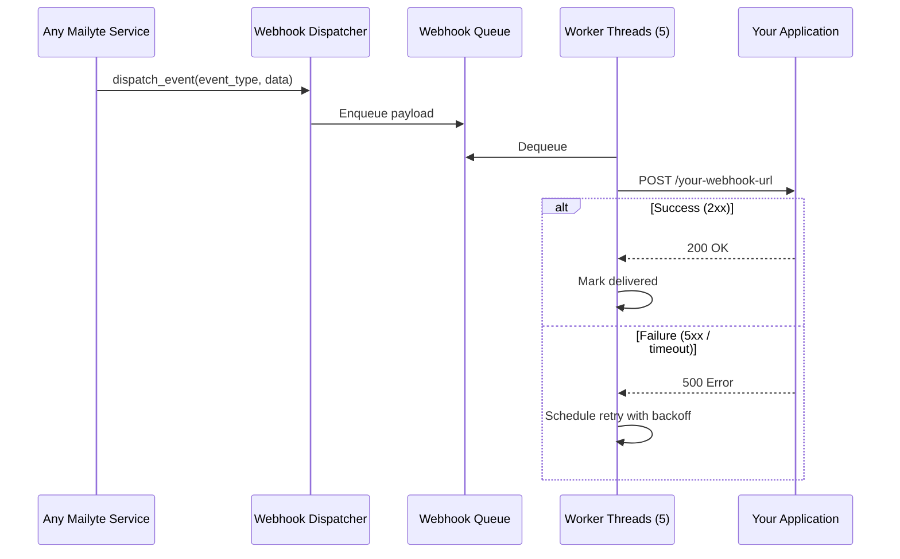

# Webhooks

**Get real-time HTTP notifications whenever something happens to an email -- sent, delivered, bounced, opened, clicked, or complained about.**

The webhook service (port `8081`) is the nervous system of Mailyte. Almost every feature dispatches events through it. You configure a URL for your organization, and the service POSTs JSON payloads to it with retry logic, HMAC signing for security, and automatic cleanup of old delivery records.

## How it works



### Event flow

1. A Mailyte service (tracking, rate limiter, storage, etc.) calls `dispatch_event()` from the shared webhook dispatcher.
2. The event is enriched with timestamp, organization ID, and source service metadata.
3. The payload is queued in an in-memory queue (max 10,000 events).
4. A pool of worker threads (default: 5) picks up events and delivers them to your webhook URL.
5. Failed deliveries are retried with exponential backoff.

### HMAC signing

Every webhook payload is signed with your organization's webhook secret using HMAC-SHA256. The signature is sent in the `X-Webhook-Signature` header. To verify:

```python
import hmac
import hashlib

def verify_webhook(payload_bytes, signature, secret):
    expected = hmac.new(
        secret.encode('utf-8'),
        payload_bytes,
        hashlib.sha256
    ).hexdigest()
    return hmac.compare_digest(f"sha256={expected}", signature)
```

!!! warning "Always verify signatures"
    Without verification, anyone who discovers your webhook URL can send fake events. The HMAC signature proves the payload came from your Mailyte instance.

## Configuration

### Core settings

| Variable | Default | Description |
|----------|---------|-------------|
| `WEBHOOK_URLS` | *(required)* | Comma-separated list of webhook URLs |
| `WEBHOOK_SECRET` | *(required)* | Secret key for HMAC signing |
| `WEBHOOK_ENCRYPTION_KEY` | *(optional)* | 32-char key for payload encryption |
| `WEBHOOK_TIMEOUT` | `30` | Seconds before a delivery attempt times out |
| `WEBHOOK_BATCH_SIZE` | `50` | Max events per batch delivery |
| `DEFAULT_WEBHOOK_URL` | *(optional)* | Fallback URL if org has none configured |

### Retry settings

| Variable | Default | Description |
|----------|---------|-------------|
| `WEBHOOK_MAX_RETRY_ATTEMPTS` | `3` | Max retries per event |
| `WEBHOOK_RETRY_BASE_DELAY` | `5` | Initial retry delay in seconds |
| `WEBHOOK_RETRY_BACKOFF_MULTIPLIER` | `2.0` | Multiply delay by this each retry |
| `WEBHOOK_RETRY_MAX_DELAY` | `3600` | Max delay between retries (1 hour) |
| `WEBHOOK_RETRY_ON_HTTP_CODES` | `500,502,503,504,429` | HTTP codes that trigger a retry |

### Cleanup settings

| Variable | Default | Description |
|----------|---------|-------------|
| `WEBHOOK_CLEANUP_ENABLED` | `true` | Auto-cleanup old delivery records |
| `WEBHOOK_CLEANUP_SCHEDULE_HOURS` | `4` | Run cleanup every N hours |
| `WEBHOOK_SUCCESSFUL_RETENTION_HOURS` | `24` | Keep successful deliveries for N hours |
| `WEBHOOK_FAILED_RETENTION_HOURS` | `72` | Keep failed deliveries for 3 days |
| `WEBHOOK_CLEANUP_BATCH_SIZE` | `1000` | Records to delete per cleanup batch |

### Event filtering

```bash
# Only receive specific events (comma-separated)
WEBHOOK_ENABLED_EVENTS=email.smtp.inbound,email.smtp.outbound,email.imap.read,dovecot.auth.success
```

If `WEBHOOK_ENABLED_EVENTS` is empty or not set, all events are delivered.

## API endpoints

### Receive inbound email event

```
POST /webhook/email/inbound
```

Used internally by Postfix to notify the webhook service about incoming mail. Not typically called by external applications.

### Receive outbound email event

```
POST /webhook/email/outbound
```

### IMAP event

```
POST /webhook/email/imap
```

### POP3 event

```
POST /webhook/email/pop3
```

### Test your webhook

```bash
curl -X POST http://localhost:8081/webhook/test \
  -H "Content-Type: application/json" \
  -d '{"message": "Hello from Mailyte!"}'
```

This sends a `test.webhook` event to all configured URLs -- useful for verifying your endpoint is reachable.

### Service status

```bash
curl http://localhost:8081/webhook/status
```

```json
{
  "status": "active",
  "queue_size": 3,
  "webhook_urls_configured": 2,
  "timestamp": "2026-03-25T14:30:00Z"
}
```

### Cleanup management

```bash
# Get cleanup stats
curl http://localhost:8081/cleanup/stats

# Trigger immediate cleanup
curl -X POST http://localhost:8081/cleanup/now

# View cleanup config
curl http://localhost:8081/cleanup/config

# Update cleanup config
curl -X PUT http://localhost:8081/cleanup/config \
  -H "Content-Type: application/json" \
  -d '{"successful_retention_hours": 48}'
```

## Event types

Here's a sampling of the events your webhook URL will receive:

| Event | Source | Description |
|-------|--------|-------------|
| `email.smtp.inbound` | Postfix | New email received |
| `email.smtp.outbound` | Postfix | Email sent |
| `email.imap.read` | Dovecot | Email read via IMAP |
| `email.imap.delete` | Dovecot | Email deleted via IMAP |
| `tracking.open` | Tracking | Recipient opened email |
| `tracking.click` | Tracking | Recipient clicked link |
| `email.bounced` | Tracking | Delivery bounced |
| `delivery.complaint` | Tracking | Spam complaint received |
| `rate_limit.exceeded` | Rate Limiter | Rate limit hit |
| `rate_limit.threshold` | Rate Limiter | Approaching rate limit |
| `storage.warning` | Storage | Storage threshold crossed |

For the full event catalog, see the [Webhook Events Reference](../reference/webhook-events.md).

## Example payload

```json
{
  "event": "email.smtp.inbound",
  "timestamp": "2026-03-25T14:30:00.000Z",
  "source_service": "postfix",
  "data": {
    "message_id": "<abc123@example.com>",
    "from": "sender@external.com",
    "to": "user@yourdomain.com",
    "subject": "Meeting tomorrow",
    "size": 15234,
    "has_attachments": false,
    "spam_score": 1.2,
    "tls_used": true,
    "spf_result": "pass",
    "dkim_result": "pass",
    "dmarc_result": "pass"
  }
}
```

## Things to know

- **The queue has a size limit.** If your webhook endpoint is down for an extended period, the in-memory queue (max 10,000 events) will fill up. Once full, new events are dropped. Monitor the queue size via the status endpoint and set up alerts.

- **Retry backoff is exponential.** First retry after 5 seconds, then 10, then 20, up to a maximum of 1 hour. After 3 failed attempts, the event is marked as failed and kept for 72 hours (for debugging).

- **Cleanup runs automatically.** Successful deliveries are purged after 24 hours, failed ones after 72 hours. You can adjust this via the cleanup config API or env vars.

- **Multiple webhook URLs are supported.** Set `WEBHOOK_URLS` to a comma-separated list, and each event will be sent to all of them. This is useful for sending events to both your application and a logging/analytics service.

- **Webhook events are fire-and-forget from the source service's perspective.** The tracking service, rate limiter, etc. call `dispatch_event()` and move on. They don't wait for delivery confirmation. This keeps the main email pipeline fast.

- **Events include EML content for email events.** Inbound and outbound email events include the full EML content (base64-encoded) and extracted attachments. If this makes payloads too large for your endpoint, you can process just the metadata fields and ignore the `eml_file` key.
