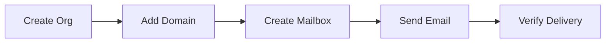

# First Steps

Your server is running. Now let's actually use it. By the end of this page you will have created an organization, added a domain, set up a mailbox, sent a test email, and confirmed it arrived.

All interaction happens through the REST API on port 5000. We will use `curl` for every step so you can follow along in any terminal.

!!! info "Base URL"
    Every example below uses `http://localhost:5000` as the base URL. In production, replace this with your actual API endpoint behind TLS.

---

## Step 1: Create an organization

Organizations are the top-level tenant in Mailyte. Everything -- domains, mailboxes, settings -- lives inside an organization. Think of it like a workspace.

```bash
curl -s -X POST http://localhost:5000/api/v1/organizations \
  -H "Content-Type: application/json" \
  -d '{
    "name": "My Company",
    "slug": "my-company"
  }' | python3 -m json.tool
```

You should get back something like:

```json
{
    "id": "org_abc123",
    "name": "My Company",
    "slug": "my-company",
    "status": "active",
    "created_at": "2026-03-25T10:00:00Z"
}
```

Save the `id` value. You will need it in the next steps.

!!! tip "Slugs must be unique"
    The `slug` is a URL-safe identifier for the organization. It must be unique across your entire Mailyte instance. Keep it short and lowercase.

---

## Step 2: Add a domain

Now tell Mailyte which domain this organization will send and receive email for.

```bash
curl -s -X POST http://localhost:5000/api/v1/organizations/org_abc123/domains \
  -H "Content-Type: application/json" \
  -d '{
    "domain": "example.com"
  }' | python3 -m json.tool
```

Expected response:

```json
{
    "id": "dom_xyz789",
    "domain": "example.com",
    "status": "pending_verification",
    "dns_records": {
        "mx": "mail.example.com",
        "spf": "v=spf1 include:mail.example.com ~all",
        "dkim_selector": "mailyte",
        "dkim_public_key": "v=DKIM1; k=rsa; p=MIIBIjANBg..."
    }
}
```

!!! warning "DNS records matter"
    The response includes the DNS records you need to add at your domain registrar. Without correct MX, SPF, and DKIM records, other mail servers will reject or spam-folder your emails. Add them before sending real mail.

    For development and testing on `localhost`, you can skip DNS setup -- emails will still flow within the local system.

---

## Step 3: Create a mailbox

A mailbox is an email account -- an address that can send and receive mail.

```bash
curl -s -X POST http://localhost:5000/api/v1/organizations/org_abc123/accounts \
  -H "Content-Type: application/json" \
  -d '{
    "email": "hello@example.com",
    "password": "a-strong-password",
    "display_name": "Hello Mailbox",
    "quota_mb": 1024
  }' | python3 -m json.tool
```

Expected response:

```json
{
    "id": "acc_456def",
    "email": "hello@example.com",
    "display_name": "Hello Mailbox",
    "quota_mb": 1024,
    "status": "active",
    "created_at": "2026-03-25T10:05:00Z"
}
```

You now have a working mailbox. The `quota_mb` field sets the storage limit in megabytes -- 1024 means 1 GB.

---

## Step 4: Send a test email

Use the API to send an email from the mailbox you just created.

```bash
curl -s -X POST http://localhost:5000/api/v1/email/send \
  -H "Content-Type: application/json" \
  -d '{
    "from": "hello@example.com",
    "to": ["hello@example.com"],
    "subject": "Test from Mailyte",
    "body": "If you can read this, your mail server works."
  }' | python3 -m json.tool
```

Expected response:

```json
{
    "message_id": "<abc123@mail.example.com>",
    "status": "queued"
}
```

The email is now in the Postfix queue. It should be delivered within a few seconds.

!!! note "Sending to yourself"
    We are sending from `hello@example.com` to `hello@example.com`. This is the simplest way to test because the email never leaves your server -- no DNS, no external delivery, no spam filters in the way.

---

## Step 5: Verify the email arrived

There are two ways to check.

### Option A: Check via the API

```bash
curl -s http://localhost:5000/api/v1/organizations/org_abc123/accounts/acc_456def/messages \
  | python3 -m json.tool
```

You should see your test message in the list.

### Option B: Connect with an email client

Point any IMAP client (Thunderbird, Apple Mail, Outlook) at your server:

| Setting | Value |
|---|---|
| IMAP server | `localhost` (or your server's IP) |
| IMAP port | `143` (STARTTLS) or `993` (SSL/TLS) |
| Username | `hello@example.com` |
| Password | The password you set in Step 3 |

Open the inbox. Your test email should be there.

!!! tip "Use Thunderbird for quick testing"
    Thunderbird handles self-signed certificates gracefully and lets you manually configure server settings, which makes it ideal for testing a new mail server.

---

## What you just did

Here is a recap of the journey:



1. **Organization** -- the tenant that owns everything.
2. **Domain** -- tells Mailyte which domain to handle mail for.
3. **Mailbox** -- an actual email address with storage.
4. **Send** -- the API queues the message in Postfix.
5. **Verify** -- Dovecot serves the delivered message over IMAP.

---

## Quick reference: API endpoints used

| Action | Method | Endpoint |
|---|---|---|
| Create organization | `POST` | `/api/v1/organizations` |
| Add domain | `POST` | `/api/v1/organizations/{org_id}/domains` |
| Create mailbox | `POST` | `/api/v1/organizations/{org_id}/accounts` |
| Send email | `POST` | `/api/v1/email/send` |
| List messages | `GET` | `/api/v1/organizations/{org_id}/accounts/{account_id}/messages` |

For the full API reference, see the [API documentation](../api/index.md).

## Next step

Everything is working. Before you go further, read through [Troubleshooting](troubleshooting.md) so you know where to look when things go sideways. (They will. It's email.)
