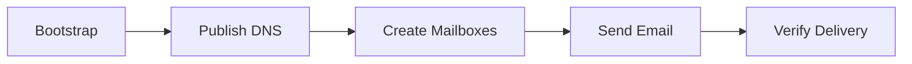

# First Steps

Your server is running. Now let's actually use it. By the end of this page you will have created an organization, added a domain, set up a mailbox, sent a test email, and confirmed it arrived.

All management happens through the REST API on port 8083. Every endpoint under `/api/v1/` requires an `X-API-Key` header -- which creates a chicken-and-egg problem on a fresh install: you need an API key to call the API, and there are none yet. The one-time **bootstrap** flow solves that.

!!! info "Base URL"
    Every example below uses `http://localhost:8083` as the base URL (the api service's published port in the base compose file). In production, replace this with your API endpoint behind Traefik, e.g. `https://api.example.com`.

---

## Step 1: Bootstrap -- organization, domain, mailbox, API key

The recommended path is the interactive script:

```bash
./scripts/setup-first-user.sh
```

It asks for an organization name, an admin email address (the domain is derived from it), and a password -- then calls the API's one-time bootstrap endpoint and prints your first **API key**. The key is also saved to `.api-key` (gitignored) for convenience.

??? note "What the script does under the hood"
    At startup, the api container writes a single-use bootstrap token to `/app/data/bootstrap-token` -- but only while no organization exists. The script reads it and calls the bootstrap endpoint with it:

    ```bash
    TOKEN=$(docker compose exec -T api cat /app/data/bootstrap-token | tr -d '\r\n')

    curl -s -X POST http://localhost:8083/api/v1/bootstrap/ \
      -H "X-Bootstrap-Token: ${TOKEN}" \
      -H "Content-Type: application/json" \
      -d '{
        "organization_name": "My Company",
        "admin_email": "hello@example.com",
        "admin_password": "a-strong-password"
      }' | python3 -m json.tool
    ```

    The response's `data.api_key` is your first credential. The token is consumed on use and refused as soon as any organization exists, so this only ever works once.

Export the key for the rest of this page:

```bash
export API_KEY=$(cat .api-key)
```

!!! tip "Admin console"
    The stack also ships an operator console at `http://localhost:3100`. Its own first-run owner account uses a separate bootstrap token -- print it with `./start.sh console-token`.

---

## Step 2: Verify what bootstrap created

```bash
# Your domain, with the DNS records you need to publish
curl -s http://localhost:8083/api/v1/domains/ \
  -H "X-API-Key: $API_KEY" | python3 -m json.tool

# Your mailbox
curl -s http://localhost:8083/api/v1/mailboxes/email-accounts \
  -H "X-API-Key: $API_KEY" | python3 -m json.tool
```

Every API response uses the same envelope:

```json
{
    "status": "success",
    "message": "Domains retrieved successfully",
    "data": { "...": "..." }
}
```

!!! warning "DNS records matter"
    The domain record includes the MX, SPF, DKIM, and DMARC values you need to add at your registrar. Without them, other mail servers will reject or spam-folder your emails. Add them before sending real mail.

    For development and testing on `localhost`, you can skip DNS setup -- mail still flows within the local system.

---

## Step 3: Add another domain (optional)

Bootstrap created one domain. Additional domains are a plain API call:

```bash
curl -s -X POST http://localhost:8083/api/v1/domains/ \
  -H "X-API-Key: $API_KEY" \
  -H "Content-Type: application/json" \
  -d '{
    "domain": "example.org"
  }' | python3 -m json.tool
```

DKIM signing keys are generated automatically and the response includes the DNS records to publish. An organization-scoped key always creates the domain in its own organization; a platform-scoped key must pass `organization_id` explicitly.

---

## Step 4: Create another mailbox

A mailbox is an email account -- an address that can send and receive mail.

```bash
curl -s -X POST http://localhost:8083/api/v1/mailboxes/email-accounts \
  -H "X-API-Key: $API_KEY" \
  -H "Content-Type: application/json" \
  -d '{
    "email": "hello@example.com",
    "password": "a-strong-password"
  }' | python3 -m json.tool
```

The password is bcrypt-hashed and the mailbox is immediately usable over IMAP/POP3/SMTP. Storage quota defaults to 1 GB; pass `storage_quota` (in bytes) to change it. The domain part of the address must already exist as an active domain.

---

## Step 5: Send a test email

The simplest end-to-end test is authenticated SMTP submission on port 587 -- the same path a real mail client uses:

```bash
python3 - <<'EOF'
import smtplib
from email.message import EmailMessage

msg = EmailMessage()
msg["From"] = "hello@example.com"
msg["To"] = "hello@example.com"
msg["Subject"] = "Test from Mailyte"
msg.set_content("If you can read this, your mail server works.")

with smtplib.SMTP("localhost", 587) as s:
    s.starttls()
    s.login("hello@example.com", "a-strong-password")
    s.send_message(msg)
print("sent")
EOF
```

Or use the built-in helper (injects directly via Postfix, no auth needed):

```bash
./start.sh            # option 20: Send test email
```

!!! note "Sending to yourself"
    Sending from `hello@example.com` to `hello@example.com` is the simplest test because the message never leaves your server -- no DNS, no external delivery, no remote spam filters in the way.

---

## Step 6: Verify the email arrived

There are three ways to check.

### Option A: Ask Dovecot directly

```bash
docker compose exec dovecot doveadm mailbox status -u hello@example.com messages INBOX
```

### Option B: Connect with an email client

Point any IMAP client (Thunderbird, Apple Mail, Outlook) at your server:

| Setting | Value |
|---|---|
| IMAP server | `localhost` (or your server's IP) |
| IMAP port | `143` (STARTTLS) or `993` (SSL/TLS) |
| Username | `hello@example.com` |
| Password | The password you set for the mailbox |

!!! tip "Use Thunderbird for quick testing"
    Thunderbird handles self-signed certificates gracefully and lets you manually configure server settings, which makes it ideal for testing a new mail server.

### Option C: Webmail

If you enabled a webmail profile (`COMPOSE_PROFILES=roundcube` in `.env`), log in at `http://localhost:8880` with the mailbox address and password.

---

## What you just did



1. **Bootstrap** -- one-time creation of the organization, first domain, first mailbox, and your API key.
2. **DNS** -- the domain record tells you exactly which MX/SPF/DKIM/DMARC records to publish.
3. **Mailboxes** -- real accounts with storage, usable by any IMAP/SMTP client immediately.
4. **Send** -- authenticated submission on 587 goes through the full Postfix/Rspamd path.
5. **Verify** -- Dovecot serves the delivered message over IMAP.

---

## Quick reference: API endpoints used

| Action | Method | Endpoint | Auth |
|---|---|---|---|
| One-time bootstrap | `POST` | `/api/v1/bootstrap/` | `X-Bootstrap-Token` |
| List domains | `GET` | `/api/v1/domains/` | `X-API-Key` |
| Add domain | `POST` | `/api/v1/domains/` | `X-API-Key` (write) |
| List mailboxes | `GET` | `/api/v1/mailboxes/email-accounts` | `X-API-Key` |
| Create mailbox | `POST` | `/api/v1/mailboxes/email-accounts` | `X-API-Key` (write) |
| Create organization | `POST` | `/api/v1/organizations/` | `X-API-Key` (platform admin) |

The interactive reference at `http://localhost:8083/api-docs` covers every endpoint, and the [API documentation](../api/index.md) section goes deeper.

## Next step

Everything is working. Before you go further, read through [Troubleshooting](troubleshooting.md) so you know where to look when things go sideways. (They will. It's email.)
