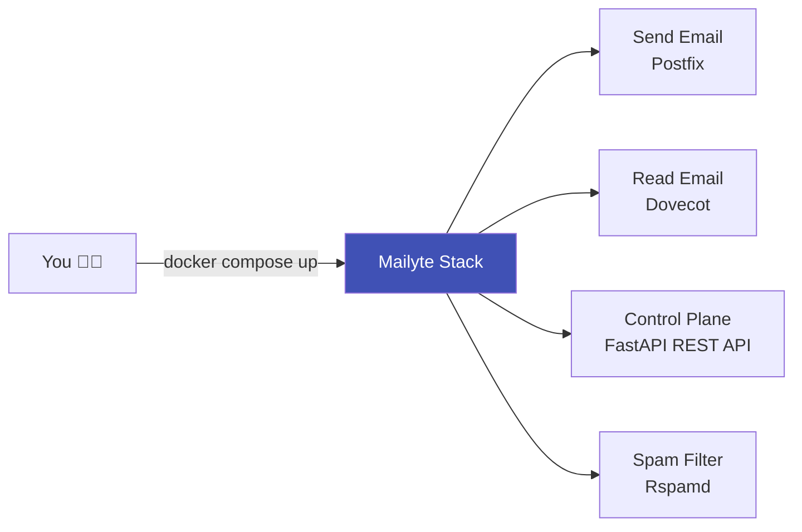

# Getting Started

Everything you need to go from zero to a running Mailyte email server — install it, configure it, and send your first email in under 15 minutes.

---

## What is Mailyte?

Mailyte is a self-hosted email platform. It bundles Postfix (SMTP), Dovecot (IMAP/POP3), Rspamd (spam filtering), a FastAPI REST API, and a collection of worker services into a single Docker Compose stack. You bring a server, a domain, and DNS access. Mailyte handles the rest.

---

## In this section

-   :material-download-circle:{ .lg .middle } **Installation**

    ---

    Clone the repo, generate secrets, configure `.env`, start the stack, and verify every container is healthy.

    [:octicons-arrow-right-24: Installation guide](installation.md)

-   :material-cog:{ .lg .middle } **Configuration**

    ---

    Understand the environment variables that control database connections, mail routing, security, feature flags, and worker behaviour.

    [:octicons-arrow-right-24: Configuration reference](configuration.md)

-   :material-rocket-launch:{ .lg .middle } **First Steps**

    ---

    Bootstrap your first organization, domain, mailbox, and API key, then send a test email.

    [:octicons-arrow-right-24: First steps walkthrough](first-steps.md)

-   :material-bug:{ .lg .middle } **Troubleshooting**

    ---

    Diagnostic commands, common pitfalls, log locations, and the fastest way to figure out what went wrong.

    [:octicons-arrow-right-24: Troubleshooting guide](troubleshooting.md)

---

## Quick-start checklist

Use this as a high-level roadmap. Each step links to its own page with full details.

- [ ] **[Install the server](installation.md)** -- clone the repo, generate secrets, configure `.env`, run `./start.sh` or `docker compose up`.
- [ ] **[Review configuration](configuration.md)** -- understand the environment variables that control database, mail routing, security, and feature flags.
- [ ] **[Take your first steps](first-steps.md)** -- create an organization, add a domain, create a mailbox, send a test email.
- [ ] **[Know how to troubleshoot](troubleshooting.md)** -- learn the diagnostic commands that save you hours when something goes wrong.

---

## What you will end up with

After completing this section you will have:

1. Every container running and healthy.
2. An organization and domain registered through the API.
3. A working mailbox that can send and receive mail.
4. Familiarity with the logs and health checks you will use day-to-day.

---

## Prerequisites at a glance

| Requirement | Minimum | Recommended |
|---|---|---|
| **OS** | Linux (Ubuntu 20.04+ or similar) | Ubuntu 22.04 LTS |
| **Docker** | 24.0+ | Latest stable |
| **Docker Compose** | v2.24+ | Latest v2 |
| **RAM** | 4 GB | 8 GB+ |
| **Disk** | 50 GB | 100 GB+ SSD |
| **Domain** | One domain with DNS control | -- |
| **Ports open** | 25, 143, 465, 587, 993 | All mail ports + 80/443 |

!!! warning "Port 25 matters"
    Many cloud providers block outbound port 25 by default. Check with your hosting provider **before** you start — you may need to request that the block be lifted. Without port 25, your server can receive email but cannot deliver it to other servers.

The [Installation](installation.md) page covers prerequisites in full.

---

## Architecture at a glance

Mailyte is made up of three layers:

=== "Mail Services"

    Postfix handles SMTP (ports 25, 587, 465). Dovecot handles IMAP/POP3 (ports 143, 993, 110, 995). Rspamd sits between them filtering spam.

=== "API & Workers"

    A FastAPI application (host port 8083 in development) is the control plane. Worker services handle tracking, webhooks, rate limiting, analytics, RAG/AI search, queue management, storage usage, archiving, and monitoring.

=== "Data Stores"

    MySQL stores configuration and metadata. Redis provides caching and pub/sub for the workers. Qdrant stores vector embeddings for AI-powered email search.

!!! info "Don't worry about memorizing all of this"
    The [Architecture](../architecture/index.md) section covers every service in detail. Right now, you just need to get the stack running.

---

## Capabilities overview

| Capability | What you get |
|---|---|
| **Send & receive email** | Full SMTP, IMAP, and POP3 support via Postfix and Dovecot |
| **REST API** | Manage everything programmatically — orgs, domains, mailboxes, aliases |
| **Spam filtering** | Rspamd spam detection with Bayesian filtering (optional ClamAV integration, not deployed by default) |
| **Multi-tenant** | Host multiple organizations with fully isolated data and quotas |
| **Email tracking** | Open tracking, click tracking, bounce and complaint logging |
| **Webhooks** | Real-time event delivery with retry and HMAC signing |
| **AI search** | Semantic search over email content with Qdrant vector DB |
| **Auto-healing** | Monitoring service detects failed containers and restarts them |
| **Backups** | Automated, age-encrypted database and filesystem backups with S3 upload |

---

## Where to go next

!!! tip "Start here"
    Head to the **[Installation guide](installation.md)**. It takes about ten minutes if you already have Docker installed.

**Related sections:**

- [Architecture](../architecture/index.md) -- understand how the system is put together
- [API Reference](../api/index.md) -- explore the REST API once your server is running
- [Features](../features/index.md) -- see everything Mailyte can do
- [Security](../security/index.md) -- harden your deployment before going live
