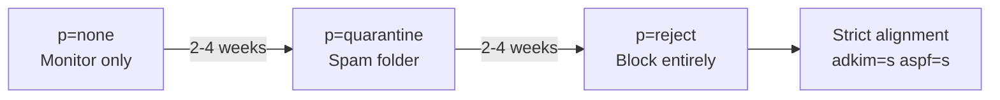

# Improving Deliverability

Deliverability is the art of getting your email into the inbox instead of the spam folder. This guide covers every lever you can pull — from DNS authentication to reputation management.

## The Authentication Trio: SPF + DKIM + DMARC

These three DNS records are the foundation. Without all three, major providers (Gmail, Microsoft, Yahoo) will treat your mail with suspicion.

### SPF (Sender Policy Framework)

SPF tells receiving servers which IPs are allowed to send email for your domain.

```
example.com.  IN  TXT  "v=spf1 mx a:mail.example.com ip4:203.0.113.1 -all"
```

- `mx` — servers in your MX records can send
- `a:mail.example.com` — your mail server specifically
- `ip4:203.0.113.1` — explicit IP authorization
- `-all` — hard fail everything else

!!! warning "Common SPF mistakes"
    - **Too many lookups** — SPF allows 10 DNS lookups max. Each `include:` counts as one. If you exceed 10, SPF breaks silently.
    - **Using `+all`** — this allows anyone to send as your domain. Never do this.
    - **Forgetting `~all` vs `-all`** — use `~all` (soft fail) during testing, `-all` (hard fail) in production.

### DKIM (DomainKeys Identified Mail)

DKIM cryptographically signs your email. See the [full DKIM setup guide](setting-up-dkim.md) for detailed instructions.

Quick check:

```bash
dig TXT default._domainkey.example.com +short
```

### DMARC (Domain-based Message Authentication)

DMARC ties SPF and DKIM together and tells receivers what to do when authentication fails.

**Start with monitoring:**

```
_dmarc.example.com.  IN  TXT  "v=DMARC1; p=none; rua=mailto:dmarc@example.com; fo=1; pct=100"
```

**After 2-4 weeks of clean reports, tighten it:**

```
_dmarc.example.com.  IN  TXT  "v=DMARC1; p=quarantine; rua=mailto:dmarc@example.com; fo=1; pct=100"
```

**After another 2-4 weeks:**

```
_dmarc.example.com.  IN  TXT  "v=DMARC1; p=reject; sp=reject; adkim=s; aspf=s; rua=mailto:dmarc@example.com; fo=1; pct=100"
```

The progression: `none` (just report) -> `quarantine` (spam folder) -> `reject` (block entirely).



## IP Warm-Up Strategy

A new IP address has zero reputation. Sending a burst of email from it will trigger spam filters. You need to ramp up gradually.

### Warm-Up Schedule

| Day | Daily Volume | Target Recipients |
|-----|-------------|-------------------|
| 1-3 | 50 | Most engaged users only |
| 4-7 | 200 | Engaged users |
| 8-14 | 500-1,000 | Active users |
| 15-21 | 2,000-5,000 | All active users |
| 22-30 | 10,000-20,000 | Broader audience |
| 31+ | Full volume | Everyone |

### Warm-Up Best Practices

- **Start with engaged recipients** — people who regularly open your emails
- **Split by provider** — warm up Gmail, Microsoft, and Yahoo separately
- **Monitor bounce rates** — if they spike above 2%, slow down
- **Watch for deferrals** — 4xx responses mean "try again later," not "rejected"
- **Don't send to old lists** — stale addresses bounce, killing your reputation

### Monitoring During Warm-Up

Check these daily:

```bash
# Check bounce rate via the API
curl http://mail.yourdomain.com:8083/api/v1/get/status/stats \
  -H "X-API-Key: YOUR_API_KEY"

# Check Postfix queue for deferrals
docker exec -it postfix postqueue -p | tail -5

# Check Rspamd for outbound rejections
docker exec -it rspamd rspamc stat
```

## Bounce Rate Management

Bounces destroy your reputation faster than almost anything else. Keep your bounce rate under 2%.

### Hard Bounces vs Soft Bounces

| Type | Meaning | Action |
|------|---------|--------|
| Hard bounce (5xx) | Address doesn't exist | Remove immediately, never retry |
| Soft bounce (4xx) | Temporary issue (full mailbox, server down) | Retry 3 times, then suppress |

### Automatic Suppression

Mailyte tracks bounces in the `email_suppressions` table and automatically suppresses hard bounces:

```bash
# Check suppression list
curl http://mail.yourdomain.com:8083/api/v1/get/suppressions/example.com \
  -H "X-API-Key: YOUR_API_KEY"
```

### Clean Your Lists

Before sending to a list:

1. Remove addresses that haven't engaged in 6+ months
2. Run the list through an email verification service
3. Remove role addresses (`info@`, `admin@`, `support@`) unless you know they're real
4. Remove addresses with typos (`@gmial.com`, `@yaho.com`)

## Reputation Management

### Monitor Your Reputation

| Tool | What it tells you |
|------|-------------------|
| [Google Postmaster Tools](https://postmaster.google.com/) | Domain/IP reputation with Gmail |
| [Microsoft SNDS](https://sendersupport.olc.protection.outlook.com/snds/) | IP reputation with Outlook |
| [MXToolbox Blacklist Check](https://mxtoolbox.com/blacklists.aspx) | Whether you're on any blacklists |
| Mailyte Analytics API | Your own sending stats and bounce rates |

### Check Blacklists

```bash
# Quick check against major blacklists
docker exec -it postfix bash -c '
  IP="203.0.113.1"
  for bl in zen.spamhaus.org b.barracudacentral.org bl.spamcop.net; do
    result=$(dig +short $(echo $IP | awk -F. "{print \$4\".\"\$3\".\"\$2\".\"\$1}").$bl)
    if [ -z "$result" ]; then
      echo "$bl: CLEAN"
    else
      echo "$bl: LISTED ($result)"
    fi
  done
'
```

### If You Get Blacklisted

1. **Stop sending** — continuing to send while listed makes it worse
2. **Find the cause** — check for compromised accounts, open relays, or bad lists
3. **Fix it** — remove the source of spam
4. **Request delisting** — most blacklists have a removal form
5. **Monitor** — watch for re-listing in the following days

## PTR Record (Reverse DNS)

This is critical. Your server's IP must have a PTR record that:

- Resolves to a hostname (`mail.example.com`)
- That hostname resolves back to the same IP (forward-confirmed reverse DNS)

```bash
# Check PTR
dig -x 203.0.113.1 +short
# Should return: mail.example.com.

# Check forward
dig A mail.example.com +short
# Should return: 203.0.113.1
```

Set the PTR record through your hosting provider (not your DNS zone file).

## Content Best Practices

Authentication gets your email to the server. Content determines whether it reaches the inbox.

- **Plain text alternative** — always include a text/plain version alongside HTML
- **Text-to-image ratio** — don't send emails that are mostly images
- **Avoid spam trigger words** — "FREE!!!", "Act Now", "Limited Time" in subject lines
- **Unsubscribe header** — include `List-Unsubscribe` in your headers
- **Consistent From address** — don't change your sending address frequently
- **Valid Reply-To** — use a real, monitored address

## MTA-STS and TLSRPT

These are newer standards that improve transport security.

### MTA-STS

Forces other mail servers to use TLS when sending to you:

```
_mta-sts.example.com.  IN  TXT  "v=STSv1; id=20260325T000000"
```

### TLSRPT

Receives reports about TLS failures:

```
_smtp._tls.example.com.  IN  TXT  "v=TLSRPTv1; rua=mailto:tls-reports@example.com"
```

## Deliverability Checklist

- [x] PTR record matches hostname
- [x] SPF record published with `-all`
- [x] DKIM key generated and DNS record published
- [x] DMARC policy set (start with `p=none`)
- [x] MTA-STS configured
- [x] TLSRPT configured
- [x] IP warm-up plan in place
- [x] Bounce handling active
- [x] Suppression lists maintained
- [x] Google Postmaster Tools set up
- [x] Blacklist monitoring active
- [x] List-Unsubscribe header included
- [x] Plain text alternative in all emails
