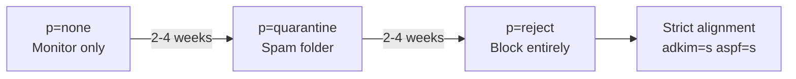

# Improving Deliverability

Deliverability is the art of getting your email into the inbox instead of the spam folder. This guide covers every lever you can pull — from DNS authentication to reputation management.

## The Authentication Trio: SPF + DKIM + DMARC

These three DNS records are the foundation. Without all three, major providers (Gmail, Microsoft, Yahoo) will treat your mail with suspicion.

### SPF (Sender Policy Framework)

SPF tells receiving servers which IPs are allowed to send email for your domain. Mailyte generates the record for you at domain creation — it uses an `include:` for the platform SPF host:

```
example.com.  IN  TXT  "v=spf1 include:spf.mail.yourdomain.com ~all"
```

Publish the value from the `dns_records` array returned by `POST /api/v1/domains/` rather than composing your own — the include hostname comes from the server's `MAIL_SPF_HOST` setting and must match a record that actually exists.

!!! warning "Common SPF mistakes"
    - **Too many lookups** — SPF allows 10 DNS lookups max. Each `include:` counts as one. If you exceed 10, SPF breaks silently.
    - **Using `+all`** — this allows anyone to send as your domain. Never do this.
    - **A second SPF record** — a domain may have exactly one `v=spf1` TXT record; two is a permerror. Merge, don't add.

### DKIM (DomainKeys Identified Mail)

DKIM cryptographically signs your email. See the [full DKIM setup guide](setting-up-dkim.md) — including the step that gets the signing key onto disk for Rspamd, without which mail goes out unsigned.

Quick check:

```bash
dig TXT default._domainkey.example.com +short
```

### DMARC (Domain-based Message Authentication)

DMARC ties SPF and DKIM together and tells receivers what to do when authentication fails.

**Start with monitoring:**

```
_dmarc.example.com.  IN  TXT  "v=DMARC1; p=none; rua=mailto:dmarc@example.com; fo=1; pct=100"
```

**After 2-4 weeks of clean reports, tighten it:**

```
_dmarc.example.com.  IN  TXT  "v=DMARC1; p=quarantine; rua=mailto:dmarc@example.com; fo=1; pct=100"
```

**After another 2-4 weeks:**

```
_dmarc.example.com.  IN  TXT  "v=DMARC1; p=reject; sp=reject; adkim=s; aspf=s; rua=mailto:dmarc@example.com; fo=1; pct=100"
```

The progression: `none` (just report) -> `quarantine` (spam folder) -> `reject` (block entirely).



### Verify all four server-side

```bash
curl https://api.yourdomain.com/api/v1/domains/DOMAIN_ID/verify-dns \
  -H "X-API-Key: YOUR_API_KEY"
```

## IP Warm-Up Strategy

A new IP address has zero reputation. Sending a burst of email from it will trigger spam filters. You need to ramp up gradually.

### Warm-Up Schedule

| Day | Daily Volume | Target Recipients |
|-----|-------------|-------------------|
| 1-3 | 50 | Most engaged users only |
| 4-7 | 200 | Engaged users |
| 8-14 | 500-1,000 | Active users |
| 15-21 | 2,000-5,000 | All active users |
| 22-30 | 10,000-20,000 | Broader audience |
| 31+ | Full volume | Everyone |

### Warm-Up Best Practices

- **Start with engaged recipients** — people who regularly open your emails
- **Split by provider** — warm up Gmail, Microsoft, and Yahoo separately
- **Monitor bounce rates** — if they spike above 2%, slow down
- **Watch for deferrals** — 4xx responses mean "try again later," not "rejected"
- **Don't send to old lists** — stale addresses bounce, killing your reputation
- **Enforce the ramp** — SMTP credentials support `hourly_limit`/`daily_limit`; raise them week by week rather than relying on your application to throttle

### Monitoring During Warm-Up

Check these daily:

```bash
# Deliverability stats per domain
curl https://api.yourdomain.com/api/v1/analytics/deliverability/example.com \
  -H "X-API-Key: YOUR_API_KEY"

# Reputation summary (domains, IPs, complaint feedback loops)
curl https://api.yourdomain.com/api/v1/reputation/summary \
  -H "X-API-Key: YOUR_API_KEY"

# Mail queue status — a growing deferred queue means receivers are throttling you
curl https://api.yourdomain.com/api/v1/queue/queue/status \
  -H "X-API-Key: YOUR_API_KEY"

# Or straight from Postfix
docker exec postfix postqueue -p | tail -5
```

## Bounce Rate Management

Bounces destroy your reputation faster than almost anything else. Keep your bounce rate under 2%.

### Hard Bounces vs Soft Bounces

| Type | Meaning | Action |
|------|---------|--------|
| Hard bounce (5xx) | Address doesn't exist | Remove immediately, never retry |
| Soft bounce (4xx) | Temporary issue (full mailbox, server down) | Retry 3 times, then suppress |

### The Suppression List

Suppressed addresses are recorded in the `email_suppressions` table and managed through the tracking API:

```bash
# List suppressions (filterable by type, date, substring; paginated)
curl "https://api.yourdomain.com/api/v1/tracking/suppressions?suppression_type=BOUNCE" \
  -H "X-API-Key: YOUR_API_KEY"

# Suppress one address
curl -X POST https://api.yourdomain.com/api/v1/tracking/suppress \
  -H "X-API-Key: YOUR_API_KEY" \
  -H "Content-Type: application/json" \
  -d '{"email": "gone@example.org", "reason": "hard bounce"}'

# Remove a suppression
curl -X DELETE https://api.yourdomain.com/api/v1/tracking/suppress/gone@example.org \
  -H "X-API-Key: YOUR_API_KEY"
```

Bulk imports (up to 1000 addresses per call, operator role) go through `POST /api/v1/tracking/suppressions/bulk` with `suppression_type` set to `BOUNCE`, `COMPLAINT`, `UNSUBSCRIBE`, or `MANUAL`.

### Clean Your Lists

Before sending to a list:

1. Remove addresses that haven't engaged in 6+ months
2. Run the list through an email verification service
3. Remove role addresses (`info@`, `admin@`, `support@`) unless you know they're real
4. Remove addresses with typos (`@gmial.com`, `@yaho.com`)

## Reputation Management

### Monitor Your Reputation

| Tool | What it tells you |
|------|-------------------|
| [Google Postmaster Tools](https://postmaster.google.com/) | Domain/IP reputation with Gmail |
| [Microsoft SNDS](https://sendersupport.olc.protection.outlook.com/snds/) | IP reputation with Outlook |
| [MXToolbox Blacklist Check](https://mxtoolbox.com/blacklists.aspx) | Whether you're on any blacklists |
| Mailyte Reputation API | `GET /api/v1/reputation/domains`, `/ips`, `/feedback-loops`, `/summary` |

### Check Blacklists

Run from any machine with `dig` (the mail server host works):

```bash
IP="203.0.113.1"
for bl in zen.spamhaus.org b.barracudacentral.org bl.spamcop.net; do
  reversed=$(echo $IP | awk -F. '{print $4"."$3"."$2"."$1}')
  result=$(dig +short ${reversed}.${bl})
  if [ -z "$result" ]; then
    echo "$bl: CLEAN"
  else
    echo "$bl: LISTED ($result)"
  fi
done
```

### If You Get Blacklisted

1. **Stop sending** — continuing to send while listed makes it worse
2. **Find the cause** — check for compromised accounts, open relays, or bad lists
3. **Fix it** — remove the source of spam
4. **Request delisting** — most blacklists have a removal form
5. **Monitor** — watch for re-listing in the following days

## PTR Record (Reverse DNS)

This is critical. Your server's IP must have a PTR record that:

- Resolves to a hostname (`mail.example.com`)
- That hostname resolves back to the same IP (forward-confirmed reverse DNS)

```bash
# Check PTR
dig -x 203.0.113.1 +short
# Should return: mail.example.com.

# Check forward
dig A mail.example.com +short
# Should return: 203.0.113.1
```

Set the PTR record through your hosting provider (not your DNS zone file).

## Content Best Practices

Authentication gets your email to the server. Content determines whether it reaches the inbox.

- **Plain text alternative** — always include a text/plain version alongside HTML
- **Text-to-image ratio** — don't send emails that are mostly images
- **Avoid spam trigger words** — "FREE!!!", "Act Now", "Limited Time" in subject lines
- **Unsubscribe header** — include `List-Unsubscribe` in your headers
- **Consistent From address** — don't change your sending address frequently
- **Valid Reply-To** — use a real, monitored address

## MTA-STS and TLSRPT

These are newer standards that improve transport security.

### MTA-STS

Forces other mail servers to use TLS when sending to you. Two pieces:

```
; The policy discovery record
_mta-sts.example.com.  IN  TXT  "v=STSv1; id=20260830T000000"

; The policy host — Mailyte's autoconfig service serves the policy file
mta-sts.example.com.   IN  CNAME  mail.yourdomain.com.
```

Since 2026-08-27 the autoconfig service answers `https://mta-sts.<domain>/.well-known/mta-sts.txt` for every hosted domain, so publishing the CNAME plus the `_mta-sts` TXT record is all a domain needs.

### TLSRPT

Receives reports about TLS failures:

```
_smtp._tls.example.com.  IN  TXT  "v=TLSRPTv1; rua=mailto:tls-reports@example.com"
```

## Deliverability Checklist

- [x] PTR record matches hostname
- [x] SPF record published (the exact value the API returned)
- [x] DKIM key generated, key file on disk, DNS record published
- [x] DMARC policy set (start with `p=none`)
- [x] MTA-STS configured
- [x] TLSRPT configured
- [x] IP warm-up plan in place (with SMTP credential limits enforcing it)
- [x] Bounce handling active
- [x] Suppression lists maintained
- [x] Google Postmaster Tools set up
- [x] Blacklist monitoring active
- [x] List-Unsubscribe header included
- [x] Plain text alternative in all emails
