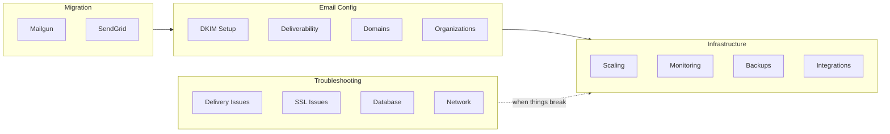

# Guides

Step-by-step guides that walk you through real tasks. Each one assumes you already have a running Mailyte server and takes you from start to finish with concrete commands and examples.

!!! prerequisite "Before you begin"
    These guides assume a working Mailyte deployment. If you don't have one yet, start with [Installation](../getting-started/installation.md) first.

---

## At a Glance

## Migration

Moving from another email provider? These guides cover the full process — exporting data, importing via the API, updating DNS, and verifying delivery.

-   :material-email-sync:{ .lg .middle } **Migrating from Mailgun**

    ---

    Export domains and mailboxes, import via API, cut over DNS, and verify delivery.

    [:octicons-arrow-right-24: Mailgun Migration](migrating-from-mailgun.md)

-   :material-email-sync-outline:{ .lg .middle } **Migrating from SendGrid**

    ---

    Export sending domains and templates, switch to Mailyte, and validate SPF/DKIM.

    [:octicons-arrow-right-24: SendGrid Migration](migrating-from-sendgrid.md)

## Email Configuration

| Guide | What It Covers | Difficulty |
|-------|---------------|------------|
| [Setting Up DKIM](setting-up-dkim.md) | Generate keys, add DNS records, configure Rspamd signing | Beginner |
| [Improving Deliverability](improving-deliverability.md) | SPF, DKIM, DMARC alignment, IP warm-up, reputation management | Intermediate |
| [Domain Configuration](domain-configuration.md) | Adding domains, DNS verification, catch-all aliases, per-domain settings | Beginner |
| [Managing Organizations](organization-management.md) | Bulk operations, quota management, billing integration hooks | Intermediate |

!!! tip "New to email infrastructure?"
    Start with [Domain Configuration](domain-configuration.md), then [Setting Up DKIM](setting-up-dkim.md), then [Improving Deliverability](improving-deliverability.md). This order builds on each previous step.

## Infrastructure

| Guide | What It Covers | Difficulty |
|-------|---------------|------------|
| [Scaling to Millions](scaling-to-millions.md) | Queue optimization, multiple Postfix instances, database sharding | Advanced |
| [Monitoring Setup](monitoring-setup.md) | End-to-end monitoring stack from scratch | Intermediate |
| [Prometheus Configuration](prometheus-configuration.md) | Detailed Prometheus config for every Mailyte service | Intermediate |
| [Grafana Dashboards](grafana-setup.md) | Import pre-built dashboards, create custom panels, set up alerting | Intermediate |
| [Backup Automation](backup-automation.md) | Automated scripts, S3 sync, retention policies, restore testing | Intermediate |
| [Custom Integrations](custom-integrations.md) | Webhooks for CRM/ticketing systems, API automation patterns | Intermediate |

## Troubleshooting

Something broken? Find your symptom below and follow the guide.

-   :material-email-off:{ .lg .middle } **Email Delivery Issues**

    ---

    Email not arriving, stuck in queue, bouncing, or being rejected by remote servers.

    [:octicons-arrow-right-24: Diagnose delivery issues](troubleshooting/email-delivery-issues.md)

-   :material-lock-alert:{ .lg .middle } **SSL Certificate Issues**

    ---

    Certificates not renewing, domain mismatch errors, Let's Encrypt rate limits.

    [:octicons-arrow-right-24: Fix SSL issues](troubleshooting/ssl-certificate-issues.md)

-   :material-database-alert:{ .lg .middle } **Database Performance**

    ---

    Slow queries, connection pool exhaustion, table locks, replication lag.

    [:octicons-arrow-right-24: Fix database issues](troubleshooting/database-performance.md)

-   :material-lan-disconnect:{ .lg .middle } **Network Connectivity**

    ---

    Ports blocked by firewall, DNS resolution failures, Docker networking problems.

    [:octicons-arrow-right-24: Fix network issues](troubleshooting/network-connectivity.md)

-   :material-chart-bell-curve:{ .lg .middle } **Monitoring Issues**

    ---

    Prometheus not scraping, Grafana dashboard errors, missing metrics.

    [:octicons-arrow-right-24: Fix monitoring issues](troubleshooting/monitoring-issues.md)

-   :material-server-off:{ .lg .middle } **Service Failures**

    ---

    Container crashes, OOM kills, disk full, services not starting.

    [:octicons-arrow-right-24: Fix service failures](troubleshooting/service-failures.md)

## Related Sections

- **[Configuration](../configuration/index.md)** — Detailed configuration reference for all components
- **[Deployment](../deployment/index.md)** — Production setup, scaling, and disaster recovery
- **[Monitoring](../monitoring/index.md)** — Dashboards, alerts, and health checks
- **[Reference](../reference/index.md)** — CLI commands, error codes, and database schema
