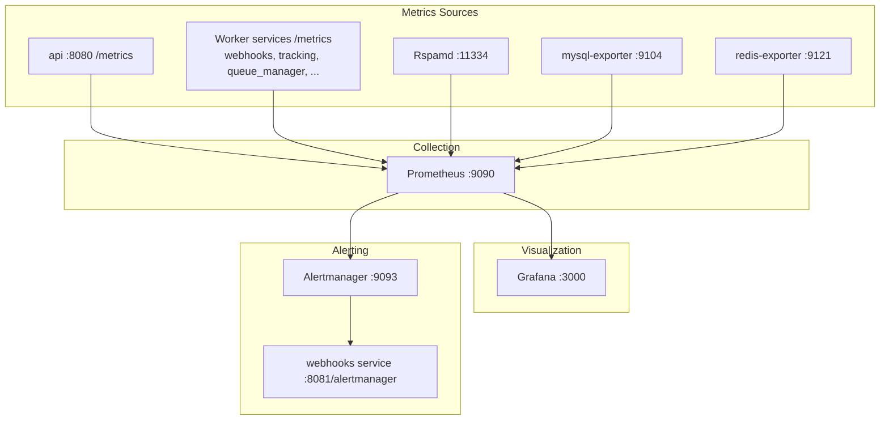

# Monitoring Setup

Mailyte's monitoring stack is **built into the main compose file** — Prometheus, Grafana, Alertmanager, and the MySQL/Redis exporters start with everything else. This guide walks through what runs where, how to reach it, and how alerting is wired.

## What You're Monitoring



## Step 1: The Stack is Already Running

`docker compose up -d` starts five monitoring services from `docker-compose.yml`:

| Service | Image | Dev port | Production |
|---------|-------|----------|------------|
| prometheus | `prom/prometheus:v2.51.0` | `9090:9090` | `127.0.0.1:9090` (loopback only) |
| grafana | `grafana/grafana:10.4.0` | `3000:3000` | `127.0.0.1:3000` + Traefik at `grafana.<domain>` |
| alertmanager | `prom/alertmanager:v0.27.0` | `9093:9093` | `127.0.0.1:9093` |
| mysql-exporter | `prom/mysqld-exporter:v0.15.1` | `9104:9104` | `127.0.0.1:9104` |
| redis-exporter | `oliver006/redis_exporter:v1.58.0` | `9121:9121` | `127.0.0.1:9121` |

There is **no separate monitoring overlay file** — everything lives in the base compose file, with production overrides in `docker-compose.prod.yml`.

!!! warning "Production reachability"
    Since 2026-08-22, production rebinds every monitoring port to loopback (they were publicly reachable with no authentication before that). Only Grafana gets a Traefik router (`https://grafana.<your-domain>`). To reach Prometheus or Alertmanager in production, use an SSH tunnel:

    ```bash
    ssh -L 9090:127.0.0.1:9090 -L 9093:127.0.0.1:9093 devops@your-server
    ```

Grafana requires `GRAFANA_ADMIN_PASSWORD` in `.env` (no default — startup validation fails without it); the username comes from `GRAFANA_ADMIN_USER` (default `admin`). Sign-up is disabled.

## Step 2: What Prometheus Scrapes

The config is mounted from `monitoring/prometheus/prometheus.yml` (15s global scrape interval, 30d retention, alert rules from `monitoring/prometheus/rules/`). It defines ~24 jobs: `prometheus` itself, `rspamd` (:11334), `mysql`/`redis` via their exporters, and one job per worker service — `api` (:8080), `webhooks` (:8081), `rate_limiter` (:8082), `monitoring` (:8085), `tracking` (:8086), `dashboard` (:8088), `analytics` (:8085), `rag` (:8090), `templates` (:8089), `url_protection` (:8090), `oauth` (:8091), `archiver`, `encryption`, `queue_manager`, `storage_usage`, `delivery_optimizer`, `jmap`, `migration`, `autoconfig`, `caldav` — each on `/metrics` at its **container** port.

Worker services expose Prometheus text via the shared in-repo collector (`shared/metrics.py`); `queue_manager` uses the real `prometheus_client` library.

!!! note "Target cleanup (2026-08-30)"
    Four permanently-DOWN scrape jobs were fixed: `analytics` and `rag` had targeted their host-mapped ports (8087/8091) instead of container ports (8085/8090) and scraped nothing; the `postfix` (`postfix-exporter:9154`) and `dovecot` (`dovecot-exporter:9166`) jobs pointed at exporter containers that exist in no compose file and are now commented out until the exporters are actually deployed. Scrape jobs were added for `templates`, `url_protection`, and `oauth`, which expose `/metrics` but were never scraped.

## Step 3: Alert Rules

Rules ship in `monitoring/prometheus/rules/`:

- **`mail_alerts.yml`** — `mail_server_alerts` group; active rules are ServiceDown, HighErrorRate, SpamSpike, DatabaseConnectionPoolExhausted, SlowQueries, and RedisMemoryHigh. The rules whose series have no producer (MailQueueBackup/Critical and the bounce-rate pair on `postfix_*`, DiskSpaceWarning/Critical on `node_filesystem_*`, KafkaConsumerLag, and the whole `security_alerts` group) are commented out with dated notes as of 2026-08-30 — restore each when its exporter/producer is deployed
- **`backup_alerts.yml`** — nine absence-first backup alerts (NoRecentFullBackup, BackupLastRunFailed, UnencryptedBackupsPresent, archive-spool alerts, ...)

To add or edit rules: change the files under `monitoring/prometheus/rules/`, then reload Prometheus without a restart (lifecycle API is enabled):

```bash
curl -X POST http://localhost:9090/-/reload
```

## Step 4: Where Alerts Go

`monitoring/alertmanager/alertmanager.yml` routes everything to the **webhooks service**, not directly to Slack/PagerDuty:

- Root receiver and the `severity: warning` route both post to `http://webhooks:8081/alertmanager`
- `severity: critical` uses the same URL with tighter timing (10s group wait, 1h repeat)
- Critical alerts inhibit matching warnings; `ServiceDown` inhibits everything else for that job
- The webhooks service's `POST /alertmanager` route (added 2026-08-30) forwards each alert through the global webhook dispatcher as a signed `system.alert.firing` / `system.alert.resolved` event to `WEBHOOK_URL`

To notify Slack, email, or PagerDuty, either extend `alertmanager.yml` with your own receivers, or handle the JSON Alertmanager posts to the webhooks service.

## Step 5: Grafana Dashboards

Grafana is fully provisioned from `monitoring/grafana/`:

- Datasource: Prometheus at `http://prometheus:9090` (default, non-editable)
- Dashboard provider loads every JSON in `monitoring/grafana/dashboards/` into a "Mailyte" folder

Two dashboards ship today: **Mailyte - Mail Server Overview** and **Mailyte - Security Dashboard**. See [Grafana Dashboards](grafana-setup.md) for details and custom panels.

## Step 6: Health Check Endpoints

Every worker service exposes `/health` on its container port. From the host (dev bindings; in production these are loopback-only on the server):

| Service | Host port (dev) | Container port |
|---------|-----------------|----------------|
| API | 8083 | 8080 |
| Webhooks | 8081 | 8081 |
| Rate Limiter | 8082 | 8082 |
| ActiveSync | 8084 | 80 |
| Monitoring | 8085 | 8085 |
| Tracking | 8086 | 8086 |
| Analytics | 8087 | 8085 |
| Dashboard | 8088 | 8088 |
| Archiver | 8089 | 8083 |
| Queue Manager | 8090 | 8090 |
| RAG | 8091 | 8090 |
| Storage Usage | 8092 | 8092 |
| Encryption | 8093 | 8084 |
| Delivery Optimizer | 8094 | 8088 |

Test them:

```bash
for port in 8081 8082 8083 8085 8086 8087 8088 8089 8090 8091 8092 8093 8094; do
  status=$(curl -s -o /dev/null -w "%{http_code}" http://localhost:$port/health)
  echo "Port $port: $status"
done
```

The `monitoring` worker (port 8085) is more than an exporter — it actively watches the other containers, serves an HTML status dashboard at `/`, and can restart failed services through the Docker proxy. Its functionality is exposed with authentication through the API gateway at `/api/v1/monitoring/*` (health, per-service status, metrics, stats, restart, auto-heal) — see [Monitoring API](../api/monitoring.md).

There are also two operator scripts: `./scripts/mailyte-monitor.sh` (status/logs/errors/resources/health, defaults to `status`) and `./scripts/container-health-monitor.py` (detects and auto-fixes common container issues; `--no-fix` to only report, `--continuous --interval 60` to daemonize).

## What to Watch

These are the metrics that matter most:

| Metric | Healthy Range | Action if Exceeded |
|--------|--------------|-------------------|
| Mail queue depth | < 100 | Check Postfix, look for deferrals |
| Bounce rate | < 2% | Clean lists, check blacklists |
| Disk usage | < 80% | Clean logs, archive mail, expand disk |
| Memory usage | < 85% | Increase RAM or tune services |
| MySQL connections | < 80% of max | Increase max_connections |
| Redis memory | < 80% of maxmemory | Increase limit or tune eviction |
| `up` per job | 1 | See [Monitoring Issues](troubleshooting/monitoring-issues.md) |

## Uptime Monitoring (External)

Internal monitoring is blind to network issues. Add external monitoring:

- **[UptimeRobot](https://uptimerobot.com/)** — free tier monitors 50 endpoints
- **[Uptime Kuma](https://github.com/louislam/uptime-kuma)** — self-hosted alternative
- **Port monitoring** — check that ports 25, 587, 993 are reachable from outside

```bash
# Test from an external server
nc -zv mail.yourdomain.com 25
nc -zv mail.yourdomain.com 587
nc -zv mail.yourdomain.com 993
```
