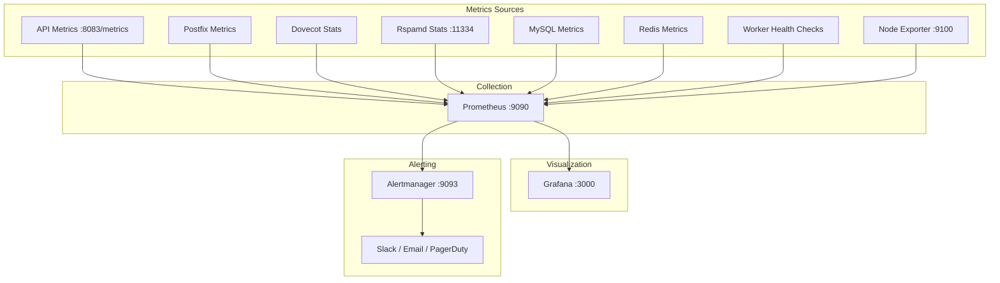

# Monitoring Setup

> **Enterprise Edition** — This feature is available in [Mailyte Enterprise](https://mailyte.com). The Community Edition does not include this functionality.


This guide walks you through setting up complete monitoring for your Mailyte deployment. By the end, you'll have dashboards showing everything from queue depth to disk usage, with alerts that wake you up when something breaks.

## What You're Monitoring



## Step 1: Enable the Monitoring Stack

Mailyte includes a monitoring Docker Compose overlay. Enable it:

```bash
# Start the monitoring stack alongside the main services
docker compose -f docker-compose.yml -f docker-compose.monitoring.yml up -d
```

Or add the monitoring services to your main `docker-compose.yml`:

```yaml
services:
  prometheus:
    image: prom/prometheus:latest
    container_name: prometheus
    ports:
      - "9090:9090"
    volumes:
      - ./monitoring/prometheus/prometheus.yml:/etc/prometheus/prometheus.yml
      - ./monitoring/prometheus/alerts:/etc/prometheus/alerts
      - prometheus_data:/prometheus
    command:
      - '--config.file=/etc/prometheus/prometheus.yml'
      - '--storage.tsdb.retention.time=30d'
      - '--web.enable-lifecycle'
    networks:
      - mailserver_network
    restart: unless-stopped

  grafana:
    image: grafana/grafana:latest
    container_name: grafana
    ports:
      - "3000:3000"
    environment:
      - GF_SECURITY_ADMIN_PASSWORD=${GRAFANA_PASSWORD:-admin}
      - GF_INSTALL_PLUGINS=grafana-clock-panel,grafana-simple-json-datasource
    volumes:
      - grafana_data:/var/lib/grafana
      - ./monitoring/grafana/provisioning:/etc/grafana/provisioning
      - ./monitoring/grafana/dashboards:/var/lib/grafana/dashboards
    depends_on:
      - prometheus
    networks:
      - mailserver_network
    restart: unless-stopped

  alertmanager:
    image: prom/alertmanager:latest
    container_name: alertmanager
    ports:
      - "9093:9093"
    volumes:
      - ./monitoring/alertmanager/alertmanager.yml:/etc/alertmanager/alertmanager.yml
    networks:
      - mailserver_network
    restart: unless-stopped

  node-exporter:
    image: prom/node-exporter:latest
    container_name: node-exporter
    ports:
      - "9100:9100"
    volumes:
      - /proc:/host/proc:ro
      - /sys:/host/sys:ro
      - /:/rootfs:ro
    command:
      - '--path.procfs=/host/proc'
      - '--path.sysfs=/host/sys'
      - '--path.rootfs=/rootfs'
    networks:
      - mailserver_network
    restart: unless-stopped

volumes:
  prometheus_data:
  grafana_data:
```

## Step 2: Configure Prometheus

See [Prometheus Configuration](prometheus-configuration.md) for the full config. The quick version:

```yaml
# monitoring/prometheus/prometheus.yml
global:
  scrape_interval: 15s
  evaluation_interval: 15s

rule_files:
  - "alerts/*.yml"

alerting:
  alertmanagers:
    - static_configs:
        - targets: ["alertmanager:9093"]

scrape_configs:
  - job_name: "mailyte-api"
    static_configs:
      - targets: ["api:8080"]

  - job_name: "mailyte-workers"
    static_configs:
      - targets:
          - "tracking:8086"
          - "webhooks:8081"
          - "analytics:8082"
          - "rate-limiter:8084"
          - "queue-manager:8085"
          - "storage-usage:8087"
          - "monitoring:8088"

  - job_name: "rspamd"
    static_configs:
      - targets: ["rspamd:11334"]

  - job_name: "node"
    static_configs:
      - targets: ["node-exporter:9100"]
```

## Step 3: Set Up Alerts

Create alert rules that matter:

```yaml
# monitoring/prometheus/alerts/mailyte.yml
groups:
  - name: mailyte
    rules:
      - alert: MailQueueBacklog
        expr: mailyte_mail_queue_size > 1000
        for: 5m
        labels:
          severity: warning
        annotations:
          summary: "Mail queue has {{ $value }} messages"

      - alert: HighBounceRate
        expr: rate(mailyte_emails_bounced_total[1h]) / rate(mailyte_emails_sent_total[1h]) > 0.05
        for: 15m
        labels:
          severity: critical
        annotations:
          summary: "Bounce rate is {{ $value | humanizePercentage }}"

      - alert: ServiceDown
        expr: up == 0
        for: 1m
        labels:
          severity: critical
        annotations:
          summary: "{{ $labels.job }} is down"

      - alert: DiskSpacelow
        expr: node_filesystem_avail_bytes{mountpoint="/"} / node_filesystem_size_bytes{mountpoint="/"} < 0.1
        for: 5m
        labels:
          severity: critical
        annotations:
          summary: "Less than 10% disk space remaining"

      - alert: HighMemoryUsage
        expr: (1 - node_memory_MemAvailable_bytes / node_memory_MemTotal_bytes) > 0.9
        for: 5m
        labels:
          severity: warning
        annotations:
          summary: "Memory usage above 90%"
```

## Step 4: Configure Alertmanager

Route alerts to Slack, email, or PagerDuty:

```yaml
# monitoring/alertmanager/alertmanager.yml
global:
  resolve_timeout: 5m

route:
  group_by: ["alertname", "severity"]
  group_wait: 10s
  group_interval: 10s
  repeat_interval: 1h
  receiver: "slack-notifications"

  routes:
    - match:
        severity: critical
      receiver: "pagerduty-critical"

receivers:
  - name: "slack-notifications"
    slack_configs:
      - api_url: "https://hooks.slack.com/services/YOUR/SLACK/WEBHOOK"
        channel: "#mailyte-alerts"
        title: '{{ .GroupLabels.alertname }}'
        text: '{{ range .Alerts }}{{ .Annotations.summary }}{{ end }}'

  - name: "pagerduty-critical"
    pagerduty_configs:
      - service_key: "YOUR_PAGERDUTY_KEY"
```

## Step 5: Set Up Grafana Dashboards

See [Grafana Setup](grafana-setup.md) for detailed instructions. Quick start:

1. Open Grafana at `http://your-server:3000`
2. Log in with admin / the password you set
3. Add Prometheus as a data source: `http://prometheus:9090`
4. Import the bundled dashboards from `monitoring/grafana/dashboards/`

## Step 6: Health Check Endpoints

Every Mailyte service exposes a health check endpoint:

| Service | Endpoint | Port |
|---------|----------|------|
| API | `/health` | 8080 |
| Tracking | `/health` | 8086 |
| Webhooks | `/health` | 8081 |
| Analytics | `/health` | 8082 |
| Rate Limiter | `/health` | 8084 |
| Queue Manager | `/health` | 8085 |
| Storage | `/health` | 8087 |
| Monitoring | `/health` | 8088 |

Test them:

```bash
# Check all services
for port in 8080 8081 8082 8084 8085 8086 8087 8088; do
  status=$(curl -s -o /dev/null -w "%{http_code}" http://localhost:$port/health)
  echo "Port $port: $status"
done
```

## What to Watch

These are the metrics that matter most:

| Metric | Healthy Range | Action if Exceeded |
|--------|--------------|-------------------|
| Mail queue depth | < 100 | Check Postfix, increase workers |
| Bounce rate | < 2% | Clean lists, check blacklists |
| Spam score (avg) | < 5 | Review Rspamd config |
| API latency (p95) | < 500ms | Check DB connections, add caching |
| Disk usage | < 80% | Clean logs, archive mail, expand disk |
| Memory usage | < 85% | Increase RAM or tune services |
| MySQL connections | < 80% of max | Increase max_connections |
| Redis memory | < 80% of maxmemory | Increase limit or tune eviction |

## Uptime Monitoring (External)

Internal monitoring is blind to network issues. Add external monitoring:

- **[UptimeRobot](https://uptimerobot.com/)** — free tier monitors 50 endpoints
- **[Uptime Kuma](https://github.com/louislam/uptime-kuma)** — self-hosted alternative
- **Port monitoring** — check that ports 25, 587, 993 are reachable from outside

```bash
# Test from an external server
nc -zv mail.yourdomain.com 25
nc -zv mail.yourdomain.com 587
nc -zv mail.yourdomain.com 993
```
