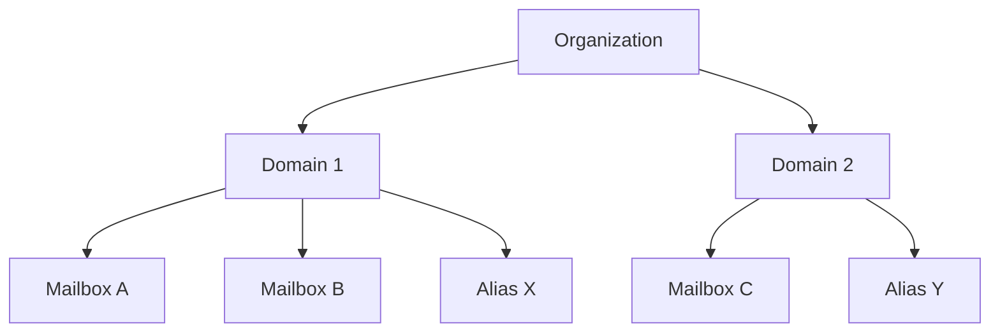

# Managing Organizations

Mailyte is multi-tenant. Organizations are the top-level container — each org owns domains, which own mailboxes. This guide covers managing orgs beyond the basics.

## Organization Hierarchy



Each organization has:

- A unique ID (string, you choose it)
- An optional `external_id` for mapping to your billing system
- Settings, rate limits, and storage quotas as JSON fields
- Webhook URLs for event notifications
- One or more domains

## Creating Organizations

### Single Organization

```bash
curl -X POST http://mail.yourdomain.com:8083/api/v1/add/organization \
  -H "X-API-Key: YOUR_API_KEY" \
  -H "Content-Type: application/json" \
  -d '{
    "id": "acme-corp",
    "name": "Acme Corporation",
    "description": "Enterprise customer",
    "admin_email": "admin@acme.com",
    "admin_name": "Jane Smith",
    "external_id": "cust_12345"
  }'
```

### Bulk Creation

```python
import requests

API = "http://mail.yourdomain.com:8083/api/v1"
HEADERS = {"X-API-Key": "YOUR_API_KEY", "Content-Type": "application/json"}

customers = [
    {"id": "acme-corp", "name": "Acme Corporation", "external_id": "cust_001"},
    {"id": "globex", "name": "Globex Inc", "external_id": "cust_002"},
    {"id": "initech", "name": "Initech LLC", "external_id": "cust_003"},
]

for customer in customers:
    resp = requests.post(f"{API}/add/organization", headers=HEADERS, json={
        **customer,
        "admin_email": f"admin@{customer['id']}.com",
    })
    print(f"{customer['name']}: {resp.json()}")
```

## Quota Management

### Setting Rate Limits

Rate limits control how many emails an organization can send:

```bash
curl -X POST http://mail.yourdomain.com:8083/api/v1/edit/organization \
  -H "X-API-Key: YOUR_API_KEY" \
  -H "Content-Type: application/json" \
  -d '{
    "items": ["acme-corp"],
    "attr": {
      "rate_limits": {
        "emails_per_hour": 1000,
        "emails_per_day": 10000,
        "emails_per_month": 200000
      }
    }
  }'
```

### Setting Storage Quotas

```bash
curl -X POST http://mail.yourdomain.com:8083/api/v1/edit/organization \
  -H "X-API-Key: YOUR_API_KEY" \
  -H "Content-Type": "application/json" \
  -d '{
    "items": ["acme-corp"],
    "attr": {
      "storage_quotas": {
        "max_storage_bytes": 107374182400,
        "max_domains": 10,
        "max_mailboxes_per_domain": 100,
        "max_aliases_per_domain": 500
      }
    }
  }'
```

!!! info "Quota enforcement"
    The rate limiter worker checks quotas in real-time via Redis. When an org exceeds its rate limit, outgoing emails are deferred (not rejected) until the window resets. Storage quotas are enforced at the Dovecot level — users can't receive email once their mailbox is full.

### Quota Tiers

A common pattern is defining tiers:

```python
TIERS = {
    "free": {
        "rate_limits": {"emails_per_day": 100, "emails_per_month": 1000},
        "storage_quotas": {"max_storage_bytes": 1 * 1024**3, "max_domains": 1, "max_mailboxes_per_domain": 5}
    },
    "starter": {
        "rate_limits": {"emails_per_day": 5000, "emails_per_month": 50000},
        "storage_quotas": {"max_storage_bytes": 10 * 1024**3, "max_domains": 3, "max_mailboxes_per_domain": 25}
    },
    "business": {
        "rate_limits": {"emails_per_day": 50000, "emails_per_month": 500000},
        "storage_quotas": {"max_storage_bytes": 100 * 1024**3, "max_domains": 10, "max_mailboxes_per_domain": 100}
    },
    "enterprise": {
        "rate_limits": {"emails_per_day": 500000, "emails_per_month": 5000000},
        "storage_quotas": {"max_storage_bytes": 1024 * 1024**3, "max_domains": 50, "max_mailboxes_per_domain": 1000}
    }
}

def apply_tier(org_id: str, tier: str):
    config = TIERS[tier]
    requests.post(f"{API}/edit/organization", headers=HEADERS, json={
        "items": [org_id],
        "attr": config
    })
```

## Monitoring Organization Usage

### Get Usage Stats

```bash
# All orgs overview
curl http://mail.yourdomain.com:8083/api/v1/get/organization/all \
  -H "X-API-Key: YOUR_API_KEY"

# Specific org
curl http://mail.yourdomain.com:8083/api/v1/get/organization/acme-corp \
  -H "X-API-Key: YOUR_API_KEY"
```

### Build a Usage Report

```python
def generate_usage_report():
    """Generate a usage report for all organizations."""
    orgs = requests.get(f"{API}/get/organization/all", headers=HEADERS).json()

    report = []
    for org in orgs:
        org_id = org["id"]
        domains = requests.get(f"{API}/get/domain/all",
            headers=HEADERS, params={"organization_id": org_id}).json()

        total_storage = sum(d.get("total_storage_used", 0) for d in domains)
        total_mailboxes = sum(d.get("total_email_accounts", 0) for d in domains)
        total_emails = sum(d.get("total_emails", 0) for d in domains)

        report.append({
            "org_id": org_id,
            "name": org.get("name"),
            "external_id": org.get("external_id"),
            "domains": len(domains),
            "mailboxes": total_mailboxes,
            "emails_total": total_emails,
            "storage_gb": round(total_storage / (1024**3), 2),
            "active": org.get("active", True),
        })

    return sorted(report, key=lambda x: x["storage_gb"], reverse=True)
```

## Billing Integration

### Using external_id for Mapping

The `external_id` field maps an organization to your billing system:

```python
# When a customer signs up in your billing system
def on_customer_created(billing_customer_id: str, name: str, plan: str):
    org_id = f"org-{billing_customer_id}"

    # Create org in Mailyte
    requests.post(f"{API}/add/organization", headers=HEADERS, json={
        "id": org_id,
        "name": name,
        "external_id": billing_customer_id,
    })

    # Apply plan quotas
    apply_tier(org_id, plan)
```

### Webhook-Based Billing

Set up a webhook to track usage events:

```python
@app.route("/webhooks/mailyte/billing", methods=["POST"])
def track_usage():
    payload = request.get_json()
    event = payload.get("event")

    if event == "email.smtp.outbound":
        org_id = payload["payload"].get("organization_id")
        # Increment usage counter in your billing system
        billing_api.increment_usage(org_id, "emails_sent", 1)

    return jsonify({"status": "ok"})
```

## Suspending and Deactivating

### Suspend an Organization

Suspending stops all email flow but preserves data:

```bash
curl -X POST http://mail.yourdomain.com:8083/api/v1/edit/organization \
  -H "X-API-Key: YOUR_API_KEY" \
  -H "Content-Type: application/json" \
  -d '{
    "items": ["acme-corp"],
    "attr": {
      "active": false
    }
  }'
```

When inactive:

- Outbound email is rejected
- Inbound email bounces with a temporary error
- IMAP/POP3 access is denied
- API calls scoped to this org return 403

### Reactivate

```bash
curl -X POST http://mail.yourdomain.com:8083/api/v1/edit/organization \
  -H "X-API-Key: YOUR_API_KEY" \
  -H "Content-Type: application/json" \
  -d '{
    "items": ["acme-corp"],
    "attr": {
      "active": true
    }
  }'
```

### Delete an Organization

!!! danger "Permanent deletion"
    This deletes all domains, mailboxes, aliases, and stored email. There is no undo.

```bash
curl -X POST http://mail.yourdomain.com:8083/api/v1/delete/organization \
  -H "X-API-Key: YOUR_API_KEY" \
  -H "Content-Type: application/json" \
  -d '["acme-corp"]'
```

## Per-Organization Webhooks

Each org can have its own webhook endpoints:

```bash
curl -X POST http://mail.yourdomain.com:8083/api/v1/edit/organization \
  -H "X-API-Key: YOUR_API_KEY" \
  -H "Content-Type: application/json" \
  -d '{
    "items": ["acme-corp"],
    "attr": {
      "webhook_urls": ["https://acme.com/webhooks/email"],
      "webhook_secret": "acme-webhook-secret-xyz"
    }
  }'
```

Events for that org's domains and mailboxes will be sent to these URLs in addition to any global webhook endpoints.
