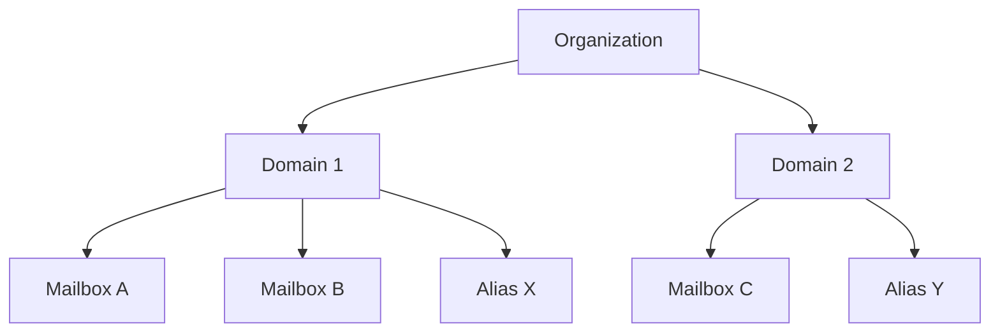

# Managing Organizations

Mailyte is multi-tenant. Organizations are the top-level container — each org owns domains, which own mailboxes. This guide covers managing orgs beyond the basics.

!!! info "API base URL and scope"
    Examples use `https://api.yourdomain.com` (Traefik publishes the API at `api.<your-domain>` in production; a dev checkout exposes it at `http://localhost:8083`). Creating and deleting organizations requires an **admin-scoped platform** API key — tenant credentials cannot manage tenants.

## Organization Hierarchy



Each organization has:

- A unique ID (string, you choose it — alphanumerics, hyphens, underscores)
- An optional `external_id` for mapping to your billing system (unique)
- `settings`, `rate_limits`, and `storage_quotas` as JSON fields
- Optional `webhook_urls` / `webhook_secret` fields
- One or more domains

## Creating Organizations

### Single Organization

```bash
curl -X POST https://api.yourdomain.com/api/v1/organizations/ \
  -H "X-API-Key: YOUR_ADMIN_API_KEY" \
  -H "Content-Type: application/json" \
  -d '{
    "id": "acme-corp",
    "name": "Acme Corporation",
    "description": "Enterprise customer",
    "admin_email": "admin@acme.com",
    "admin_name": "Jane Smith",
    "external_id": "cust_12345"
  }'
```

Optional fields accepted at creation: `settings`, `rate_limits`, `storage_quotas`, `webhook_urls`, `webhook_secret`, `active`.

!!! note "Resellers"
    Reseller credentials create tenants through `POST /api/v1/reseller/sub-organizations` instead — organization creation on this endpoint is a platform-level action.

### Bulk Creation

```python
import requests

API = "https://api.yourdomain.com/api/v1"
HEADERS = {"X-API-Key": "YOUR_ADMIN_API_KEY", "Content-Type": "application/json"}

customers = [
    {"id": "acme-corp", "name": "Acme Corporation", "external_id": "cust_001"},
    {"id": "globex", "name": "Globex Inc", "external_id": "cust_002"},
    {"id": "initech", "name": "Initech LLC", "external_id": "cust_003"},
]

for customer in customers:
    resp = requests.post(
        f"{API}/organizations/",
        headers=HEADERS,
        json={
            **customer,
            "admin_email": f"admin@{customer['id']}.com",
        },
    )
    print(f"{customer['name']}: {resp.json()}")
```

## Quota Management

Rate limits and storage quotas live in the dedicated quotas endpoint. Reads and writes:

```bash
# Current limits and per-domain usage breakdown
curl https://api.yourdomain.com/api/v1/organizations/acme-corp/quotas \
  -H "X-API-Key: YOUR_API_KEY"

# Update
curl -X PUT https://api.yourdomain.com/api/v1/organizations/acme-corp/quotas \
  -H "X-API-Key: YOUR_API_KEY" \
  -H "Content-Type: application/json" \
  -d '{
    "rate_limits": {
      "emails_per_hour": 1000,
      "emails_per_day": 10000
    },
    "storage_quotas": {
      "max_storage_bytes": 107374182400,
      "max_domains": 10,
      "max_mailboxes_per_domain": 100
    }
  }'
```

!!! info "Operator overrides vs automated plan sync"
    A quota write by a human operator sets an **override flag**. Automated callers (for example a billing system syncing plan limits) are refused with `409` while an override stands, unless they pass `?force=true` — this stops a nightly plan sync from silently undoing a support engineer's deliberate change. Clear a standing override with:

    ```bash
    curl -X POST https://api.yourdomain.com/api/v1/organizations/acme-corp/quotas/clear-override \
      -H "X-API-Key: YOUR_API_KEY"
    ```

### Quota Tiers

A common pattern is defining tiers and applying them through the quotas endpoint:

```python
TIERS = {
    "free": {
        "rate_limits": {"emails_per_day": 100},
        "storage_quotas": {"max_storage_bytes": 1 * 1024**3, "max_domains": 1},
    },
    "starter": {
        "rate_limits": {"emails_per_day": 5000},
        "storage_quotas": {"max_storage_bytes": 10 * 1024**3, "max_domains": 3},
    },
    "business": {
        "rate_limits": {"emails_per_day": 50000},
        "storage_quotas": {"max_storage_bytes": 100 * 1024**3, "max_domains": 10},
    },
}


def apply_tier(org_id: str, tier: str):
    requests.put(f"{API}/organizations/{org_id}/quotas", headers=HEADERS, json=TIERS[tier])
```

Per-domain and per-mailbox sending limits are managed separately through the rate limiter API — see `GET/POST /api/v1/rate-limiter/rate-limits/domain/{domain}` and `.../rate-limits/mailbox/{email}`.

## Monitoring Organization Usage

### Get Usage Stats

```bash
# All orgs — paginated, searchable, sortable by name, created_at,
# domain_count, email_account_count, or total_storage_used
curl "https://api.yourdomain.com/api/v1/organizations/?sort_by=total_storage_used&sort_dir=desc" \
  -H "X-API-Key: YOUR_API_KEY"

# Specific org
curl https://api.yourdomain.com/api/v1/organizations/acme-corp \
  -H "X-API-Key: YOUR_API_KEY"

# Look up by your billing system's ID
curl https://api.yourdomain.com/api/v1/organizations/by-external-id/cust_12345 \
  -H "X-API-Key: YOUR_API_KEY"
```

### Build a Usage Report

```python
def generate_usage_report():
    """Storage and account usage for every organization."""
    orgs = requests.get(
        f"{API}/organizations/",
        headers=HEADERS,
        params={"sort_by": "total_storage_used", "sort_dir": "desc", "per_page": 100},
    ).json()["data"]["items"]

    report = []
    for org in orgs:
        quotas = requests.get(f"{API}/organizations/{org['id']}/quotas", headers=HEADERS).json()[
            "data"
        ]
        report.append(
            {
                "org_id": org["id"],
                "name": org.get("name"),
                "external_id": org.get("external_id"),
                "quotas": quotas,
            }
        )
    return report
```

(Adjust the response-unwrapping to the envelope your API version returns — every response carries `type`/`msg` plus a `data` payload.)

## Billing Integration

The `external_id` field maps an organization to your billing system, and `GET /organizations/by-external-id/{external_id}` resolves it back:

```python
def on_customer_created(billing_customer_id: str, name: str, plan: str):
    org_id = f"org-{billing_customer_id}"

    requests.post(
        f"{API}/organizations/",
        headers=HEADERS,
        json={"id": org_id, "name": name, "external_id": billing_customer_id},
    )
    apply_tier(org_id, plan)
```

For usage-based billing, consume platform webhook events (see [Custom Integrations](custom-integrations.md)) or poll the analytics endpoints per domain (`GET /api/v1/analytics/email-volume/{domain}`).

## Suspending and Deactivating

### Suspend an Organization

```bash
curl -X PUT https://api.yourdomain.com/api/v1/organizations/acme-corp \
  -H "X-API-Key: YOUR_API_KEY" \
  -H "Content-Type: application/json" \
  -d '{"active": false}'
```

!!! warning "What the flag does — and does not — enforce"
    `active: false` marks the organization inactive at the API level; data is preserved and the change is reversible. The mail path, however, enforces at the **domain** and **account** level: Postfix accepts inbound mail for any domain with `active = 1`, and Dovecot/SMTP authentication checks `email_accounts.status = 'active'`. To actually stop mail flow for a tenant, also disable its domains (`PUT /api/v1/domains/{domain_id}` with `{"active": false}`) or suspend its accounts.

    Dovecot caches authentication results for up to an hour, so a disabled account can keep logging in until the cache expires. Flush it to enforce immediately:

    ```bash
    docker exec dovecot doveadm auth cache flush
    ```

### Reactivate

```bash
curl -X PUT https://api.yourdomain.com/api/v1/organizations/acme-corp \
  -H "X-API-Key: YOUR_API_KEY" \
  -H "Content-Type: application/json" \
  -d '{"active": true}'
```

### Delete an Organization

!!! danger "The organization must be empty"
    `DELETE /api/v1/organizations/{id}` refuses to remove an organization that still has domains or email accounts — delete those first. This is deliberate: there is no single-call cascade that wipes a tenant's mail.

```bash
curl -X DELETE https://api.yourdomain.com/api/v1/organizations/acme-corp \
  -H "X-API-Key: YOUR_ADMIN_API_KEY"
```

## Per-Organization Webhook Fields

Each organization row can store `webhook_urls` and a `webhook_secret`:

```bash
curl -X PUT https://api.yourdomain.com/api/v1/organizations/acme-corp \
  -H "X-API-Key: YOUR_API_KEY" \
  -H "Content-Type: application/json" \
  -d '{
    "webhook_urls": ["https://acme.com/webhooks/email"],
    "webhook_secret": "acme-webhook-secret-xyz"
  }'
```

!!! warning "Delivery caveat"
    As of 2026-08-30 these organization-level fields are stored but not consumed by the event pipeline. Live event delivery goes to endpoints registered via `POST /api/v1/webhooks/endpoints` (for tracking, rate-limit, and storage events) and to the platform-wide `WEBHOOK_URL` (for mail-flow events). See [Custom Integrations](custom-integrations.md) for what actually fires where.
