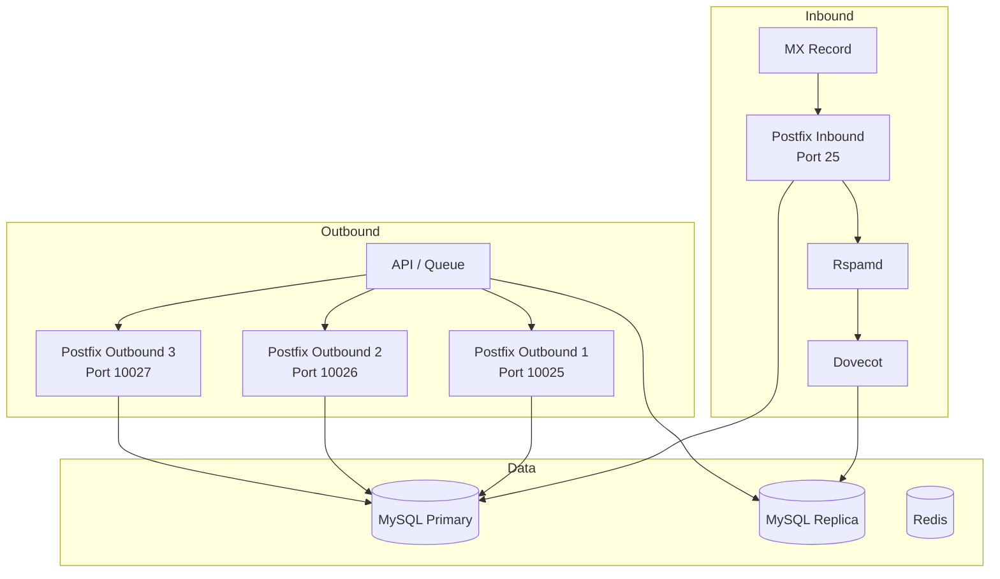
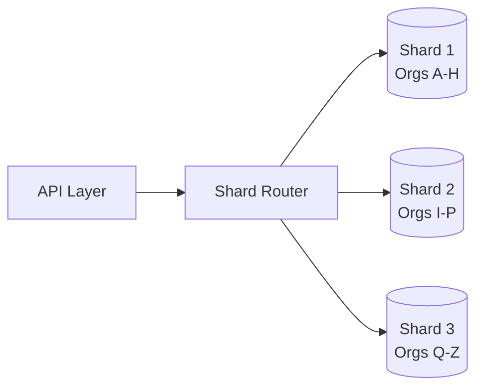

# Scaling to Millions

> **Enterprise Edition** — This feature is available in [Mailyte Enterprise](https://mailyte.com). The Community Edition does not include this functionality.


The default Mailyte setup handles tens of thousands of emails per day comfortably. To push into the millions, you need some architecture changes. This guide covers what to change and when.

## When to Start Scaling

| Daily Volume | Architecture |
|-------------|--------------|
| < 50,000 | Default single-server setup |
| 50,000 - 500,000 | Optimize queues, tune databases, add monitoring |
| 500,000 - 2,000,000 | Multiple Postfix instances, read replicas |
| 2,000,000+ | Full horizontal scaling, database sharding |

## Phase 1: Optimize the Single Server (up to 500K/day)

### Postfix Queue Tuning

The default Postfix config is conservative. For higher throughput:

```bash
# config/mailer/postfix/custom/main.cf

# Increase concurrent deliveries
default_destination_concurrency_limit = 20
smtp_destination_concurrency_limit = 20
local_destination_concurrency_limit = 5

# Increase process limits
default_process_limit = 200

# Reduce queue scan interval
queue_run_delay = 60s
minimal_backoff_time = 60s
maximal_backoff_time = 600s

# Increase connection cache
smtp_connection_cache_on_demand = yes
smtp_connection_cache_time_limit = 30s
smtp_connection_reuse_time_limit = 300s
```

!!! warning "Per-destination limits"
    Gmail and Microsoft rate-limit incoming SMTP connections. Don't set `smtp_destination_concurrency_limit` above 20 for external delivery or you'll get temporary blocks.

### MySQL Tuning

Edit your MySQL config or pass environment variables:

```yaml
# docker-compose.yml - mysql service
command: >
  --innodb-buffer-pool-size=2G
  --innodb-log-file-size=512M
  --innodb-flush-log-at-trx-commit=2
  --max-connections=500
  --query-cache-type=0
  --innodb-io-capacity=2000
  --innodb-io-capacity-max=4000
  --innodb-read-io-threads=8
  --innodb-write-io-threads=8
```

Key settings:

- **`innodb-buffer-pool-size`** — set to 50-70% of available RAM
- **`innodb-flush-log-at-trx-commit=2`** — trades durability for speed (safe for email)
- **`max-connections`** — enough for all workers + API + Postfix + Dovecot

### Redis Tuning

```yaml
# docker-compose.yml - redis service
command: >
  redis-server
  --appendonly yes
  --maxmemory 1gb
  --maxmemory-policy allkeys-lru
  --tcp-backlog 511
  --timeout 0
  --tcp-keepalive 300
```

### Worker Concurrency

Increase worker thread counts:

```bash
# Environment variables for workers
TRACKING_WORKERS=4
WEBHOOK_WORKERS=8
ANALYTICS_WORKERS=4
QUEUE_MANAGER_WORKERS=8
```

## Phase 2: Multiple Postfix Instances (up to 2M/day)

At this scale, a single Postfix instance becomes the bottleneck. Split inbound and outbound processing.

### Architecture



### Docker Compose for Multiple Outbound Instances

```yaml
# docker-compose.override.yml
services:
  postfix-outbound-1:
    build: ./mailer/postfix
    container_name: postfix-outbound-1
    environment:
      - INSTANCE_TYPE=outbound
      - INSTANCE_ID=1
      - DB_HOST=mysql
      - REDIS_HOST=redis
    ports:
      - "10025:25"
    networks:
      - mailserver_network

  postfix-outbound-2:
    build: ./mailer/postfix
    container_name: postfix-outbound-2
    environment:
      - INSTANCE_TYPE=outbound
      - INSTANCE_ID=2
      - DB_HOST=mysql
      - REDIS_HOST=redis
    ports:
      - "10026:25"
    networks:
      - mailserver_network

  postfix-outbound-3:
    build: ./mailer/postfix
    container_name: postfix-outbound-3
    environment:
      - INSTANCE_TYPE=outbound
      - INSTANCE_ID=3
      - DB_HOST=mysql
      - REDIS_HOST=redis
    ports:
      - "10027:25"
    networks:
      - mailserver_network
```

### Queue Manager Load Balancing

The queue manager worker distributes outbound emails across Postfix instances:

```python
# Round-robin across outbound instances
OUTBOUND_INSTANCES = [
    "postfix-outbound-1:25",
    "postfix-outbound-2:25",
    "postfix-outbound-3:25",
]
```

### MySQL Read Replicas

Move read-heavy queries (mailbox lookups, auth checks, stats) to a replica:

```yaml
mysql-replica:
  image: mysql:8.0
  container_name: mysql-replica
  environment:
    - MYSQL_ROOT_PASSWORD=${DB_ROOT_PASSWORD}
  command: >
    --server-id=2
    --read-only=ON
    --super-read-only=ON
    --replicate-do-db=${DB_NAME:-mailserver}
  volumes:
    - mysql_replica_data:/var/lib/mysql
  networks:
    - mailserver_network
```

Configure the API and workers to use the replica for reads:

```bash
DB_READ_HOST=mysql-replica
DB_WRITE_HOST=mysql
```

## Phase 3: Full Horizontal Scaling (2M+/day)

### Database Sharding

Shard by organization ID. Each shard holds a subset of organizations and all their associated data.



The shard router maps `organization_id` to a database connection:

```python
def get_shard(org_id: str) -> str:
    """Return the shard database host for this org."""
    shard_index = hash(org_id) % NUM_SHARDS
    return SHARD_HOSTS[shard_index]
```

### Multiple API Instances Behind a Load Balancer

```yaml
# Use Docker Compose scaling
services:
  api:
    build: ./worker/api
    deploy:
      replicas: 4
    # ... rest of config
```

Put Nginx or HAProxy in front:

```nginx
upstream mailyte_api {
    least_conn;
    server api-1:8080;
    server api-2:8080;
    server api-3:8080;
    server api-4:8080;
}

server {
    listen 443 ssl;
    location /api/ {
        proxy_pass http://mailyte_api;
    }
}
```

### Dedicated Queue Database

At very high volumes, the `mail_queue` table gets hammered. Move it to a dedicated MySQL instance or switch to Redis Streams:

```bash
QUEUE_DB_HOST=mysql-queue
QUEUE_DB_NAME=mailyte_queue
```

### Monitoring at Scale

At this volume, monitoring is not optional. You need:

- **Prometheus + Grafana** for real-time metrics
- **Alerting** on queue depth, bounce rates, latency
- **Per-instance dashboards** to spot bottlenecks

See [Monitoring Setup](monitoring-setup.md) and [Prometheus Configuration](prometheus-configuration.md).

## Performance Benchmarks

Measured on a 8-core, 32GB RAM server with NVMe storage:

| Configuration | Throughput | Latency (p95) |
|--------------|------------|----------------|
| Default single instance | ~2,000/hour | 1.2s |
| Tuned single instance | ~15,000/hour | 0.8s |
| 3 outbound instances | ~40,000/hour | 0.5s |
| 3 outbound + read replica | ~60,000/hour | 0.3s |
| Full horizontal (4 servers) | ~200,000/hour | 0.2s |

## Key Takeaways

1. **Tune before you scale** — most setups never need more than Phase 1
2. **Queue depth is your early warning** — if it keeps growing, you need more capacity
3. **Separate inbound and outbound** — they have different bottlenecks
4. **Read replicas give the most bang for the buck** — Dovecot and the API are read-heavy
5. **Monitor everything** — you can't optimize what you can't measure
