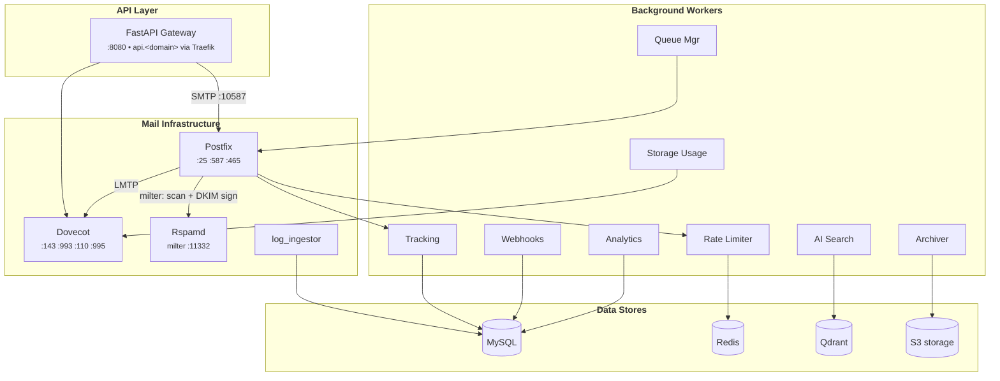

---
hide:
  - navigation
  - toc
---

# Mailyte Email Server Handbook

The complete developer guide to the Mailyte Email Server — the infrastructure behind Mailyte's email hosting platform. Everything from first setup to scaling to millions of emails, explained in plain language.

-   :material-rocket-launch:{ .lg .middle } **Getting Started**

    ---

    Install the server, configure your environment, and send your first email in under 15 minutes.

    [:octicons-arrow-right-24: Jump in](getting-started/index.md)

-   :material-sitemap:{ .lg .middle } **Architecture**

    ---

    How all the pieces fit together — services, data flows, database design, and multi-tenant isolation.

    [:octicons-arrow-right-24: See the big picture](architecture/index.md)

-   :material-api:{ .lg .middle } **API Reference**

    ---

    Every REST endpoint documented with parameters, response schemas, and copy-paste examples in 4 languages.

    [:octicons-arrow-right-24: Explore the API](api/index.md)

-   :material-cog:{ .lg .middle } **Configuration**

    ---

    Fine-tune Postfix, Dovecot, Rspamd, SSL certificates, DNS records, and performance knobs.

    [:octicons-arrow-right-24: Configure it](configuration/index.md)

-   :material-shield-check:{ .lg .middle } **Security**

    ---

    Authentication, encryption at every layer, intrusion detection, and a pre-launch hardening checklist.

    [:octicons-arrow-right-24: Lock it down](security/index.md)

-   :material-wrench:{ .lg .middle } **Development**

    ---

    Set up your dev environment, build custom workers, write tests, and ship releases.

    [:octicons-arrow-right-24: Start building](development/index.md)

---

## What is Mailyte Email Server?

It's a complete, production-ready email system that runs inside Docker containers. It handles the entire lifecycle of an email — from the moment someone clicks "Send" to delivery, spam filtering, tracking, and storage.

Here's what you get out of the box:

| Capability | What it does | Powered by |
|-----------|-------------|------------|
| **Send & receive email** | SMTP inbound/outbound with database-driven virtual domains | Postfix |
| **Email client access** | IMAP, POP3, JMAP, ManageSieve — plus client auto-configuration (autoconfig/autodiscover/MTA-STS) | Dovecot, jmap worker, autoconfig worker |
| **Spam filtering & DKIM** | Machine-learning spam detection inbound, per-domain DKIM signing outbound | Rspamd (ClamAV optional, not deployed by default) |
| **REST API** | Manage everything programmatically — orgs, domains, mailboxes, SMTP credentials | FastAPI gateway (34 route modules) |
| **SMTP credentials** | Per-mailbox API keys for sending, revocable with immediate effect | SMTP credentials module + Dovecot doveadm |
| **Email tracking** | Open pixels, click-through link rewrites, engagement analytics | Tracking worker + Postfix content filter |
| **Email logs** | Per-message delivery records and delivery-event feed | log_ingestor (tails Postfix's log) |
| **AI-powered search** | Semantic email search using vector embeddings | Qdrant + RAG worker |
| **Real-time webhooks** | Signed, retried callbacks for mail, tracking, storage, and security events | Shared webhook dispatcher + webhooks worker |
| **Auto SSL certificates** | Let's Encrypt with auto-renewal, per-domain SNI, and Traefik integration | cert_manager |
| **Monitoring** | Prometheus metrics, Grafana dashboards, health checks, auto-restart | Monitoring stack + monitoring worker |
| **Multi-tenant** | Full data isolation per organization with quota management | Built into every layer |
| **Mail archiving** | Every message archived, age-encrypted, to S3-compatible storage | Archiver worker |
| **Rate limiting** | Per-sender, per-org, and per-key abuse prevention, enforced inside Postfix | Rate limiter + Redis |

---

## The Architecture at a Glance

The server is organized in three layers, all running as Docker containers:

!!! tip "The 30-second version"
    **Postfix** sends and receives email. **Dovecot** lets email clients read it. **Rspamd** blocks spam coming in and DKIM-signs mail going out. The **FastAPI gateway** manages everything and serves the webmail. **Workers** handle tracking, webhooks, analytics, archiving, and more; **log_ingestor** turns Postfix's log into queryable email logs. **MySQL** stores the data, **Redis** caches it, **Qdrant** powers AI search, and **S3** holds the encrypted archive.

---

## System Requirements

| Resource | Minimum | Recommended | High Volume |
|----------|---------|-------------|-------------|
| **CPU** | 2 cores | 4 cores | 8+ cores |
| **RAM** | 4 GB | 8 GB | 16+ GB |
| **Disk** | 50 GB SSD | 200 GB SSD | 1 TB+ NVMe |
| **Network** | 100 Mbps | 1 Gbps | 10+ Gbps |
| **Docker** | 24.0+ | Latest | Latest |
| **Docker Compose** | v2.20+ | Latest | Latest |

---

## Where to Start

=== "I need to set this up"

    Head to the [Installation Guide](getting-started/installation.md) for a step-by-step walkthrough. You'll have a working server in about 15 minutes.

=== "I need to understand how it works"

    Start with the [Architecture Overview](architecture/index.md) to see the big picture, then dive into [How Data Flows](architecture/data-flow.md) to follow an email through the system.

=== "I need to call the API"

    The [API Reference](api/index.md) has every endpoint documented. Check the [Quickstart](api/examples/quickstart.md) for ready-to-use snippets in curl, Python, JavaScript, and PHP.

=== "I need to add a feature"

    The [Development Guide](development/index.md) covers your dev environment setup, and [Building Custom Workers](development/custom-workers.md) shows you how to extend the system.

=== "Something is broken"

    Jump to [Troubleshooting](guides/troubleshooting/email-delivery-issues.md) for the most common issues, or check [Health Checks](monitoring/health-checks.md) to diagnose service problems.

---

  Built with :material-heart: by the Mailyte engineering team at <strong>TechiesAfrica</strong>

