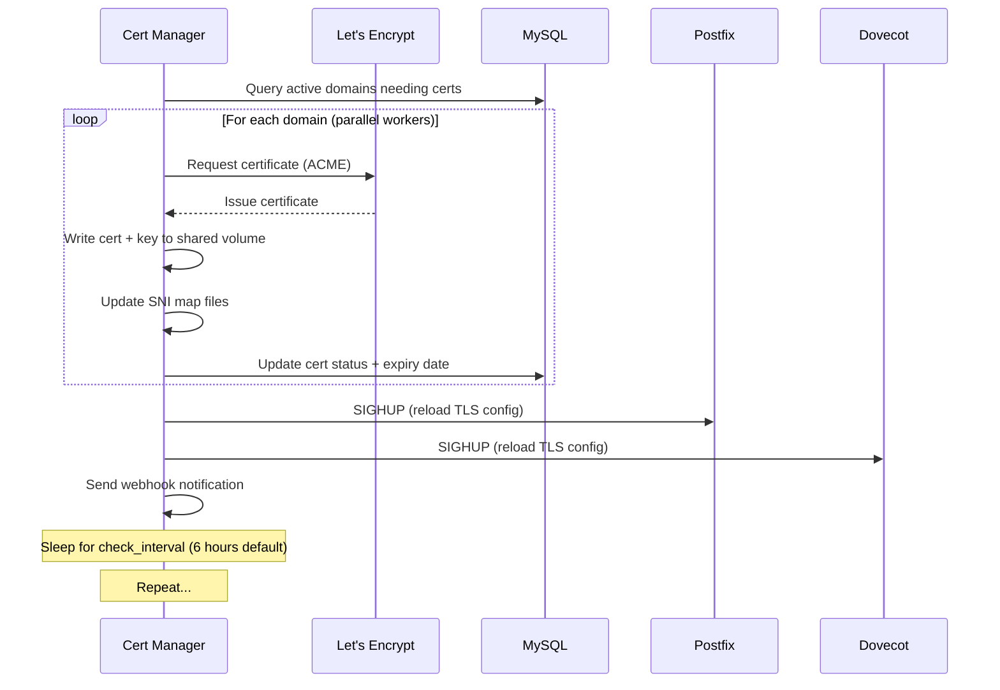

# Certificate Manager -- Automated SSL

The certificate manager handles the entire lifecycle of TLS certificates for the mail server. It obtains certificates from Let's Encrypt, monitors expiration, auto-renews before they expire, and distributes them to Postfix and Dovecot. In development mode, the mail services generate self-signed certs; in production, this service takes over with real ones.

## What It Does

- Obtains Let's Encrypt certificates via ACME (HTTP-01 or DNS-01 challenges)
- Monitors certificate expiration and auto-renews 30 days before expiry
- Supports **SNI** (Server Name Indication) for hosting multiple domains on one IP
- Supports **wildcard certificates** via DNS-01 challenges
- Distributes certs to shared volumes that Postfix and Dovecot mount
- Sends **SIGHUP** to Postfix and Dovecot containers to reload certs without downtime
- Fires **webhook notifications** on cert events (issued, renewed, failed)
- Supports **multiple ACME accounts** to multiply Let's Encrypt rate limits
- Runs parallel cert workers for processing many domains concurrently

## How It Works



## ACME Challenge Flow

### HTTP-01 (Default, via webroot)

The cert manager does **not** bind port 80 -- Traefik owns port 80 permanently as the reverse proxy, and only one process can bind it. Instead, certbot runs in `--webroot` mode, writing challenge files into the shared `ACME_WEBROOT_PATH` (`./storage/acme_challenge`). A tiny nginx container (`acme_webroot`) serves that directory, and Traefik routes `/.well-known/acme-challenge/*` to it for **any** hostname, at high priority so the HTTPS redirect never swallows a challenge.

For this to work, port 80 must be open to the internet (on Traefik) and DNS must point the hostname at this server. `CERT_SERVER_IPS` tells cert_manager this server's public address(es) so it can skip SAN candidates that point elsewhere -- it cannot resolve its own hostname from inside the container (Docker answers with the private 172.x address), and one wrong SAN fails the whole certbot order.

!!! warning "Traefik's built-in ACME stays off"
    Every Traefik router uses `tls=true` with **no certResolver**. Configuring one makes Traefik intercept `/.well-known/acme-challenge/` on that entrypoint, which swallowed cert_manager's challenges in production once already. One ACME client (this one) issues everything; Traefik reads the results through its file provider (`traefik_certs.yml`, written by cert_manager into `storage/sni_config/`).

### DNS-01 (For Wildcards)

Wildcard certificates (`*.yourdomain.com`) require DNS-01 validation. The cert manager creates a TXT record at `_acme-challenge.yourdomain.com` via your DNS provider's API.

Supported DNS providers are configured via the `DNS_PROVIDER` env var (e.g., `route53`, `cloudflare`).

## SNI Setup

SNI lets the server present different certificates for different domains. This is how you host `mail.company-a.com` and `mail.company-b.com` on the same server.

The cert manager writes two map files:

**For Postfix** (`/etc/ssl/sni/postfix_sni.map`):
```
mail.company-a.com /etc/ssl/sni/company-a.key /etc/ssl/sni/company-a.crt
mail.company-b.com /etc/ssl/sni/company-b.key /etc/ssl/sni/company-b.crt
```

After writing, it runs `postmap -F hash:/etc/postfix/sni_certs.map` and sends SIGHUP.

**For Dovecot** (`/etc/ssl/sni/dovecot_sni.conf`):
```
local_name mail.company-a.com {
  ssl_cert = </etc/ssl/sni/company-a.crt
  ssl_key  = </etc/ssl/sni/company-a.key
}
```

Dovecot reloads on SIGHUP without dropping existing connections.

## ACME Account Rotation

Let's Encrypt has rate limits: 300 new orders per 3 hours per account. If you manage many domains, you can configure multiple ACME accounts to multiply this limit:

```bash
# 3 accounts = 900 orders / 3 hours
ACME_EMAILS=acme1@company.com,acme2@company.com,acme3@company.com
```

The cert manager round-robins through accounts for each certificate request.

## Configuration

| Variable | Default | Description |
|----------|---------|-------------|
| `ACME_EMAIL` | `admin@localhost` | Primary ACME account email |
| `ACME_EMAILS` | (same as above) | Comma-separated list of ACME accounts for rotation |
| `ACME_STAGING` | `true` | Use Let's Encrypt staging (set to `false` for production) |
| `SSL_CERT_PATH` | `/etc/ssl/certs` | Where to write certificate files |
| `SSL_KEY_PATH` | `/etc/ssl/private` | Where to write key files |
| `SNI_CONFIG_PATH` | `/etc/ssl/sni` | Where to write SNI map files |
| `CERT_RENEWAL_DAYS` | `30` | Renew when cert has this many days left |
| `CERT_CHECK_INTERVAL` | `21600` | Seconds between expiration checks (6 hours) |
| `CERT_WORKER_THREADS` | `3` | Number of parallel certbot processes |
| `USE_WILDCARD_CERTS` | `false` | Enable wildcard certificate strategy |
| `WILDCARD_DOMAIN` | (empty) | Base domain for wildcard cert |
| `DNS_PROVIDER` | (empty) | DNS provider for DNS-01 challenges |
| `DOCKER_RELOAD_ENABLED` | `false` in code, `true` in compose | Reload Postfix/Dovecot after cert changes |
| `DOCKER_PROXY_URL` | `http://docker-proxy:2375` | Scoped Docker API used for those reloads -- there is no socket mount |
| `POSTFIX_CONTAINER` / `DOVECOT_CONTAINER` | `postfix` / `dovecot` | Container names to reload |
| `CERT_SERVER_IPS` | (empty) | This server's public IP(s) -- must be set explicitly; self-resolution answers with the container's private address |
| `TRAEFIK_ADMIN_SUBDOMAINS` | `api,autoconfig,jmap,caldav,docs,grafana,traefik,console` | Which `<sub>.${DOMAIN}` names get Traefik-facing certs. Must be passed through compose -- setting it only in `.env` does nothing |
| `TRAEFIK_EXTRA_HOSTNAMES` | (empty) | Fully-qualified extra hostnames not under `${DOMAIN}` (e.g. the webmail's public name); same compose-passthrough caveat |
| `ACME_WEBROOT_PATH` | `/var/www/acme-challenge` | HTTP-01 webroot shared with the `acme_webroot` container |
| `MAIL_HOSTNAME` | (empty) | Customer-facing mail hostname to certify, distinct from `HOSTNAME` |
| `WEBHOOK_URLS` | (empty) | Comma-separated webhook URLs for cert events |
| `WEBHOOK_SECRET` | (empty) | HMAC secret for webhook signing |
| `DB_HOST` | `mysql` | MySQL host |
| `DB_NAME` | `mailserver` | Database name |

## Database Tables

The cert manager tracks certificate state in the `ssl_certificates` table:

| Column | Type | Description |
|--------|------|-------------|
| `id` | INT | Primary key |
| `domain` | VARCHAR | Domain name |
| `cert_path` | VARCHAR | Path to certificate file |
| `key_path` | VARCHAR | Path to private key file |
| `issuer` | VARCHAR | Certificate issuer (Let's Encrypt) |
| `issued_at` | DATETIME | When the cert was issued |
| `expires_at` | DATETIME | Expiration date |
| `status` | ENUM | `active`, `pending`, `expired`, `failed` |
| `last_renewal_attempt` | DATETIME | Last renewal attempt timestamp |
| `renewal_error` | TEXT | Error message from last failed renewal |

## Troubleshooting Renewal Failures

### "Rate limit exceeded"

Let's Encrypt limits you to 50 certificates per registered domain per week and 300 new orders per 3 hours per account. Solutions:

1. Add more ACME accounts via `ACME_EMAILS`
2. Use wildcard certs to cover many subdomains with one cert
3. Wait for the rate limit window to pass

### "DNS problem: NXDOMAIN"

Your domain's DNS is not pointing to this server. Verify with:

```bash
dig +short A mail.yourdomain.com
```

### "Challenge failed: Connection refused" / 404 on the challenge

Port 80 must reach Traefik, and Traefik must route `/.well-known/acme-challenge/*` to the `acme_webroot` container. Common causes:

- Firewall blocking port 80
- The `acme_webroot` container not running
- The hostname resolving to a different server (see `CERT_SERVER_IPS`)

### "Certificate not being picked up"

After issuance, the cert must be on the shared volume and the mail services must reload:

1. Check that `SSL_CERT_PATH` matches what Postfix/Dovecot expect
2. Verify `DOCKER_RELOAD_ENABLED=true` if you want automatic SIGHUP
3. Alternatively, restart the mail containers manually

## Docker Configuration

```yaml
cert_manager:
  build: ./mailer/cert_manager
  container_name: cert_manager
  # No port 80 binding -- Traefik owns 80; challenges go through acme_webroot
  volumes:
    - ./storage/ssl_certs:/etc/ssl/certs
    - ./storage/ssl_private:/etc/ssl/private
    - ./storage/sni_config:/etc/ssl/sni
    - letsencrypt_data:/etc/letsencrypt
    - ./storage/acme_challenge:/var/www/acme-challenge
  networks:
    - mailserver_network
    - internal_only          # to reach docker-proxy
  depends_on:
    - mysql
    - migrate
    - docker-proxy

acme_webroot:
  image: nginx:alpine
  volumes:
    - ./storage/acme_challenge:/usr/share/nginx/html:ro
```

!!! note "No Docker socket"
    Service reloads go through the **docker-proxy** container (scoped to list/inspect/restart), not a socket mount -- a `:ro` socket mount doesn't actually restrict anything, which is why it was removed. See `reload_dependent_services()` in `cert_manager.py`.

!!! warning "acme_webroot mount depth"
    certbot's webroot plugin appends `.well-known/acme-challenge/{token}` itself, so the shared host directory is mounted straight onto nginx's docroot. Pre-suffixing the mount path doubles the suffix and 404s every real challenge (confirmed live).

!!! tip "Start with Staging"
    Always start with `ACME_STAGING=true`. Staging certs are not trusted by browsers but have much higher rate limits for testing. Switch to `false` only when everything works (`docker-compose.prod.yml` forces `ACME_STAGING=false`).
