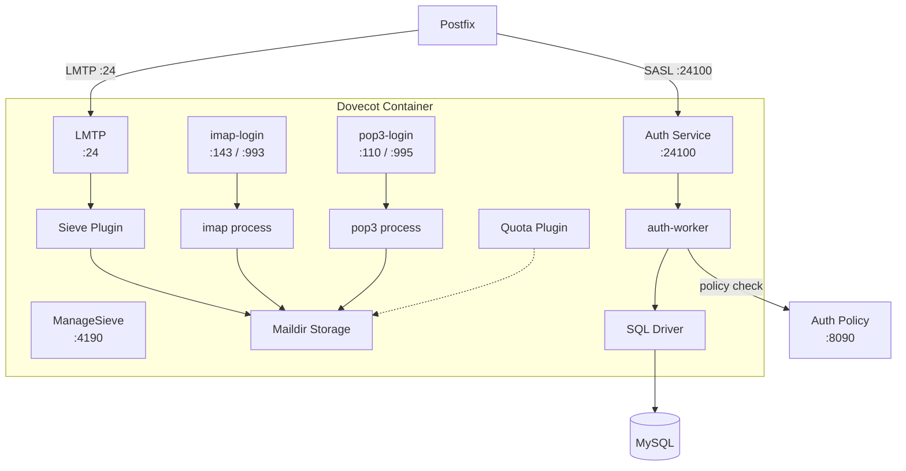

# Dovecot -- IMAP, POP3, and Authentication

Dovecot is where emails live once they arrive. It stores them, serves them to mail clients via IMAP and POP3, manages quotas, runs Sieve filter scripts, and -- importantly -- handles authentication for the entire mail system (including Postfix).

## What It Does

- **IMAP** on ports 143 (STARTTLS) and 993 (implicit TLS)
- **POP3** on ports 110 (STARTTLS) and 995 (implicit TLS)
- **LMTP** on port 24 -- receives mail from Postfix for local delivery
- **Auth service** on port 24100 -- shared SASL authentication for Postfix
- **ManageSieve** on port 4190 -- remote Sieve script management
- **Quota enforcement** with warning notifications at 75%, 80%, and 95%
- **Smart folders** -- auto-created Notifications, Social, Promotions, Updates folders

## Architecture



## Configuration

Everything is in a single file: `mailer/dovecot/config/dovecot.conf`. Dovecot does support split configs with `conf.d/` includes, but we keep things in one place for clarity.

### Authentication

```ini
auth_mechanisms = plain login
auth_username_format = %Lu          # lowercase the username
auth_cache_size = 10M               # cache auth results for performance
auth_cache_ttl = 1 hour
auth_cache_negative_ttl = 1 min     # cache "wrong password" for 1 min
auth_failure_delay = 2 secs         # slow down brute-force attempts
```

Credentials come from MySQL via the SQL driver:

```ini
passdb {
  driver = sql
  args = /etc/dovecot/dovecot-sql.conf.ext
}
userdb {
  driver = sql
  args = /etc/dovecot/dovecot-sql.conf.ext
}
```

The `dovecot-sql.conf.ext` file contains the actual SQL queries for looking up passwords and user info from the `email_accounts` table.

#### Auth Policy (Brute-Force Protection)

Dovecot integrates with a Redis-backed auth policy server for brute-force detection:

```ini
auth_policy_server_url = http://127.0.0.1:8090/
auth_policy_check_before_auth = yes
auth_policy_check_after_auth = yes
auth_policy_report_after_auth = yes
```

The policy server (`dovecot-auth-policy.py`) tracks failed login attempts per IP and username, progressively increasing delays and eventually blocking repeat offenders.

### Virtual Users and Mail Storage

All mailboxes use Maildir format, stored on a shared volume:

```ini
mail_location = maildir:/var/mail/vhosts/%d/%n
# %d = domain (example.com)
# %n = user (john)
# Result: /var/mail/vhosts/example.com/john/
```

The `vmail` user (UID/GID 5000) owns all mail files. No system accounts are needed for virtual users.

### Namespace and Special Folders

Dovecot auto-creates standard IMAP folders on first login:

| Folder | Special Use | Auto |
|--------|------------|------|
| INBOX | -- | always |
| Drafts | `\Drafts` | create |
| Sent | `\Sent` | create |
| Junk | `\Junk` | create |
| Trash | `\Trash` | create |
| Archive | `\Archive` | create |
| Notifications | -- | create |
| Social | -- | create |
| Promotions | -- | create |
| Updates | -- | create |

The last four are **smart folders** -- Rspamd classifies incoming email with an `X-Email-Category` header, and a global Sieve script routes them accordingly.

### Quota Management

Quotas use the Maildir backend (counts actual disk usage):

```ini
quota = maildir:User quota
quota_rule  = *:storage=5GB          # Default: 5 GB per mailbox
quota_rule2 = Trash:storage=+500MB   # Trash gets extra 500 MB
quota_rule3 = Junk:storage=+100MB    # Junk gets extra 100 MB
quota_grace = 10%%                   # 10% grace period
```

Per-user quotas from the database override these defaults via the `quota_rule` field in the SQL user query.

Warning thresholds trigger an external script:

```ini
quota_warning  = storage=95%% quota-warning 95 %u
quota_warning2 = storage=80%% quota-warning 80 %u
quota_warning3 = storage=75%% quota-warning 75 %u
```

The `dovecot-quota-warning.sh` script sends a notification email to the user and can trigger webhook events for admin alerting.

### Sieve Filtering

Sieve lets users (and the system) define mail filtering rules:

```ini
sieve = file:~/sieve;active=~/.dovecot.sieve
sieve_global_dir = /etc/dovecot/sieve/global/
sieve_global_path = /etc/dovecot/sieve/default.sieve
sieve_extensions = +notify +imapflags +vacation-seconds +editheader
```

The global Sieve script runs for every email and handles smart folder routing. Per-user scripts can add vacation replies, forwarding rules, and custom filtering.

Users manage their Sieve scripts remotely via ManageSieve on port 4190.

### TLS Configuration

```ini
ssl = required                    # No plaintext connections
ssl_cert = </etc/ssl/certs/server.crt
ssl_key  = </etc/ssl/private/server.key
ssl_dh   = </etc/dovecot/dh.pem  # DH params for forward secrecy
ssl_min_protocol = TLSv1.2
ssl_prefer_server_ciphers = yes
```

SNI support for multiple domains:

```ini
!include_try /etc/dovecot/conf.d/sni.conf
```

The cert manager writes per-domain `local_name {}` blocks to this file and sends SIGHUP to Dovecot to reload without dropping connections.

### Service Definitions and Process Limits

| Service | Port | Process Limit | Client Limit | Notes |
|---------|------|---------------|-------------|-------|
| imap-login | 143, 993 | 256 | 1000 | Chrooted, runs as `dovenull` |
| imap | -- | 1024 | 1/process | One process per connection |
| pop3-login | 110, 995 | 128 | 1000 | Chrooted |
| pop3 | -- | 512 | 1/process | |
| lmtp | 24 | 50 | 1/process | TCP listener for Postfix |
| auth | 24100 | 2 | 4096 | TCP listener for Postfix SASL |
| auth-worker | -- | 30 (min 5) | -- | Actual SQL lookup workers |
| managesieve-login | 4190 | 64 | 500 | Chrooted |

All login processes run as `dovenull` in a chroot jail for security. The auth service runs as `dovecot` with a dedicated pool of workers.

## Protocol-Specific Settings

### IMAP

```ini
mail_max_userip_connections = 20   # Max connections per user per IP
imap_idle_notify_interval = 2 mins # IDLE push notification interval
```

### POP3

```ini
pop3_uidl_format = %08Xu%08Xv     # Unique message IDs
pop3_fast_size_lookups = yes       # Performance optimization
pop3_lock_session = yes            # Prevent concurrent POP3 sessions
```

## Health Checks

The monitoring service checks Dovecot by:

1. Connecting to IMAP port 993 and verifying the banner
2. Checking the auth service is responding on port 24100
3. Verifying LMTP delivery works on port 24
4. Monitoring `doveadm` stats for unusual patterns

## Docker Configuration

```yaml
dovecot:
  build: ./mailer/dovecot
  container_name: dovecot
  ports:
    - "143:143"
    - "993:993"
    - "110:110"
    - "995:995"
  volumes:
    - mail_data:/var/mail/vhosts
    - ssl_certs:/etc/ssl
    - sieve_scripts:/etc/dovecot/sieve
```

## Environment Variables

| Variable | Default | Description |
|----------|---------|-------------|
| `DB_HOST` | `mysql` | MySQL host |
| `DB_PORT` | `3306` | MySQL port |
| `DB_NAME` | `mailserver` | Database name |
| `DB_USER` | `mailuser` | Database user |
| `DB_PASSWORD` | `mailpassword` | Database password |
| `SSL_CERT_PATH` | `/etc/ssl/certs/server.crt` | TLS certificate |
| `SSL_KEY_PATH` | `/etc/ssl/private/server.key` | TLS private key |
| `MAIL_QUOTA_DEFAULT` | `5368709120` | Default quota in bytes (5 GB) |

## Gotchas

!!! warning "Auth Cache Invalidation"
    When you change a user's password via the API, the old password may still work for up to 1 hour due to `auth_cache_ttl`. If you need immediate invalidation, run `doveadm auth cache flush` inside the container.

!!! warning "Quota Calculation"
    Maildir quotas are calculated from actual file sizes on disk. If you manually move files around in `/var/mail/vhosts/`, you need to recalculate quotas with `doveadm quota recalc -A`.

!!! tip "Debugging Auth"
    Set `auth_debug = yes` in `dovecot.conf` to see detailed authentication flow in the logs. Remember to turn it off in production -- it logs sensitive information.
