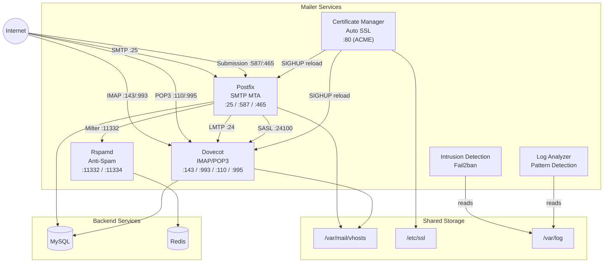
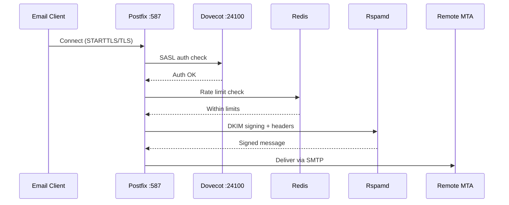
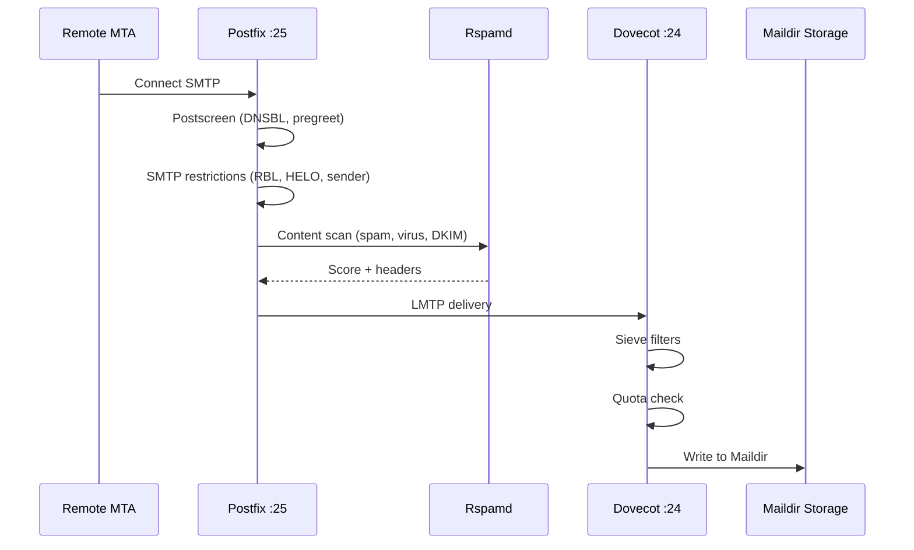

# Mailer Services

The mailer layer is the beating heart of Mailyte. These are the services that actually move, store, filter, and protect email. They run as separate Docker containers and communicate over the internal Docker network.

---

## Architecture at a Glance

## Service Quick Reference

-   :material-email-fast:{ .lg .middle } **Postfix**

    ---

    SMTP mail transfer agent — sends and receives email. Handles virtual domains, SASL auth, TLS, and queue management.

    **Container:** `postfix` | **Ports:** 25, 587, 465

    [:octicons-arrow-right-24: Postfix](postfix.md)

-   :material-email-open:{ .lg .middle } **Dovecot**

    ---

    IMAP/POP3 server — stores mail, authenticates users, runs Sieve filters, and enforces quotas.

    **Container:** `dovecot` | **Ports:** 143, 993, 110, 995, 24, 24100

    [:octicons-arrow-right-24: Dovecot](dovecot.md)

-   :material-shield-check:{ .lg .middle } **Rspamd**

    ---

    Anti-spam engine — DKIM signing, Bayesian filtering, ClamAV virus scanning, phishing detection, and neural network scoring.

    **Container:** `rspamd` | **Ports:** 11332, 11334

    [:octicons-arrow-right-24: Rspamd](rspamd.md)

-   :material-lock:{ .lg .middle } **Certificate Manager**

    ---

    Automated Let's Encrypt SSL certificates with auto-renewal and service reload.

    **Container:** `cert_manager` | **Port:** 80 (ACME)

    [:octicons-arrow-right-24: Certificate Manager](cert-manager.md)

-   :material-shield-alert:{ .lg .middle } **Intrusion Detection**

    ---

    Fail2ban jails for brute-force protection on SMTP, IMAP, and POP3 authentication.

    **Runs inside:** postfix/dovecot containers

    [:octicons-arrow-right-24: Intrusion Detection](intrusion-detection.md)

-   :material-file-search:{ .lg .middle } **Log Analyzer**

    ---

    Real-time log processing, anomaly detection, and pattern matching across all services.

    **Runs as:** sidecar container

    [:octicons-arrow-right-24: Log Analyzer](log-analyzer.md)

## How Mail Flows Through the System

Understanding the mail flow helps you debug delivery issues and tune performance.

### Outbound (your user sends an email)

1. **User connects** to Postfix on port 587 (STARTTLS) or 465 (implicit TLS).
2. **SASL authentication** — Postfix delegates to Dovecot on port 24100 to verify credentials against MySQL.
3. **Rate limiting** — the `rate_limit_policy.py` policy server checks per-mailbox, per-domain, and per-org hourly limits in Redis.
4. **Content filtering** — the email passes through the tracking injector, which adds open/click tracking pixels for HTML emails.
5. **Rspamd milter** — signs the email with DKIM, adds authentication headers.
6. **Delivery** — Postfix hands the email to the remote MTA over SMTP.
7. **Webhook notification** — the webhook sender fires an `email.sent` event.

### Inbound (someone sends email to your user)

1. **Postscreen** filters out spam bots using DNSBL lookups, pregreet detection, and pipelining checks. This alone blocks about 80% of junk.
2. **SMTP restrictions** — Postfix applies RBL checks, HELO validation, sender/recipient validation.
3. **Rspamd milter** — full spam analysis: Bayesian filtering, SPF/DKIM/DMARC verification, ClamAV virus scan, phishing detection, neural network scoring.
4. **LMTP delivery** — Postfix hands the email to Dovecot via LMTP on port 24.
5. **Sieve filtering** — Dovecot runs per-user and global Sieve scripts (smart folders, vacation replies, etc.).
6. **Quota check** — Dovecot enforces the mailbox quota. If the user is over quota, the email bounces with a temporary failure.
7. **Storage** — the email lands in `/var/mail/vhosts/{domain}/{user}/` as Maildir.

## Shared Infrastructure

All mailer services share these backend resources:

| Resource | Purpose | Used By |
|----------|---------|---------|
| **MySQL** | Virtual domains, mailboxes, aliases, rate limit configs, cert tracking | Postfix, Dovecot |
| **Redis** | Rate limit counters, Rspamd Bayesian data, auth caching | Rspamd, rate limiter |
| **`/var/mail/vhosts`** | Mail storage (Maildir format) | Postfix, Dovecot |
| **`/etc/ssl`** | SSL/TLS certificates | Postfix, Dovecot, cert-manager |
| **`/var/log`** | Service logs | All services, log analyzer, IDS |
| **Docker network** | Inter-service communication using container names as hostnames | All services |

!!! note "Container hostnames"
    Services communicate using container names as hostnames on the Docker internal network. For example, Postfix reaches Dovecot's SASL service at `dovecot:24100`.

## Related Sections

- **[Worker Modules](../worker/index.md)** — The API, tracking, webhooks, and analytics layer that sits on top of the mailer
- **[Configuration](../configuration/index.md)** — Detailed configuration for Postfix, Dovecot, and Rspamd
- **[Monitoring](../monitoring/index.md)** — Health checks and metrics for all mailer services
- **[Reference > CLI Commands](../reference/cli-commands.md)** — Docker exec commands for managing mailer services
