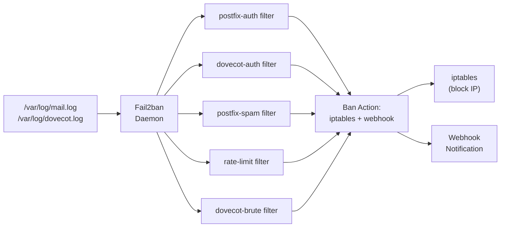

# Intrusion Detection -- Fail2ban

Fail2ban watches the mail server logs in real time and automatically bans IP addresses that show signs of attack -- brute-force login attempts, spam delivery, rate limit violations, and other abuse patterns. It is the bouncer at the door.

!!! note "Host-side install, not a container"
    `mailer/intrusion_detection/` is **not in any compose file** and does not run inside the postfix/dovecot containers. It is installed directly on the host by `mailer/intrusion_detection/scripts/install.sh` (run as root), which installs the fail2ban package and deploys the jail config, filters, and webhook action from this directory. Banning at the host's iptables is the point -- a container could not block traffic ahead of Docker's own published ports. Whether fail2ban is actually installed on a given host is host state; check `systemctl status fail2ban` there.

## What It Does

- Monitors Postfix and Dovecot logs for attack patterns
- Automatically bans offending IPs using iptables firewall rules
- Sends **webhook notifications** on ban/unban events
- Configurable ban durations, thresholds, and detection windows
- Multiple jails for different attack types

## How It Works



Fail2ban works in a simple loop:

1. Tail the log files
2. Match each line against filter regex patterns
3. Count matches per IP within a time window (`findtime`)
4. If count exceeds `maxretry`, trigger the ban action
5. After `bantime` expires, unban the IP

## Jail Configuration

All jails are defined in `mailer/intrusion_detection/config/fail2ban.conf`:

### Postfix SMTP Auth Failures

```ini
[postfix-auth]
enabled  = true
port     = smtp,465,587
filter   = postfix-auth
logpath  = /var/log/mail.log
maxretry = 3            # Ban after 3 failed auth attempts
bantime  = 3600         # Ban for 1 hour
findtime = 600          # Within a 10-minute window
```

This catches someone trying to guess SMTP login credentials. Three wrong passwords in 10 minutes and they are locked out for an hour.

### Dovecot Auth Failures

```ini
[dovecot-auth]
enabled  = true
port     = pop3,pop3s,imap,imaps
filter   = dovecot-auth
logpath  = /var/log/dovecot.log
maxretry = 3
bantime  = 3600
findtime = 600
```

Same idea but for IMAP/POP3 login attempts.

### Postfix Spam Attempts

```ini
[postfix-spam]
enabled  = true
port     = smtp,465,587
filter   = postfix-spam
logpath  = /var/log/mail.log
maxretry = 10           # More lenient -- some rejections are normal
bantime  = 7200         # Ban for 2 hours
findtime = 3600         # Within a 1-hour window
```

This catches IPs that repeatedly try to send mail that gets rejected (bad recipients, bad senders, RBL hits).

### Rate Limit Violations

```ini
[rate-limit]
enabled  = true
port     = smtp,465,587
filter   = rate-limit
logpath  = /var/log/mail.log
maxretry = 5
bantime  = 1800         # Ban for 30 minutes
findtime = 300          # Within a 5-minute window
```

Catches IPs that keep hitting rate limits, suggesting automated abuse.

### Dovecot Brute Force

```ini
[dovecot-brute]
enabled  = true
port     = pop3,pop3s,imap,imaps
filter   = dovecot-brute
logpath  = /var/log/dovecot.log
maxretry = 5
bantime  = 7200         # Ban for 2 hours
findtime = 1800         # Within a 30-minute window
```

A stricter jail that catches persistent but slower brute-force attempts that might slip under the `dovecot-auth` jail's radar.

## Custom Filters

Filter files live in `mailer/intrusion_detection/filters/` and contain regex patterns that match log lines:

### postfix-auth.conf

```ini
[Definition]
failregex = warning: .*\[<HOST>\]: SASL (?:LOGIN|PLAIN|DIGEST-MD5|CRAM-MD5) authentication failed
```

### dovecot-auth.conf

```ini
[Definition]
failregex = auth-worker.*: sql\(.*,<HOST>\): Password mismatch
            auth: Login failed.*rip=<HOST>
```

### postfix-spam.conf

```ini
[Definition]
failregex = NOQUEUE: reject: RCPT from .*\[<HOST>\]
            warning: non-SMTP command from .*\[<HOST>\]
```

### rate-limit.conf

```ini
[Definition]
failregex = warning: .*\[<HOST>\]: Rate limit exceeded
```

The `<HOST>` placeholder is special to Fail2ban -- it extracts the IP address from the matched line.

## Ban Actions

Each jail uses two actions:

### iptables-multiport

Blocks the IP at the firewall level:

```bash
# What happens when an IP is banned
iptables -I f2b-postfix-auth -s 1.2.3.4 -j REJECT --reject-with icmp-port-unreachable
```

### Webhook Notification

Sends a webhook notification on ban/unban events via `mailer/intrusion_detection/scripts/fail2ban-webhook.py`:

```json
{
  "event": "fail2ban.ban",
  "jail": "postfix-auth",
  "ip": "1.2.3.4",
  "timestamp": "2025-01-15T10:30:00Z",
  "ban_duration": 3600,
  "failures": 3
}
```

## Whitelisting

To prevent banning trusted IPs (your office, monitoring services, etc.), add them to the `ignoreip` directive:

```ini
[DEFAULT]
ignoreip = 127.0.0.1/8 ::1 10.0.0.0/8 172.16.0.0/12 192.168.0.0/16
```

Docker internal networks are whitelisted by default since inter-container communication should never be banned.

## Monitoring Banned IPs

### View current bans

```bash
# List all banned IPs across all jails
docker exec <container> fail2ban-client status

# List banned IPs for a specific jail
docker exec <container> fail2ban-client status postfix-auth
```

### Manually unban an IP

```bash
docker exec <container> fail2ban-client set postfix-auth unbanip 1.2.3.4
```

### Check ban history

The `fail2ban-manager.py` script provides an API for querying ban history and managing bans programmatically. The monitoring service queries this for dashboard reporting.

## Configuration

Defaults come from the `[DEFAULT]` section of `mailer/intrusion_detection/config/fail2ban.conf` (literal values, not environment variables):

| Setting | Default | Description |
|---------|---------|-------------|
| `bantime` | `1800` | Default ban time in seconds (per-jail values override) |
| `findtime` | `600` | Default detection window in seconds |
| `maxretry` | `5` | Default max failures before ban |
| `destemail` / `sender` | `admin@yourdomain.com` / `fail2ban@yourdomain.com` | Ban notification mail (edit before installing) |

The webhook action (`actions/webhook.conf` + `scripts/fail2ban-webhook.py`) is attached to every jail alongside `iptables-multiport`.

## Gotchas

!!! warning "Docker Networking"
    In a Docker environment, Fail2ban sees the Docker bridge IP, not the client's real IP, unless you use host networking or configure Postfix to log the `X-Forwarded-For` header. Make sure your setup preserves client IPs.

!!! warning "Log Paths"
    The jail config's `logpath` values (`/var/log/mail.log`, `/var/log/dovecot.log`) are the classic host locations. In this stack, Postfix and Dovecot logs are bind-mounted to `./logs/mailer/postfix/mail.log` and `./logs/mailer/dovecot/` under the project root -- point the jails at those host paths (or symlink) when installing, or fail2ban tails files nothing writes.

!!! tip "Testing"
    To test a jail without waiting for real attacks, use `fail2ban-regex` to verify your filter patterns against a log file:
    ```bash
    fail2ban-regex /var/log/mail.log /etc/fail2ban/filter.d/postfix-auth.conf
    ```
