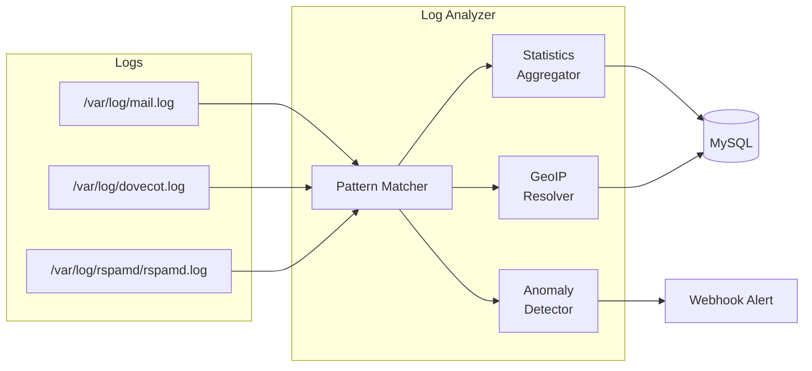

# Log Analyzer -- Real-Time Log Intelligence

The log analyzer is a Python service that continuously processes mail server logs, detects patterns, computes statistics, and feeds alerts into the monitoring system. While Fail2ban handles reactive blocking, the log analyzer provides the big-picture view -- delivery rates, bounce trends, spam volumes, geographic data, and anomaly detection.

## What It Does

- Parses Postfix, Dovecot, and Rspamd logs in real time
- Computes delivery statistics (sent, bounced, deferred, rejected)
- Tracks top sender/receiver domains
- Detects anomalies (sudden spike in bounces, unusual sending patterns)
- Provides geographic analysis of connecting IPs (via GeoIP)
- Stores aggregated stats in MySQL for the analytics worker
- Sends webhook alerts for detected anomalies

## How It Works



## Log Patterns

The analyzer uses compiled regex patterns to parse log lines. Here are the patterns it recognizes:

### Postfix Patterns

| Pattern | What It Matches |
|---------|----------------|
| `postfix_sent` | `postfix/smtp[...]: QUEUE_ID: to=<recipient>, ... status=sent` |
| `postfix_bounced` | `postfix/smtp[...]: QUEUE_ID: to=<recipient>, ... status=bounced` |
| `postfix_deferred` | `postfix/smtp[...]: QUEUE_ID: to=<recipient>, ... status=deferred` |
| `postfix_rejected` | `postfix/smtpd[...]: NOQUEUE: reject: ... from hostname[IP]` |

### Dovecot Patterns

| Pattern | What It Matches |
|---------|----------------|
| `dovecot_login` | `dovecot: imap-login: Login: user=<user>, method=..., rip=IP` |
| `dovecot_failed` | `dovecot: auth-worker(...): sql(...): Password mismatch for user` |

### Rspamd Patterns

| Pattern | What It Matches |
|---------|----------------|
| `rspamd_spam` | `rspamd[...]: task; spam: ... [SCORE/15.00]` |
| `rspamd_ham` | `rspamd[...]: task; ham: ... [SCORE/15.00]` |

## Statistics Computed

The analyzer computes rolling statistics over configurable time windows (default: last 24 hours):

### Delivery Stats

- Total emails sent, bounced, deferred, rejected
- Delivery success rate (%)
- Bounce rate by category (hard/soft)
- Deferred queue growth rate

### Domain Analytics

- Top 10 sending domains
- Top 10 receiving domains
- Per-domain delivery rates

### Spam Stats

- Total spam detected vs. ham
- Spam ratio over time
- Top spam sources (IP/domain)

### Security Stats

- Failed login attempts by IP
- Successful logins by IP and user
- Geographic distribution of connections

### Hourly Volume

- Emails per hour breakdown
- Peak hour identification
- Trend analysis (increasing/decreasing)

## Anomaly Detection

The analyzer watches for patterns that indicate problems:

| Anomaly | Trigger | Alert Level |
|---------|---------|-------------|
| Bounce spike | Bounce rate > 10% over 1 hour | Warning |
| Deferred queue growing | Queue size doubling within 30 min | Warning |
| Auth brute force | > 50 failed logins from one IP in 10 min | Critical |
| Spam volume spike | Spam ratio > 80% over 1 hour | Warning |
| Delivery failure | 0 successful deliveries in 30 min | Critical |
| Unusual sender | Single mailbox sending > 5x its average | Warning |

When an anomaly is detected, the analyzer fires a webhook event and logs the alert. The monitoring dashboard displays these alerts in real time.

## GeoIP Integration

If the GeoLite2 database is available, the analyzer resolves connecting IPs to countries:

```python
self.geoip_db = '/usr/share/GeoIP/GeoLite2-Country.mmdb'
```

This data feeds into:

- Geographic heatmaps in the dashboard
- Country-based anomaly detection (sudden traffic from a new country)
- The analytics worker for per-organization geo reports

## Database Tables

The analyzer writes aggregated stats to:

| Table | Purpose |
|-------|---------|
| `mail_logs` | Individual email delivery records |
| `analytics_daily` | Daily aggregated statistics |
| `analytics_hourly` | Hourly volume data |
| `security_events` | Failed logins, anomalies |

## Configuration

| Variable | Default | Description |
|----------|---------|-------------|
| `DB_HOST` | `localhost` | MySQL host |
| `DB_PORT` | `3306` | MySQL port |
| `DB_NAME` | `mailserver` | Database name |
| `DB_USER` | `root` | Database user |
| `DB_PASSWORD` | (empty) | Database password |
| `GEOIP_DB_PATH` | `/usr/share/GeoIP/GeoLite2-Country.mmdb` | Path to GeoIP database |
| `WEBHOOK_URLS` | (empty) | Webhook URLs for anomaly alerts |
| `ANALYSIS_INTERVAL` | `300` | Seconds between analysis runs |

## Adding Custom Rules

To add a new detection pattern, add a compiled regex to the `patterns` dictionary in `mailer/log_analyzer/app.py`:

```python
self.patterns['my_custom_pattern'] = re.compile(
    r'my-service\[\d+\]: suspicious activity from \[([^\]]+)\]'
)
```

Then add handling logic in the appropriate analysis method to extract data from the matched groups and record it.

## Gotchas

!!! warning "GeoIP Database"
    The GeoLite2 database requires a free MaxMind account and license key to download. Without it, geographic features are silently disabled. The analyzer still works for everything else.

!!! warning "Log Rotation"
    If logs are rotated while the analyzer is running, it needs to detect the rotation and re-open the files. The current implementation handles this by periodically re-checking file sizes.

!!! tip "Performance"
    The analyzer processes logs line by line. For very high-volume servers (millions of emails/day), consider increasing the `ANALYSIS_INTERVAL` to batch more data per run, or run the analyzer as a separate container with dedicated CPU.
