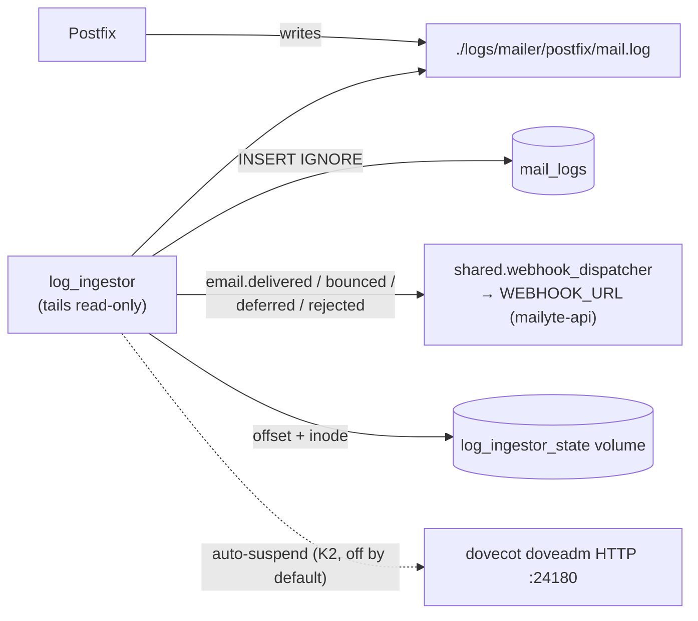

# Log Ingestor

The log ingestor (`mailer/log_ingestor/`, added 2026-08-22) tails Postfix's mail log and turns it into per-message rows in the `mail_logs` table, firing the matching `email.delivered` / `email.bounced` / `email.deferred` / `email.rejected` webhooks as it goes. It is the **sole producer** for `mail_logs` -- and, through the webhooks it fires at mailyte-api, for that system's `delivery_events`.

## Why It Exists

Before this container, nothing in the stack ever wrote a per-message row to `mail_logs`. The table, the platform API endpoints that read it (`message_trace`, `analytics`), and the tenant Email Logs UI all existed around a producer that had never been built -- confirmed on production 2026-08-22, where `mail_logs` sat at 0 rows while mail flowed normally.

The components that *looked* like the producer are not:

- `mailer/log_analyzer/` writes aggregate `mail_analysis_reports`, never per-message rows -- and is in no compose file, so no container even exists
- `webhook_sender.py` is defined in `master.cf` as the `webhook-filter` transport, but no `content_filter` references it -- dead config
- `tracking_injector.py` has a webhook hook that returns immediately unless `TRACKING_WEBHOOK_URL` is set, which it is not

Postfix's own log is the right source: it is the authoritative record of every delivery attempt regardless of how the message was submitted (SMTP, submission, webmail, API), and `mail_logs`' columns -- `relay`, `delays`, `dsn`, `status` -- map onto a Postfix delivery line one-for-one.

## How It Works



- **Idempotent by construction**: each row's primary key is derived deterministically from (queue id, recipient, status, timestamp) and inserted with `INSERT IGNORE`. Re-reading a log region after a crash or replay cannot create duplicates.
- **Rotation-safe**: rotation is detected by inode, not size, so a rotated-then-smaller file is not mistaken for truncation.
- **Filter hops are excluded**: Postfix logs a `status=sent` line when it hands a message to the tracking filter and another when the re-injected copy is delivered. Relays listed in `INGESTOR_INTERNAL_RELAYS` (default `tracking-filter,webhook-filter`) are skipped so each message is counted once.
- **Auto-suspend (SMTP API keys K2)**: with `AUTO_SUSPEND_ENABLED=true`, an SMTP API key whose recent traffic exceeds a failure ratio is suspended and Dovecot's auth cache is flushed through the doveadm HTTP API so the suspension bites immediately. **Off by default** until the thresholds have been observed against real traffic.

## Invocation

Not an HTTP service -- it is a long-running tailer with no listening port, started by compose:

```yaml
log_ingestor:
  build:
    context: .
    dockerfile: ./mailer/log_ingestor/Dockerfile
  container_name: log_ingestor
  volumes:
    - ./logs/mailer/postfix:/var/log/postfix:ro    # postfix owns the file; we only follow it
    - log_ingestor_state:/var/lib/log_ingestor
```

The state volume keeps the read offset so a recreate doesn't re-read the whole log (a replay would be harmless -- just wasteful -- thanks to the deterministic keys).

## Configuration

| Variable | Default | Description |
|----------|---------|-------------|
| `POSTFIX_LOG_PATH` | `/var/log/postfix/mail.log` | The log to tail |
| `INGESTOR_STATE_PATH` | `/var/lib/log_ingestor/state` | Offset/inode state file |
| `INGESTOR_POLL_SECONDS` | `2` | Poll interval |
| `INGESTOR_QID_CACHE` | `20000` | Queue-ids remembered while awaiting delivery lines |
| `INGESTOR_INTERNAL_RELAYS` | `tracking-filter,webhook-filter` | Relays excluded from delivery counting |
| `WEBHOOK_URL` | (mapped from `WEBHOOK_URLS` in compose) | Dispatcher target -- the dispatcher reads the **singular** name; unset means every event silently no-ops |
| `WEBHOOK_SECRET` | -- | HMAC signing key |
| `AUTO_SUSPEND_ENABLED` | `false` | SMTP API key auto-suspension |
| `AUTO_SUSPEND_MIN_MESSAGES` / `AUTO_SUSPEND_FAILURE_RATIO` / `AUTO_SUSPEND_WINDOW_HOURS` | `20` / `0.5` / `1` | Suspension thresholds |
| `DOVEADM_URL` / `DOVEADM_API_KEY` | `http://dovecot:24180` / -- | Auth-cache flush on suspension |
| `DB_HOST` / `DB_PORT` / `DB_NAME` / `DB_USER` / `DB_PASSWORD` | `mysql` / `3306` / `mailserver` / `mailuser` / -- | Where `mail_logs` lives |
| `LOG_LEVEL` | `INFO` | Service log level (HTTP client libraries are pinned to WARNING regardless) |

## Data Written

| Store | What |
|-------|------|
| `mail_logs` (MySQL) | One row per delivery attempt: sender, recipient, subject, status, relay, delays, dsn, bounce reason |
| `smtp_credential_events` (MySQL) | Auto-suspension audit rows (when enabled) |
| Webhooks | `email.delivered` / `email.bounced` / `email.deferred` / `email.rejected` to `WEBHOOK_URL` -- this is what populates mailyte-api's `delivery_events` |

## Gotchas

!!! warning "Everything downstream assumes this container is running"
    Email Logs UIs, message trace, deliverability analytics, and delivery webhooks all go dark (empty, not erroring) if this container stops -- exactly the failure mode that went unnoticed before it existed. If log surfaces look empty, check `docker logs log_ingestor` first.

!!! warning "The log file must actually receive Postfix's log"
    This service reads `./logs/mailer/postfix/mail.log`. Postfix once ran with no logging configured at all -- zero mail logs server-wide (fixed 2026-08-22). If that file stops growing while mail flows, the problem is upstream in the Postfix container's syslog setup, not here.
