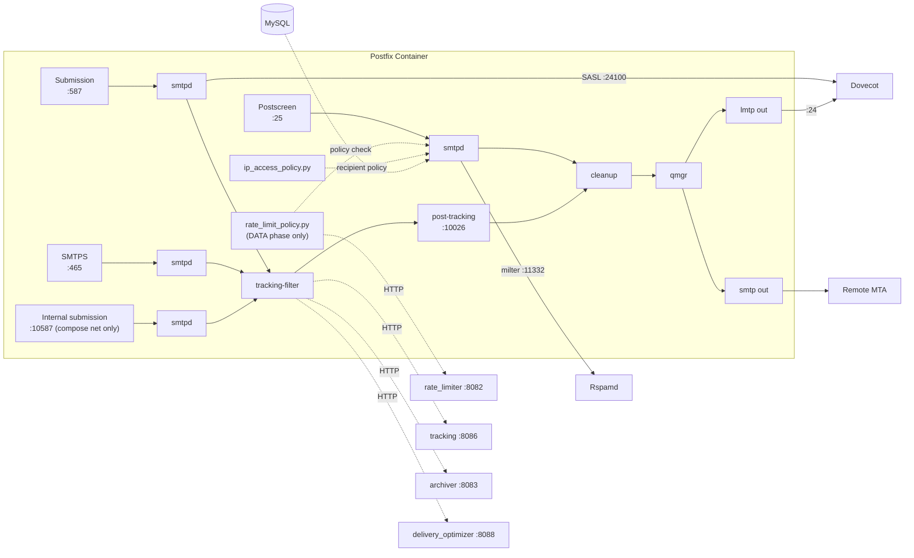

# Postfix -- SMTP Mail Transfer Agent

Postfix is the front door of the mail system. It handles every email that enters or leaves the server. If Mailyte were a post office, Postfix would be the sorting room, the loading dock, and the security desk all rolled into one.

## What It Does

- Accepts inbound email on **port 25** (SMTP)
- Accepts outbound email from authenticated users on **port 587** (submission) and **port 465** (SMTPS, implicit TLS)
- Accepts trusted in-stack submissions (webmail/API) on the **internal listener 10587** -- compose-network only, never published
- Routes mail to Dovecot for local delivery via LMTP (`lmtp:inet:dovecot:24`)
- Filters mail through Rspamd for spam/DKIM
- Runs the tracking injector as a content filter on all three locally-originated paths (587/465/10587)
- Consults the rate limiter (at DATA phase) and per-org IP access policy during SMTP transactions
- Consults the delivery optimizer and archives outbound mail (from inside the tracking injector)
- Its log is tailed by the [log ingestor](log-ingestor.md), which is what produces `mail_logs` rows and delivery webhooks

## Architecture



## Configuration Files

All config lives in `mailer/postfix/config/`, baked into the image at build time (`COPY config/ /etc/postfix/`). At container startup, `entrypoint.sh` applies environment-variable overrides using `postconf -e` and writes `/etc/postfix/runtime.env` for the pipe scripts.

### main.cf -- The Big One

This is where most of Postfix's behavior is defined. Here are the key sections:

#### Virtual Domains (MySQL Lookups)

Postfix does not store domain or user data locally. Everything comes from MySQL via four lookup maps:

```ini
# Which domains do we accept mail for?
virtual_mailbox_domains = proxy:mysql:/etc/postfix/mysql-virtual-mailbox-domains.cf

# Which mailboxes exist?
virtual_mailbox_maps = proxy:mysql:/etc/postfix/mysql-virtual-mailbox-maps.cf

# Email aliases (forwarding rules)
virtual_alias_maps = proxy:mysql:/etc/postfix/mysql-virtual-alias-maps.cf

# Who is allowed to send as whom? (prevents spoofing)
smtpd_sender_login_maps = proxy:mysql:/etc/postfix/mysql-sender-login-maps.cf
```

The `proxy:` prefix is important -- it routes lookups through `proxymap`, which runs outside the chroot jail and can actually reach MySQL.

Each `.cf` file follows the same pattern:

```ini
# mysql-virtual-mailbox-domains.cf
user     = mailuser
password = mailpassword
hosts    = mysql
dbname   = mailserver
query    = SELECT domain FROM domains WHERE domain='%s' AND active=1
```

#### TLS Configuration

```ini
# Cert paths (overridden at startup from env vars)
smtpd_tls_cert_file = /etc/ssl/certs/server.crt
smtpd_tls_key_file  = /etc/ssl/private/server.key

# SNI for multi-domain hosting
tls_server_sni_maps = hash:/etc/postfix/sni_certs.map

# TLS 1.2+ only, strong ciphers
smtpd_tls_protocols = !SSLv2,!SSLv3,!TLSv1,!TLSv1.1
smtpd_tls_ciphers   = high

# SASL auth only allowed over TLS
smtpd_tls_auth_only = yes
```

#### SASL Authentication (via Dovecot)

Postfix does not handle authentication itself. It delegates to Dovecot over TCP:

```ini
smtpd_sasl_type       = dovecot
smtpd_sasl_path       = inet:dovecot:24100
smtpd_sasl_auth_enable = yes
```

This means Dovecot is the single source of truth for user credentials. One password database, shared between SMTP and IMAP.

#### SMTP Restrictions (Anti-Spam)

Postfix applies restrictions in layers. Each layer is a chain of checks evaluated in order:

| Restriction Layer | Key Checks |
|-------------------|-----------|
| `smtpd_client_restrictions` | Permit trusted networks and SASL auth, reject pipelining, `reject_rbl_client zen.spamhaus.org`, warn on unknown client hostname |
| `smtpd_helo_restrictions` | Reject invalid/non-FQDN HELO hostnames, warn on unknown |
| `smtpd_sender_restrictions` | Reject non-FQDN senders and unknown sender domains -- **no rate limit and no login-mismatch check here** (see below) |
| `smtpd_recipient_restrictions` | Validate recipients, `reject_unauth_destination`, RBL check, per-org IP access policy |
| `smtpd_data_restrictions` | Reject pipelining abuse and multi-recipient bounces, then the **one and only** rate-limit policy check |
| `smtpd_relay_restrictions` | Permit SASL auth + mynetworks, defer everything else |

`smtpd` uses a single RBL, `zen.spamhaus.org`; the multi-source weighted scoring happens in postscreen (below), where one mid-confidence listing costs a sender points rather than the whole message.

!!! danger "Two postmortems live in these lists -- read main.cf before editing"
    1. **The rate-limit policy runs at DATA phase and nowhere else.** It once ran in the sender, recipient, *and* data lists at once; each call records usage, so one message was counted three times and essentially every unauthenticated inbound message was deferred with `450 4.7.1 Rate limit exceeded`.
    2. **`reject_sender_login_mismatch` must not appear in the global `smtpd_sender_restrictions`.** Port 25 inherits the global value and carries unauthenticated public mail by definition -- the check then rejects any inbound message whose envelope sender happens to own a local mailbox (`553 5.7.1 ... not logged in`). That broke inbound production mail on 2026-08-22. Sender-ownership enforcement lives only in the submission (587) and smtps (465) service overrides in `master.cf`, listed *ahead of* `permit_sasl_authenticated` so it is not short-circuited.

#### Postscreen (Pre-SMTP Filtering)

Postscreen sits in front of `smtpd` on port 25 and kills most spam bots before they even get to talk SMTP. It uses DNSBL scoring with weighted sources:

```ini
postscreen_dnsbl_sites =
    zen.spamhaus.org*3,        # Most trusted -- weight 3
    b.barracudacentral.org*2,
    bl.spamcop.net*2,
    dnsbl.sorbs.net*1,
    psbl.surriel.com*1
postscreen_dnsbl_threshold = 3  # Need score >= 3 to get blocked
```

It also catches bots that talk before the banner (pregreet), send bare newlines, or try pipelining. Good clients get cached for 10 days so they skip these checks next time.

#### Header and Body Checks

```ini
header_checks      = regexp:/etc/postfix/header_checks
body_checks        = regexp:/etc/postfix/body_checks
mime_header_checks = regexp:/etc/postfix/mime_header_checks
```

These files are created empty by the Dockerfile. Add your own patterns for stripping internal headers, blocking dangerous MIME types, etc.

#### Performance Tuning

```ini
message_size_limit               = 52428800   # 50 MB
default_process_limit            = 100
smtpd_client_connection_rate_limit   = 30     # per 60s (anvil_rate_time_unit)
smtpd_client_connection_count_limit  = 50
smtpd_client_message_rate_limit      = 100
smtpd_client_recipient_rate_limit    = 200
```

### master.cf -- Service Definitions

This file defines every Postfix sub-service. The interesting custom ones:

#### Tracking Content Filter

Locally-originated mail (ports 587, 465, and the internal 10587) passes through the tracking injector before delivery:

```
tracking-filter unix -  n  n  -  25  pipe
  flags=Rq
  user=vmail
  argv=/usr/local/bin/tracking_injector.py -f ${sender} -- ${recipient}
```

After tracking injection, the email re-enters Postfix on the post-tracking listener:

```
127.0.0.1:10026 inet n  -  y  -  -  smtpd
  -o content_filter=
  -o smtpd_relay_restrictions=permit_mynetworks,reject
  -o receive_override_options=no_header_body_checks,no_unknown_recipient_checks
```

The 10026 listener carries several deliberate overrides -- read the comments in `master.cf` before touching them. Two matter most: `smtpd_relay_restrictions=permit_mynetworks,reject` (the re-injection connection carries no SASL, so inheriting the global default rejected every filtered outbound message with "554 Relay access denied"), and `smtpd_data_restrictions` without the rate-limit policy (the message was already counted at its real ingress; counting the re-injected copy double-billed every message).

#### Internal Submission (10587)

```
10587 inet  n  -  y  -  -  smtpd
  -o content_filter=tracking-filter:
  -o smtpd_client_restrictions=permit_mynetworks,reject
  ...
  -o milter_macro_daemon_name=ORIGINATING
```

The webmail/API submit here instead of port 25, so their mail passes through the tracking filter. Port 25 deliberately has no content filter -- it carries all *inbound* mail, and tracking must never touch messages arriving for our users. The webmail cannot use 587/465 because no mailbox password is stored anywhere (only bcrypt hashes), so it submits as a trusted client on the compose network and the API pins the From address. This port is not published to the host in any compose file -- publishing it would expose an unauthenticated relay.

#### Rate Limit Policy Service

```
policy-rate-limit unix -  n  n  -  -  spawn
  user=vmail
  argv=/usr/local/bin/rate_limit_policy.py
```

This script speaks the Postfix policy protocol on stdin/stdout and delegates every decision to the **rate limiter worker over HTTP** (`POST http://rate_limiter:8082/check_rate_limit`) -- it holds no counters of its own. Over quota it answers `DEFER_IF_PERMIT 4.7.1 Rate limit exceeded...`; if the worker is unreachable it fails open with `DUNNO`. See the [Rate Limiter worker](../worker/rate-limiter.md) for the full decision flow.

#### IP Access Policy

```
policy-ip-access unix -  n  n  -  -  spawn
  user=vmail
  argv=/usr/local/bin/ip_access_policy.py
```

Enforces per-organization IP allowlists, referenced from `smtpd_recipient_restrictions`.

#### Webhook Sender (dead config)

`master.cf` still defines a `webhook-filter` pipe service running `webhook_sender.py`, but **no `content_filter` references it** -- `tracking-filter` occupies that slot on every filtered listener, so `webhook-filter` never executes. Delivery-event webhooks (`email.delivered` / `bounced` / `deferred` / `rejected`) are produced by the [log ingestor](log-ingestor.md) instead, which tails Postfix's log.

## Tracking Injector Deep Dive

The tracking injector (`mailer/postfix/scripts/tracking_injector.py`) is the pipe command behind the `tracking-filter` service. Per message it:

1. Reads the email from stdin (Postfix pipe interface)
2. Parses it to extract sender, recipients, message ID
3. Looks up the tenant/domain in MySQL (with an in-memory cache)
4. Consults the delivery optimizer (`POST http://delivery_optimizer:8088/check`) -- if the optimizer is unreachable it paces down by a fixed delay rather than sending unthrottled
5. Calls the tracking service (`POST http://tracking:8086/api/tracking/inject`) for HTML mail, getting back content with a pixel injected and links rewritten
6. POSTs the accepted message to the archiver (`ARCHIVE_SERVICE_URL`, when `ARCHIVE_OUTBOUND_ENABLED=true`)
7. Re-injects the (possibly modified) message via the 10026 listener for final delivery

If tracking or archiving fails, the original email is delivered unchanged -- delivery reliability always wins.

!!! danger "Nothing in this script may write to stderr at volume"
    Postfix's `pipe(8)` captures the command's stderr. Under load, CPython can fail to flush a chatty stderr during interpreter shutdown and **exit with status 120** -- which Postfix reports as "Command died with status 120" and turns into a **bounce, after the message was already delivered**. This happened in production (fixed 2026-08-22): the logger's stderr handler is now WARNING-and-above only, routine logging goes to `/var/log/postfix_tracking.log`, and an `atexit` hook points stderr at `/dev/null` before shutdown. Keep it that way -- an innocent `print()` or a DEBUG-level stderr handler reintroduces bounced-after-delivery mail.

!!! note "Environment comes from runtime.env, not Postfix"
    `pipe(8)` hands the script a hardcoded minimal environment regardless of `import_environment`. Real configuration is loaded from `/etc/postfix/runtime.env`, written by `entrypoint.sh` from the container's environment at startup. A new env var must be added to that file's list or the script will never see it.

Key environment variables (via `runtime.env`):

| Variable | Default | Description |
|----------|---------|-------------|
| `TRACKING_SERVICE_URL` | `http://tracking:8086` | Tracking worker |
| `TRACKING_ENABLED` | `true` | Global tracking toggle |
| `DELIVERY_OPTIMIZER_URL` | `http://delivery_optimizer:8088` | Send-check endpoint |
| `DELIVERY_OPTIMIZER_TIMEOUT` / `DELIVERY_OPTIMIZER_FALLBACK_DELAY` | `5` / `2` | Optimizer failure pacing |
| `ARCHIVE_OUTBOUND_ENABLED` | `true` | Outbound archival toggle |
| `ARCHIVE_SERVICE_URL` / `ARCHIVE_TIMEOUT` | `http://archiver:8083` / `3` | Archiver |
| `DB_HOST` / `DB_NAME` / ... | `mysql` / `mailserver` | Tenant lookups |

## Log Ingestion

Postfix's own log (`/var/log/postfix/mail.log`, bind-mounted to `./logs/mailer/postfix/`) is the authoritative record of every delivery attempt. The [log ingestor](log-ingestor.md) container tails it read-only and turns it into `mail_logs` rows and `email.delivered`/`bounced`/`deferred`/`rejected` webhooks. Nothing else produces those.

## Security Hardening

Postfix is locked down with multiple layers:

- **SMTP smuggling protection**: `smtpd_forbid_bare_newline = reject` (CVE-2023-51764)
- **VRFY disabled**: prevents email address enumeration
- **Custom banner**: hides version info (`$myhostname ESMTP`)
- **Chroot jails**: public-facing services run chrooted (the container needs `SYS_CHROOT` -- see the capability list in `docker-compose.yml`)
- **TLS-only auth**: `smtpd_tls_auth_only = yes`
- **Sender login mismatch rejection on 587/465 only** -- never in the global sender restrictions (see the postmortem admonition above)
- **Error limits**: soft limit 10, hard limit 20 -- kicks off clients that keep making errors
- **Container hardening**: `no-new-privileges`, `cap_drop: ALL` plus only the capabilities Postfix's privilege-separation model needs (`NET_BIND_SERVICE`, `CHOWN`, `FOWNER`, `SETUID`, `SETGID`, `DAC_OVERRIDE`, `SYS_CHROOT`)

## Health Monitoring

The monitoring service checks Postfix health by:

1. Connecting to port 25 and verifying the SMTP banner
2. Running `postfix status` inside the container
3. Checking the mail queue size with `mailq`
4. Verifying the deferred queue is not growing unboundedly

## Docker Configuration

```yaml
postfix:
  build: ./mailer/postfix
  container_name: postfix
  ports:
    - "25:25"
    - "587:587"
    - "465:465"
    - "10026:10026"     # loopback-only in prod (internal reinjection listener)
  volumes:
    - ./storage/mail_data:/var/mail/vhosts
    - ./storage/ssl_certs:/etc/ssl/certs/custom
    - ./storage/ssl_private:/etc/ssl/private/custom
    - ./storage/sni_config:/etc/ssl/sni:ro
    - ./logs/mailer/postfix:/var/log/postfix
    - ./config/mailer/postfix:/etc/postfix/custom
    - postfix_spool:/var/spool/postfix
  depends_on:
    - mysql
    - migrate
    - redis
    - rspamd
```

The spool is a **named volume** on purpose: it used to be container-local, so `--force-recreate` silently destroyed every queued message. The queue manager mounts the same volume to reach the `showq` socket.

## Environment Variables

| Variable | Default | Description |
|----------|---------|-------------|
| `HOSTNAME` | `mail.example.com` | Server hostname (HELO, banners) |
| `DOMAIN` | `example.com` | Base domain |
| `DB_HOST` / `DB_PORT` / `DB_NAME` / `DB_USER` / `DB_PASSWORD` | `mysql` / `3306` / `mailserver` / `mailuser` / -- | MySQL lookups |
| `REDIS_HOST` / `REDIS_PORT` | `redis` / `6379` | Redis |
| `TRACKING_ENABLED` | `true` | Tracking injection toggle |
| `TRACKING_SERVICE_URL` | `http://tracking:8086` | Tracking worker |
| `ARCHIVE_OUTBOUND_ENABLED` / `ARCHIVE_SERVICE_URL` / `ARCHIVE_TIMEOUT` | `true` / `http://archiver:8083` / `3` | Outbound archival |
| `DELIVERY_OPTIMIZER_URL` | `http://delivery_optimizer:8088` | Send-time checks |
| `WEBHOOK_SECRET` / `WEBHOOK_SERVICE_URL` | -- / `http://webhooks:8081` | Webhook signing/targets |
| `DEFAULT_TENANT_ID` / `DEFAULT_DOMAIN_ID` | `default` | Fallback tenant attribution |

## Gotchas

!!! warning "Proxy Maps"
    If you add a new MySQL lookup map, you must also add it to `proxy_read_maps` in `main.cf`. Without this, proxymap refuses to serve it and lookups silently fail.

!!! warning "Content Filter Loop"
    The post-tracking listener on `127.0.0.1:10026` has `content_filter=` (empty) to prevent infinite loops. Never add a content filter to this service.

!!! warning "main.cf is baked into the image"
    The Dockerfile does `COPY config/ /etc/postfix/`, and `entrypoint.sh` applies env-derived `postconf -e` overrides on every start. A `postconf -e` run by hand inside the running container is therefore lost on the next recreate -- change `mailer/postfix/config/main.cf` in the repo and rebuild, or the edit will silently vanish.

!!! tip "Debugging"
    Increase `smtpd_tls_loglevel` to 2 or 3 for TLS debugging. Postfix logs to `/var/log/postfix/mail.log` inside the container, bind-mounted to `./logs/mailer/postfix/` on the host -- the same file the log ingestor tails.
