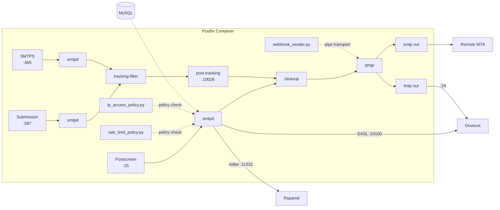

# Postfix -- SMTP Mail Transfer Agent

Postfix is the front door of the mail system. It handles every email that enters or leaves the server. If Mailyte were a post office, Postfix would be the sorting room, the loading dock, and the security desk all rolled into one.

## What It Does

- Accepts inbound email on **port 25** (SMTP)
- Accepts outbound email from authenticated users on **port 587** (submission) and **port 465** (SMTPS, implicit TLS)
- Routes mail to Dovecot for local delivery via LMTP
- Filters mail through Rspamd for spam/DKIM
- Injects tracking pixels into outgoing HTML emails
- Enforces rate limits at the mailbox, domain, and organization level
- Sends webhook notifications on email events

## Architecture



## Configuration Files

All config lives in `mailer/postfix/config/`. At container startup, `entrypoint.sh` copies these into `/etc/postfix/` and applies environment variable overrides using `postconf -e`.

### main.cf -- The Big One

This is where most of Postfix's behavior is defined. Here are the key sections:

#### Virtual Domains (MySQL Lookups)

Postfix does not store domain or user data locally. Everything comes from MySQL via four lookup maps:

```ini
# Which domains do we accept mail for?
virtual_mailbox_domains = proxy:mysql:/etc/postfix/mysql-virtual-mailbox-domains.cf

# Which mailboxes exist?
virtual_mailbox_maps = proxy:mysql:/etc/postfix/mysql-virtual-mailbox-maps.cf

# Email aliases (forwarding rules)
virtual_alias_maps = proxy:mysql:/etc/postfix/mysql-virtual-alias-maps.cf

# Who is allowed to send as whom? (prevents spoofing)
smtpd_sender_login_maps = proxy:mysql:/etc/postfix/mysql-sender-login-maps.cf
```

The `proxy:` prefix is important -- it routes lookups through `proxymap`, which runs outside the chroot jail and can actually reach MySQL.

Each `.cf` file follows the same pattern:

```ini
# mysql-virtual-mailbox-domains.cf
user     = mailuser
password = mailpassword
hosts    = mysql
dbname   = mailserver
query    = SELECT domain FROM domains WHERE domain='%s' AND active=1
```

#### TLS Configuration

```ini
# Cert paths (overridden at startup from env vars)
smtpd_tls_cert_file = /etc/ssl/certs/server.crt
smtpd_tls_key_file  = /etc/ssl/private/server.key

# SNI for multi-domain hosting
tls_server_sni_maps = hash:/etc/postfix/sni_certs.map

# TLS 1.2+ only, strong ciphers
smtpd_tls_protocols = !SSLv2,!SSLv3,!TLSv1,!TLSv1.1
smtpd_tls_ciphers   = high

# SASL auth only allowed over TLS
smtpd_tls_auth_only = yes
```

#### SASL Authentication (via Dovecot)

Postfix does not handle authentication itself. It delegates to Dovecot over TCP:

```ini
smtpd_sasl_type       = dovecot
smtpd_sasl_path       = inet:dovecot:24100
smtpd_sasl_auth_enable = yes
```

This means Dovecot is the single source of truth for user credentials. One password database, shared between SMTP and IMAP.

#### SMTP Restrictions (Anti-Spam)

Postfix applies restrictions in layers. Each layer is a chain of checks evaluated in order:

| Restriction Layer | Key Checks |
|-------------------|-----------|
| `smtpd_client_restrictions` | Permit trusted networks, SASL auth, then 8 RBL blocklists |
| `smtpd_helo_restrictions` | Reject invalid/non-FQDN HELO hostnames |
| `smtpd_sender_restrictions` | Reject non-FQDN senders, unknown domains, rate limit check |
| `smtpd_recipient_restrictions` | Validate recipients, RBL check, IP access policy, rate limit |
| `smtpd_data_restrictions` | Reject pipelining abuse, multi-recipient bounces, rate limit |
| `smtpd_relay_restrictions` | Permit SASL auth + mynetworks, defer everything else |

The RBL (Real-time Blackhole List) sources used:

- `zen.spamhaus.org`
- `bl.spamcop.net`
- `dnsbl.sorbs.net`
- `psbl.surriel.com`
- `b.barracudacentral.org`
- `dnsbl-1.uceprotect.net`
- `cbl.abuseat.org`
- `dnsbl.dronebl.org`

#### Postscreen (Pre-SMTP Filtering)

Postscreen sits in front of `smtpd` on port 25 and kills most spam bots before they even get to talk SMTP. It uses DNSBL scoring with weighted sources:

```ini
postscreen_dnsbl_sites =
    zen.spamhaus.org*3,        # Most trusted -- weight 3
    b.barracudacentral.org*2,
    bl.spamcop.net*2,
    dnsbl.sorbs.net*1,
    psbl.surriel.com*1
postscreen_dnsbl_threshold = 3  # Need score >= 3 to get blocked
```

It also catches bots that talk before the banner (pregreet), send bare newlines, or try pipelining. Good clients get cached for 10 days so they skip these checks next time.

#### Header and Body Checks

```ini
header_checks      = regexp:/etc/postfix/header_checks
body_checks        = regexp:/etc/postfix/body_checks
mime_header_checks = regexp:/etc/postfix/mime_header_checks
```

These files are created empty by the Dockerfile. Add your own patterns for stripping internal headers, blocking dangerous MIME types, etc.

#### Performance Tuning

```ini
message_size_limit               = 52428800   # 50 MB
default_process_limit            = 100
smtpd_client_connection_rate_limit   = 30     # per 60s (anvil_rate_time_unit)
smtpd_client_connection_count_limit  = 50
smtpd_client_message_rate_limit      = 100
smtpd_client_recipient_rate_limit    = 200
```

### master.cf -- Service Definitions

This file defines every Postfix sub-service. The interesting custom ones:

#### Tracking Content Filter

Outgoing mail from ports 587/465 passes through the tracking injector before delivery:

```
# Content filter for submission/smtps
tracking-filter unix -  n  n  -  25  pipe
  flags=Rq
  user=postfix
  argv=/usr/local/bin/tracking_injector.py
```

After tracking injection, the email re-enters Postfix on the post-tracking listener:

```
# No further content filtering -- already processed
127.0.0.1:10026 inet n  -  y  -  -  smtpd
  -o content_filter=
  -o receive_override_options=no_header_body_checks,no_unknown_recipient_checks
```

#### Rate Limit Policy Service

```
policy-rate-limit unix -  n  n  -  -  spawn
  user=vmail
  argv=/usr/local/bin/rate_limit_policy.py
```

This Python script reads the Postfix policy protocol from stdin, checks Redis counters against limits stored in MySQL, and returns `DUNNO` (allow) or `REJECT 4.7.1 Rate limit exceeded...`.

#### IP Access Policy

```
policy-ip-access unix -  n  n  -  -  spawn
  user=vmail
  argv=/usr/local/bin/ip_access_policy.py
```

Enforces per-organization IP whitelists for SMTP relay.

#### Webhook Sender

```
webhook-filter unix -  n  n  -  -  pipe
  flags=Rq
  user=vmail
  argv=/usr/local/bin/webhook_sender.py inbound
```

Fires webhook events for inbound email via the shared webhook dispatcher (Redis pub/sub for cross-container delivery).

## Tracking Injector Deep Dive

The tracking injector (`mailer/postfix/scripts/tracking_injector.py`) is a Postfix content filter that:

1. Reads the email from stdin (Postfix pipe interface)
2. Parses the email to extract sender, recipients, message ID
3. Looks up the tenant/domain in MySQL (with 5-minute in-memory cache)
4. Calls the tracking service API (`http://tracking:8086/api/tracking/inject`) with the HTML content
5. Gets back modified HTML with a 1x1 tracking pixel and rewritten links
6. Outputs the modified email to stdout for Postfix to continue delivery

If anything fails at any step, the original email is delivered unchanged. Delivery reliability always wins over tracking.

Key environment variables:

| Variable | Default | Description |
|----------|---------|-------------|
| `TRACKING_SERVICE_URL` | `http://tracking:8086` | URL of the tracking worker |
| `TRACKING_ENABLED` | `true` | Global tracking toggle |
| `TRACKING_API_TIMEOUT` | `10` | Seconds before giving up on tracking API |
| `DB_HOST` | `mysql` | MySQL host for tenant lookups |
| `DB_NAME` | `mailserver` | Database name |

## Rate Limit Policy Deep Dive

The rate limiter (`mailer/postfix/scripts/rate_limit_policy.py`) enforces a three-tier hierarchy:

```
Organization (10,000/hr default)
  └── Domain (5,000/hr default)
       └── Mailbox (1,000/hr default)
```

Each tier is checked in order. If any tier is exceeded, the email is rejected with a `4.7.1` temporary failure code so the sender can retry later.

Limits are stored as JSON in the `settings` column of the respective tables:

```json
{"rate_limits": {"hourly": 500, "daily": 5000}}
```

Redis keys follow the pattern `rate:{entity_type}:{identifier}:{YYYY-MM-DD-HH}` with a 2-hour TTL.

When a limit is exceeded, the system dispatches a `RATE_LIMIT_EXCEEDED` webhook event via the shared dispatcher.

## Webhook Sender

The webhook sender (`mailer/postfix/scripts/webhook_sender.py`) fires events for inbound/outbound email. It extracts comprehensive metadata:

- Message ID, subject, from/to/cc
- SPF, DKIM, DMARC authentication results
- Received header chain analysis (hop count)
- Attachment inventory (names, sizes, types)
- Email size and content type flags

Events are dispatched via Redis pub/sub through the shared `webhook_dispatcher` module for cross-container delivery to the webhooks worker.

## Security Hardening

Postfix is locked down with multiple layers:

- **SMTP smuggling protection**: `smtpd_forbid_bare_newline = yes` (CVE-2023-51764)
- **VRFY/ETRN disabled**: prevents email address enumeration
- **Custom banner**: hides version info (`$myhostname ESMTP`)
- **Chroot jails**: all public-facing services run chrooted
- **TLS-only auth**: `smtpd_tls_auth_only = yes`
- **Sender login mismatch rejection**: prevents authenticated users from spoofing other addresses
- **Error limits**: soft limit 10, hard limit 20 -- kicks off clients that keep making errors

## Health Monitoring

The monitoring service checks Postfix health by:

1. Connecting to port 25 and verifying the SMTP banner
2. Running `postfix status` inside the container
3. Checking the mail queue size with `mailq`
4. Verifying the deferred queue is not growing unboundedly

## Docker Configuration

```yaml
postfix:
  build: ./mailer/postfix
  container_name: postfix
  ports:
    - "25:25"
    - "587:587"
    - "465:465"
  volumes:
    - mail_data:/var/mail/vhosts
    - ssl_certs:/etc/ssl
    - logs:/var/log
  depends_on:
    - mysql
    - redis
    - dovecot
    - rspamd
```

## Environment Variables

| Variable | Default | Description |
|----------|---------|-------------|
| `HOSTNAME` | `mail.example.com` | Server hostname (used in HELO, banners) |
| `DB_HOST` | `mysql` | MySQL host |
| `DB_PORT` | `3306` | MySQL port |
| `DB_NAME` | `mailserver` | Database name |
| `DB_USER` | `mailuser` | Database user |
| `DB_PASSWORD` | `mailpassword` | Database password |
| `REDIS_HOST` | `redis` | Redis host |
| `REDIS_PORT` | `6379` | Redis port |
| `POSTFIX_TLS_CERT_FILE` | `/etc/ssl/certs/server.crt` | TLS certificate path |
| `POSTFIX_TLS_KEY_FILE` | `/etc/ssl/private/server.key` | TLS key path |
| `TRACKING_ENABLED` | `true` | Enable/disable tracking injection |
| `TRACKING_SERVICE_URL` | `http://tracking:8086` | Tracking service URL |
| `WEBHOOK_SERVICE_URL` | `http://webhooks:8081` | Webhook service URL |

## Gotchas

!!! warning "Proxy Maps"
    If you add a new MySQL lookup map, you must also add it to `proxy_read_maps` in `main.cf`. Without this, proxymap refuses to serve it and lookups silently fail.

!!! warning "Content Filter Loop"
    The post-tracking listener on `127.0.0.1:10026` has `content_filter=` (empty) to prevent infinite loops. Never add a content filter to this service.

!!! tip "Debugging"
    Increase `smtpd_tls_loglevel` to 2 or 3 for TLS debugging. Check logs in `/var/log/mail.log` or via `docker logs postfix`.
