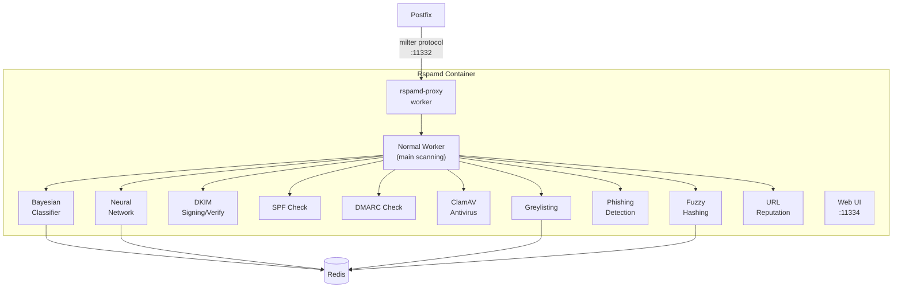

# Rspamd -- Anti-Spam, DKIM, and Content Filtering

Rspamd is the brain that decides whether an email is legitimate or garbage. It runs as a milter (mail filter) that Postfix consults for every email. Beyond spam detection, it also handles DKIM signing, SPF/DMARC verification, virus scanning, and phishing detection.

Think of Rspamd as a panel of judges. Each judge (module) scores the email on different criteria. The scores add up, and if the total crosses a threshold, the email gets flagged or rejected.

## What It Does

- **Spam filtering** with Bayesian classification, neural networks, fuzzy hashing
- **DKIM signing** for outbound email and **DKIM verification** for inbound
- **SPF and DMARC** checks for sender authentication
- **ClamAV antivirus** integration for attachment scanning
- **Greylisting** to defer suspicious first-time senders
- **Phishing detection** using URL analysis and domain reputation
- **Rate limiting** (in addition to Postfix's own rate limits)
- **Web UI** on port 11334 for monitoring and training

## Architecture



## Configuration Files

All customizations live in `mailer/rspamd/config/local.d/`. Rspamd has a layered config system -- files in `local.d/` override the defaults without replacing them.

Here is what each config file does:

| File | Purpose |
|------|---------|
| `classifier-bayes.conf` | Bayesian spam classifier settings |
| `neural.conf` | Neural network spam detection |
| `dkim_signing.conf` | DKIM signing keys and selectors |
| `spf.conf` | SPF validation settings |
| `dmarc.conf` | DMARC policy enforcement |
| `antivirus.conf` | ClamAV integration |
| `greylisting.conf` | Greylisting policy |
| `phishing.conf` | Phishing URL detection |
| `fuzzy_check.conf` | Fuzzy hash matching for known spam |
| `url_reputation.conf` | URL reputation checking |
| `redis.conf` | Redis connection settings |
| `actions.conf` | Score thresholds and actions |
| `milter_headers.conf` | Which headers to add/modify |
| `arc.conf` | ARC (Authenticated Received Chain) settings |
| `multimap.conf` | Custom multi-map rules |
| `settings.conf` | Per-user/per-domain settings |
| `whitelist_domains.map` | Domains that skip spam checks |
| `worker-proxy.inc` | Proxy worker configuration |

### Spam Scoring and Actions

Rspamd assigns a numeric score to each email. The `actions.conf` file defines what happens at each threshold:

| Score | Action | What Happens |
|-------|--------|-------------|
| < 4 | No action | Email delivered normally |
| 4-6 | Add header | `X-Spam: Yes` header added, email delivered |
| 6-10 | Rewrite subject | Subject gets `[SPAM]` prefix |
| > 10 | Reject | Email rejected at SMTP level |
| > 15 | Drop | Email silently discarded |

These thresholds are tunable. Start conservative (higher thresholds) and tighten as you collect training data.

### Bayesian Classifier

The Bayesian filter learns what spam and ham (legitimate email) look like for your specific mail server. It stores token statistics in Redis.

```lua
-- classifier-bayes.conf
classifier "bayes" {
  backend = "redis";
  min_tokens = 11;
  min_learns = 200;    -- Need 200 samples before classifier activates
  autolearn = true;    -- Auto-learn from very high/low scoring emails
}
```

The classifier needs training data to be effective. It auto-learns from emails that score very high (definitely spam) or very low (definitely ham), but manual training produces better results.

**Training via the Web UI** is the easiest approach -- mark emails as spam or ham in the Rspamd web interface on port 11334.

**Training via command line:**

```bash
# Train as spam
docker exec rspamd rspamc learn_spam < /path/to/spam-email.eml

# Train as ham
docker exec rspamd rspamc learn_ham < /path/to/ham-email.eml

# Check training statistics
docker exec rspamd rspamc stat
```

### Neural Network Detection

Rspamd includes a neural network module that learns complex spam patterns that traditional rules miss:

```lua
-- neural.conf
neural {
  enabled = true;
  train {
    max_trains = 1000;
    max_usages = 20;
    learning_rate = 0.01;
  }
}
```

The neural network trains automatically from the results of other modules. It kicks in after enough training data has been collected and provides an additional scoring signal.

### DKIM Signing

Outbound emails are signed with DKIM to prove they came from your server:

```lua
-- dkim_signing.conf
dkim_signing {
  path = "/var/lib/rspamd/dkim/$domain.$selector.key";
  selector = "mail";
  allow_username_mismatch = true;
}
```

DKIM keys are stored per-domain. When you add a new domain, you need to:

1. Generate a DKIM key pair
2. Place the private key at `/var/lib/rspamd/dkim/{domain}.{selector}.key`
3. Add the public key as a DNS TXT record at `{selector}._domainkey.{domain}`

The API worker automates this process when you create a new domain.

### ClamAV Antivirus

Rspamd sends attachments to ClamAV for virus scanning:

```lua
-- antivirus.conf
antivirus {
  clamav {
    action = "reject";
    type = "clamav";
    servers = "clamav:3310";
    scan_mime_parts = true;
  }
}
```

If ClamAV detects a virus, the email is rejected at the SMTP level with a clear error message.

### Greylisting

Greylisting temporarily rejects the first email from an unknown sender. Legitimate mail servers retry; spam bots usually do not.

```lua
-- greylisting.conf
greylist {
  expire = 86400;        -- Remember senders for 24 hours
  timeout = 300;         -- Defer for 5 minutes on first attempt
  key_prefix = "grey";
  whitelist_domains_url = "/etc/rspamd/local.d/whitelist_domains.map";
}
```

Add major email providers (Gmail, Outlook, etc.) to the whitelist so their mail is never greylisted.

### SPF and DMARC

```lua
-- spf.conf
spf {
  enabled = true;
  spf_cache_size = 2k;
  spf_cache_expire = 12h;
}
```

```lua
-- dmarc.conf
dmarc {
  enabled = true;
  actions = {
    quarantine = "add_header";
    reject = "reject";
  }
}
```

Rspamd respects the sender's DMARC policy. If a domain publishes `p=reject` and the email fails both SPF and DKIM, it gets rejected.

## Web UI

The Rspamd web UI is available on port 11334. It provides:

- Real-time email scanning statistics
- Spam/ham ratio graphs
- Per-symbol score breakdowns
- Manual spam/ham training
- Configuration viewer
- Log viewer

Access it at `http://your-server:11334/`. The password is set via the `RSPAMD_PASSWORD` environment variable.

## Tuning False Positives

False positives (legitimate email marked as spam) are the worst outcome. Here is how to reduce them:

1. **Whitelist known senders** -- Add trusted domains to `whitelist_domains.map`
2. **Train the Bayesian classifier** -- More training data = better accuracy
3. **Adjust score thresholds** -- Raise the `add header` threshold in `actions.conf`
4. **Check per-symbol scores** -- Use the Web UI to see which rules are triggering. If a specific rule causes too many false positives, reduce its weight in a custom `.conf` file
5. **Use the settings module** -- Create per-domain or per-user overrides in `settings.conf`

```lua
-- Example: relax scoring for a specific domain
settings {
  trusted_partner {
    priority = 10;
    from = "/@trustedpartner\\.com$/";
    apply {
      actions {
        reject = 999;    -- Never reject
        greylist = 999;  -- Never greylist
      }
    }
  }
}
```

## Docker Configuration

```yaml
rspamd:
  build: ./mailer/rspamd
  container_name: rspamd
  ports:
    - "11332:11332"  # Milter protocol (Postfix connects here)
    - "11334:11334"  # Web UI + API
  volumes:
    - rspamd_data:/var/lib/rspamd
  depends_on:
    - redis
```

## Environment Variables

| Variable | Default | Description |
|----------|---------|-------------|
| `REDIS_HOST` | `redis` | Redis host for Bayesian data, greylisting, neural network |
| `REDIS_PORT` | `6379` | Redis port |
| `RSPAMD_PASSWORD` | (empty) | Web UI password |
| `CLAMAV_HOST` | `clamav` | ClamAV host |
| `CLAMAV_PORT` | `3310` | ClamAV port |

## Gotchas

!!! warning "Bayesian Minimum Learns"
    The Bayesian classifier will not activate until it has at least 200 spam and 200 ham samples (configurable via `min_learns`). Until then, it contributes zero to the score. Train early and often.

!!! warning "DKIM Key Permissions"
    DKIM private keys must be readable by the `_rspamd` user inside the container. If you mount keys from the host, check the file permissions.

!!! tip "Redis Memory"
    Rspamd stores a lot of data in Redis (Bayesian tokens, neural network weights, greylisting records, fuzzy hashes). Monitor Redis memory usage and set a `maxmemory` policy to prevent OOM issues.

!!! tip "Testing Spam Detection"
    Use the GTUBE test string in an email body to trigger a guaranteed spam detection:
    ```
    XJS*C4JDBQADN1.NSBN3*2IDNEN*GTUBE-STANDARD-ANTI-UBE-TEST-EMAIL*C.34X
    ```
