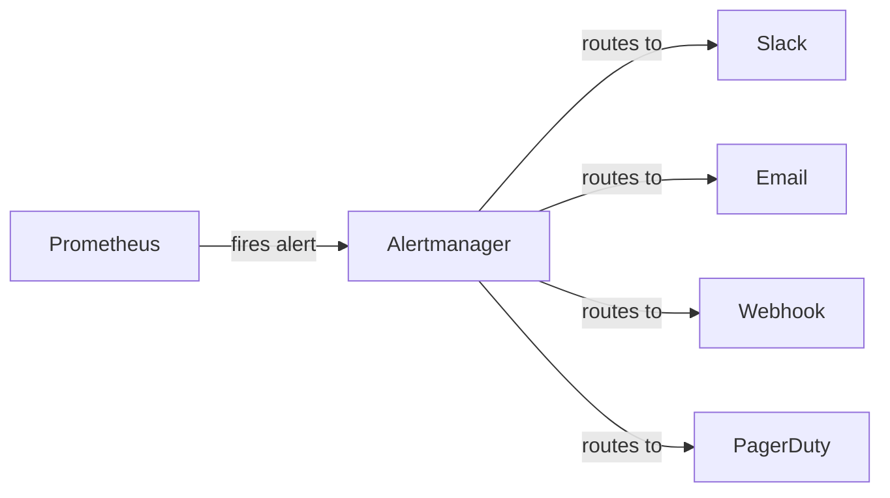

# Alerting

Alerts tell you something is wrong before your users do — set them up and trust them.

## How Alerting Works

Prometheus evaluates alert rules every 15 seconds. When a rule fires, it sends the alert to Alertmanager. Alertmanager groups, deduplicates, and routes alerts to your notification channels.



## Alert Rules

Alert rules live in `monitoring/prometheus/rules/`. Here are the ones Mailyte ships with.

### Mail Queue Alerts

```yaml
# rules/postfix.yml
groups:
  - name: postfix
    rules:
      - alert: MailQueueHigh
        expr: postfix_queue_size > 500
        for: 5m
        labels:
          severity: warning
        annotations:
          summary: "Mail queue is backing up"
          description: "Queue has {{ $value }} messages (threshold: 500)"

      - alert: MailQueueCritical
        expr: postfix_queue_size > 2000
        for: 2m
        labels:
          severity: critical
        annotations:
          summary: "Mail queue is critically high"
          description: "Queue has {{ $value }} messages — delivery may be stalled"

      - alert: HighBounceRate
        expr: >
          rate(postfix_bounce_total[15m])
          / rate(postfix_delivery_total[15m]) > 0.1
        for: 10m
        labels:
          severity: warning
        annotations:
          summary: "Bounce rate exceeds 10%"
          description: "Current bounce rate: {{ $value | humanizePercentage }}"

      - alert: DeliveryStalled
        expr: rate(postfix_delivery_total[10m]) == 0
        for: 10m
        labels:
          severity: critical
        annotations:
          summary: "No emails delivered in 10 minutes"
          description: "Postfix may be down or misconfigured"
```

### Service Down Alerts

```yaml
# rules/services.yml
groups:
  - name: services
    rules:
      - alert: ServiceDown
        expr: up == 0
        for: 1m
        labels:
          severity: critical
        annotations:
          summary: "{{ $labels.job }} is down"
          description: "Prometheus cannot reach {{ $labels.instance }}"

      - alert: APIHighErrorRate
        expr: >
          rate(http_requests_total{status=~"5.."}[5m])
          / rate(http_requests_total[5m]) > 0.05
        for: 5m
        labels:
          severity: warning
        annotations:
          summary: "API error rate above 5%"
          description: "{{ $value | humanizePercentage }} of requests are failing"

      - alert: APIDown
        expr: up{job="api"} == 0
        for: 30s
        labels:
          severity: critical
        annotations:
          summary: "FastAPI is unreachable"
          description: "The API on :5000 is not responding"
```

### Infrastructure Alerts

```yaml
# rules/infrastructure.yml
groups:
  - name: infrastructure
    rules:
      - alert: DiskSpaceLow
        expr: >
          (node_filesystem_avail_bytes{mountpoint="/"}
          / node_filesystem_size_bytes{mountpoint="/"}) < 0.15
        for: 5m
        labels:
          severity: warning
        annotations:
          summary: "Disk space below 15%"
          description: "{{ $value | humanizePercentage }} free on root filesystem"

      - alert: DiskSpaceCritical
        expr: >
          (node_filesystem_avail_bytes{mountpoint="/"}
          / node_filesystem_size_bytes{mountpoint="/"}) < 0.05
        for: 1m
        labels:
          severity: critical
        annotations:
          summary: "Disk space below 5%"
          description: "Server will run out of disk soon"

      - alert: HighMemoryUsage
        expr: >
          (1 - node_memory_MemAvailable_bytes
          / node_memory_MemTotal_bytes) > 0.9
        for: 5m
        labels:
          severity: warning
        annotations:
          summary: "Memory usage above 90%"
          description: "Available memory is critically low"

      - alert: HighCPUUsage
        expr: >
          100 - (avg by(instance)
          (irate(node_cpu_seconds_total{mode="idle"}[5m])) * 100) > 85
        for: 10m
        labels:
          severity: warning
        annotations:
          summary: "CPU usage above 85%"
          description: "Sustained high CPU for 10+ minutes"
```

### Database Alerts

```yaml
# rules/database.yml
groups:
  - name: database
    rules:
      - alert: MySQLDown
        expr: mysql_up == 0
        for: 30s
        labels:
          severity: critical
        annotations:
          summary: "MySQL is down"
          description: "Cannot connect to MySQL"

      - alert: MySQLTooManyConnections
        expr: >
          mysql_global_status_threads_connected
          / mysql_global_variables_max_connections > 0.8
        for: 5m
        labels:
          severity: warning
        annotations:
          summary: "MySQL connections above 80% of max"
          description: "{{ $value | humanizePercentage }} of connection limit used"

      - alert: MySQLSlowQueries
        expr: rate(mysql_global_status_slow_queries[5m]) > 0.1
        for: 5m
        labels:
          severity: warning
        annotations:
          summary: "MySQL slow queries increasing"
          description: "{{ $value }} slow queries per second"

      - alert: RedisMemoryHigh
        expr: >
          redis_memory_used_bytes / redis_memory_max_bytes > 0.85
        for: 5m
        labels:
          severity: warning
        annotations:
          summary: "Redis memory usage above 85%"
```

## Alert Severity Levels

| Severity | Meaning | Response Time | Example |
|----------|---------|--------------|---------|
| `critical` | Service is down or data is at risk | Immediate | MySQL down, disk full |
| `warning` | Something needs attention soon | Within hours | Queue growing, high CPU |
| `info` | Worth knowing, no action needed | Next business day | Certificate expiring in 30 days |

## Alertmanager Configuration

```yaml
# monitoring/alertmanager/alertmanager.yml
global:
  resolve_timeout: 5m
  smtp_from: alerts@yourdomain.com
  smtp_smarthost: localhost:25

route:
  receiver: default
  group_by: [alertname, severity]
  group_wait: 30s
  group_interval: 5m
  repeat_interval: 4h
  routes:
    - match:
        severity: critical
      receiver: critical-alerts
      repeat_interval: 1h
    - match:
        severity: warning
      receiver: warning-alerts
      repeat_interval: 4h

receivers:
  - name: default
    webhook_configs:
      - url: http://health-monitor:8080/webhook/alerts

  - name: critical-alerts
    slack_configs:
      - api_url: ${SLACK_WEBHOOK_URL}
        channel: "#mailyte-critical"
        title: "CRITICAL: {{ .GroupLabels.alertname }}"
        text: "{{ range .Alerts }}{{ .Annotations.description }}\n{{ end }}"
    email_configs:
      - to: oncall@yourdomain.com

  - name: warning-alerts
    slack_configs:
      - api_url: ${SLACK_WEBHOOK_URL}
        channel: "#mailyte-alerts"
        title: "Warning: {{ .GroupLabels.alertname }}"
        text: "{{ range .Alerts }}{{ .Annotations.description }}\n{{ end }}"

inhibit_rules:
  - source_match:
      severity: critical
    target_match:
      severity: warning
    equal: [alertname]
```

> **Note:** The `inhibit_rules` section prevents warning alerts from firing when a critical alert for the same issue is already active. No need to get two alerts for one problem.

## Silencing Alerts

During maintenance, silence alerts so you don't get flooded:

```bash
# Silence all alerts for 2 hours
amtool silence add --alertmanager.url=http://localhost:9093 \
  --duration=2h \
  --comment="Planned maintenance window"

# Silence a specific alert
amtool silence add --alertmanager.url=http://localhost:9093 \
  alertname=MailQueueHigh \
  --duration=1h \
  --comment="Flushing queue manually"

# List active silences
amtool silence query --alertmanager.url=http://localhost:9093
```

## Testing Alerts

Don't wait for things to break. Test your alert pipeline:

```bash
# Send a test alert to Alertmanager
curl -X POST http://localhost:9093/api/v2/alerts \
  -H "Content-Type: application/json" \
  -d '[{
    "labels": {
      "alertname": "TestAlert",
      "severity": "warning"
    },
    "annotations": {
      "summary": "This is a test alert",
      "description": "Testing the alert pipeline"
    }
  }]'
```

If your Slack channel doesn't get a message, check the Alertmanager logs:

```bash
docker compose logs alertmanager
```
