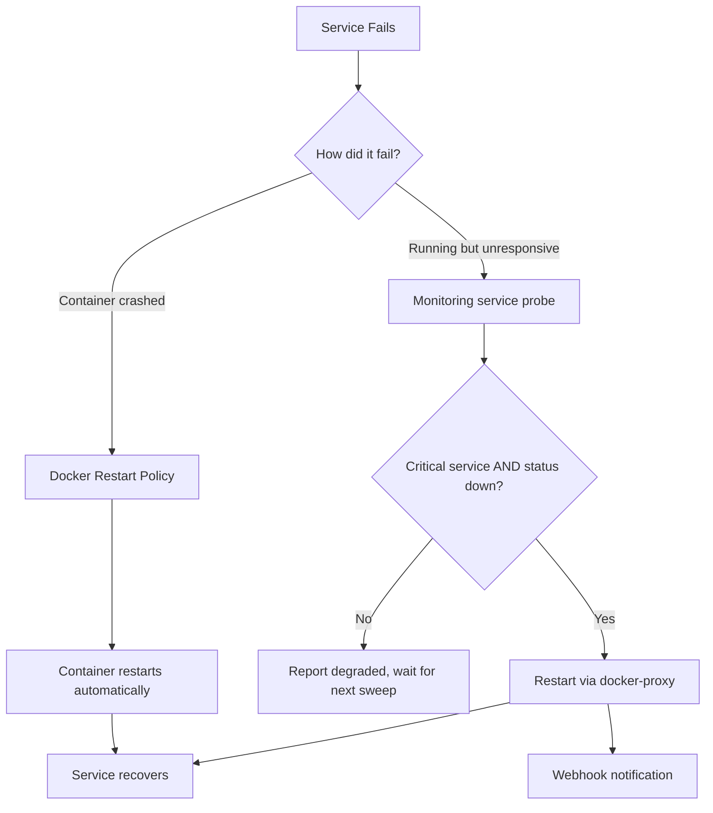

# Auto-Healing

When a service fails, Mailyte detects it and restarts it automatically — usually before anyone notices.

## How It Works

Auto-healing happens at two levels:

1. **Docker restart policies** — Docker itself restarts crashed containers
2. **Monitoring service** — detects services that are *running but broken* (port open, protocol dead) and triggers restarts



## Docker Restart Policies

Every Mailyte service has a restart policy: `unless-stopped` in the base `docker-compose.yml`, upgraded to `always` in `docker-compose.prod.yml`.

**Restart policy options:**

| Policy | Behavior |
|--------|----------|
| `no` | Never restart (Docker's default) |
| `always` | Always restart, even after a host reboot with the container previously stopped |
| `unless-stopped` | Restart unless you explicitly stop it |
| `on-failure[:max]` | Only restart on non-zero exit, with optional retry limit |

> **Note:** `unless-stopped` handles crashes gracefully but respects `docker compose stop` during maintenance — which is why the dev compose uses it. Production uses `always` so everything comes back after a host reboot.

## Docker Health Checks

Nearly every container defines a `healthcheck:` in `docker-compose.yml`. Real examples from the compose file:

```yaml
rspamd:
  healthcheck:
    test: ["CMD-SHELL", "timeout 2 bash -c 'echo > /dev/tcp/localhost/11334' 2>/dev/null || exit 1"]

monitoring:
  healthcheck:
    test: ["CMD-SHELL", "python3 -c 'import socket; s=socket.socket(); s.settimeout(2); s.connect((\"localhost\", 8085)); s.close()'"]
    interval: 30s
    timeout: 10s
    retries: 3
    start_period: 15s

prometheus:
  healthcheck:
    test: ["CMD-SHELL", "wget -qO- http://localhost:9090/-/healthy || exit 1"]
    interval: 15s
```

**Fields explained:**

| Field | What It Does |
|-------|-------------|
| `test` | Command to run inside the container |
| `interval` | Time between checks |
| `timeout` | Max time to wait for the check to complete |
| `retries` | How many failures before marking unhealthy |
| `start_period` | Grace period after container starts |

Docker's verdict also matters for routing: Traefik excludes containers marked `unhealthy`, so a broken healthcheck can take a healthy service out of rotation.

## Monitoring-Service Auto-Healing

The monitoring service goes beyond Docker's built-in checks. It tests actual functionality — an SMTP banner from Postfix, an IMAP greeting from Dovecot, an authenticated-free `/ping` from Rspamd, a `/health` from the API.

**What gets healed:** only the four services marked `critical` in `service_monitor.py` — `postfix`, `dovecot`, `rspamd`, and `api`. Non-critical workers are reported as degraded but never auto-restarted. (`cert_manager` is deliberately non-critical: false-positive restarts of it once exhausted Let's Encrypt rate limits for several subdomains.)

**When:** during the comprehensive monitoring sweep, every 5 minutes. A critical service whose probe reports `down` or `error` is restarted; a webhook `recovery_action` notification is sent with the result.

**Restart guardrails** (constants in `service_monitor.py`):

| Setting | Value |
|---------|-------|
| Max restart attempts per service | 3 |
| Cooldown between attempts | 300 seconds |

### The Docker socket is proxied, not mounted

The monitoring container does **not** get `/var/run/docker.sock`. It reaches Docker through the `docker-proxy` service (`tecnativa/docker-socket-proxy`) via `DOCKER_HOST=tcp://docker-proxy:2375`. The proxy allows exactly what auto-healing needs and nothing more:

```yaml
docker-proxy:
  image: tecnativa/docker-socket-proxy:latest
  environment:
    - CONTAINERS=1
    - POST=1
    - ALLOW_RESTARTS=1
    # Everything else defaults to 0: EXEC, IMAGES, BUILD, NETWORKS,
    # VOLUMES, SECRETS, SWARM, ...
  volumes:
    - /var/run/docker.sock:/var/run/docker.sock:ro
```

A compromised monitoring container can therefore restart containers, but cannot exec into them, read secrets, build images, or touch volumes.

## Manual Healing

Both operations require the monitoring admin token (see [Health Checks](health-checks.md#other-endpoints)):

```bash
# Restart one service
curl -X POST http://localhost:8085/restart/postfix \
  -H "X-Admin-Token: $TOKEN"

# Sweep and heal everything unhealthy
curl -X POST http://localhost:8085/auto-heal \
  -H "X-Admin-Token: $TOKEN"
```

Through the API gateway the same operations are `POST /api/v1/monitoring/services/{name}/restart` and `POST /api/v1/monitoring/auto-heal` — those additionally require a platform-scope API credential with the `operator` role, and still forward your `X-Admin-Token` downstream.

## Viewing Restart History

```bash
# Docker's built-in restart count
docker inspect --format='{{.RestartCount}}' postfix

# Last restart time
docker inspect --format='{{.State.StartedAt}}' postfix

# Monitoring service's healing log
docker compose logs monitoring | grep -i "auto-heal\|restart"

# All container events (starts, stops, restarts)
docker events --filter type=container --since 24h
```

## Disabling Auto-Healing

There is no `ENABLE_AUTO_HEALING` switch. To stop the monitoring service from restarting things during maintenance, stop the monitoring service itself (Docker restart policies still apply):

```bash
docker compose stop monitoring
# ... maintenance ...
docker compose start monitoring
```

Alternatively, stopping `docker-proxy` removes the monitoring service's ability to restart anything while leaving its health reporting intact (restart attempts will simply fail and be reported).
