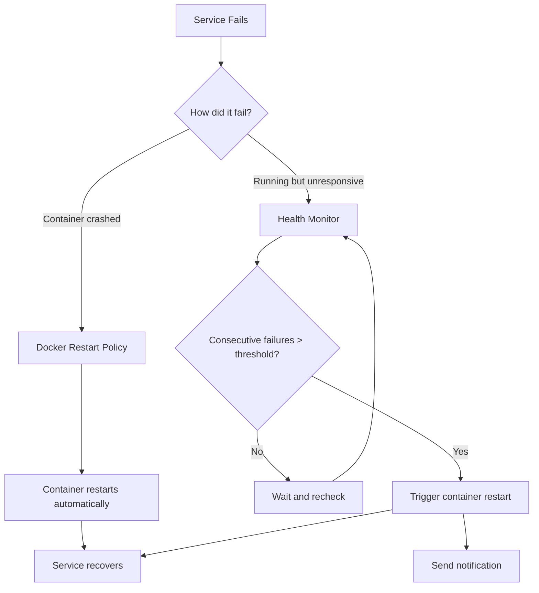

# Auto-Healing

When a service fails, Mailyte detects it and restarts it automatically — usually before anyone notices.

## How It Works

Auto-healing happens at two levels:

1. **Docker restart policies** — Docker itself restarts crashed containers
2. **Health monitor** — Detects services that are running but broken, and triggers restarts



## Docker Restart Policies

Every Mailyte service has a restart policy in Docker Compose:

```yaml
services:
  postfix:
    restart: unless-stopped
    # Restarts automatically if the process exits
    # Does NOT restart if you manually stop it

  dovecot:
    restart: unless-stopped

  rspamd:
    restart: unless-stopped

  mysql:
    restart: unless-stopped

  redis:
    restart: unless-stopped

  api:
    restart: unless-stopped

  worker:
    restart: unless-stopped

  health-monitor:
    restart: always
    # The health monitor itself always restarts — it's the watchdog
```

**Restart policy options:**

| Policy | Behavior |
|--------|----------|
| `no` | Never restart (default) |
| `always` | Always restart, even if manually stopped |
| `unless-stopped` | Restart unless you explicitly stop it |
| `on-failure[:max]` | Only restart on non-zero exit, with optional retry limit |

> **Note:** `unless-stopped` is the sweet spot for most services. It handles crashes gracefully but respects your `docker compose stop` commands during maintenance.

## Docker Health Checks

Docker has built-in health check support. These run inside the container and mark it as `healthy` or `unhealthy`.

```yaml
services:
  postfix:
    healthcheck:
      test: ["CMD", "nc", "-z", "localhost", "25"]
      interval: 30s
      timeout: 5s
      retries: 3
      start_period: 30s

  dovecot:
    healthcheck:
      test: ["CMD", "nc", "-z", "localhost", "143"]
      interval: 30s
      timeout: 5s
      retries: 3
      start_period: 30s

  rspamd:
    healthcheck:
      test: ["CMD", "curl", "-f", "http://localhost:11334/ping"]
      interval: 30s
      timeout: 5s
      retries: 3
      start_period: 15s

  mysql:
    healthcheck:
      test: ["CMD", "mysqladmin", "ping", "-h", "localhost"]
      interval: 30s
      timeout: 5s
      retries: 3
      start_period: 60s

  redis:
    healthcheck:
      test: ["CMD", "redis-cli", "ping"]
      interval: 15s
      timeout: 3s
      retries: 3
      start_period: 10s

  api:
    healthcheck:
      test: ["CMD", "curl", "-f", "http://localhost:5000/health"]
      interval: 15s
      timeout: 5s
      retries: 3
      start_period: 30s
```

**Fields explained:**

| Field | What It Does |
|-------|-------------|
| `test` | Command to run inside the container |
| `interval` | Time between checks |
| `timeout` | Max time to wait for the check to complete |
| `retries` | How many failures before marking unhealthy |
| `start_period` | Grace period after container starts (checks during this time don't count as failures) |

## Health Monitor Auto-Healing

The health monitor goes beyond Docker's built-in checks. It tests actual functionality, not just "is the port open."

For example, Docker's health check confirms MySQL's port is open. The health monitor runs `SELECT 1` to confirm MySQL is actually processing queries.

**How the health monitor restarts services:**

```python
# Simplified logic inside the health monitor
async def check_and_heal(service):
    result = await run_health_check(service)

    if result.healthy:
        service.consecutive_failures = 0
        return

    service.consecutive_failures += 1

    if service.consecutive_failures >= UNHEALTHY_THRESHOLD:
        logger.warning(f"{service.name} failed {service.consecutive_failures} times, restarting")
        await restart_container(service.name)
        await send_notification(service.name, "restarted")
        service.consecutive_failures = 0
```

**Restart behavior:**

| Scenario | Action | Notification |
|----------|--------|-------------|
| 1 failed check | Log and wait | None |
| 2 failed checks | Log and wait | None |
| 3 failed checks (default threshold) | Restart container | Webhook + Slack |
| Restart succeeds | Resume normal checks | Recovery notification |
| Restart fails | Retry after backoff | Escalated notification |

## Restart Backoff

To prevent restart loops, the health monitor uses exponential backoff:

```
1st restart: Immediate
2nd restart: Wait 30 seconds
3rd restart: Wait 60 seconds
4th restart: Wait 120 seconds
5th restart: Wait 300 seconds (5 min)
After 5 restarts: Stop trying, send critical alert
```

> **Warning:** If a service reaches 5 failed restarts, the health monitor stops auto-healing and sends a critical alert. At that point, a human needs to investigate.

## Configuration

Environment variables for the health monitor:

```yaml
health-monitor:
  environment:
    - ENABLE_AUTO_HEALING=true
    - UNHEALTHY_THRESHOLD=3
    - MAX_RESTART_ATTEMPTS=5
    - RESTART_BACKOFF_BASE=30
    - RESTART_COOLDOWN=300
    - DOCKER_SOCKET=/var/run/docker.sock
  volumes:
    - /var/run/docker.sock:/var/run/docker.sock:ro
```

| Variable | Default | Description |
|----------|---------|-------------|
| `ENABLE_AUTO_HEALING` | `true` | Master switch for auto-healing |
| `UNHEALTHY_THRESHOLD` | `3` | Consecutive failures before restart |
| `MAX_RESTART_ATTEMPTS` | `5` | Stop trying after this many restarts |
| `RESTART_BACKOFF_BASE` | `30` | Base seconds for backoff calculation |
| `RESTART_COOLDOWN` | `300` | Seconds after a restart before checking again |

> **Note:** The health monitor needs access to the Docker socket (`/var/run/docker.sock`) to restart containers. This is a privileged operation — make sure only trusted services have this access.

## Viewing Restart History

```bash
# Docker's built-in restart count
docker inspect --format='{{.RestartCount}}' mailyte-postfix

# Last restart time
docker inspect --format='{{.State.StartedAt}}' mailyte-postfix

# Health monitor's restart log
docker compose logs health-monitor | grep "restart"

# All container events (starts, stops, restarts)
docker events --filter type=container --since 24h
```

## Disabling Auto-Healing

During maintenance or debugging, you might want to disable auto-healing:

```bash
# Disable via environment variable
docker compose exec health-monitor \
  curl -X POST http://localhost:8080/admin/auto-healing/disable

# Or restart with the flag off
ENABLE_AUTO_HEALING=false docker compose up -d health-monitor
```

Remember to re-enable it when you're done.
