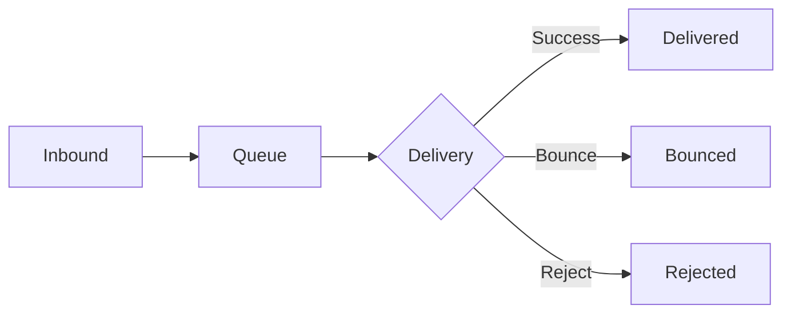

# Grafana

> **Enterprise Edition** — This feature is available in [Mailyte Enterprise](https://mailyte.com). The Community Edition does not include this functionality.


Grafana turns Prometheus metrics into dashboards you can actually understand at a glance.

## Setup

Grafana runs on port `3000` as part of the monitoring stack. On first launch, it auto-provisions datasources and dashboards from config files.

```yaml
# docker-compose.monitoring.yml (relevant section)
grafana:
  image: grafana/grafana:latest
  ports:
    - "3000:3000"
  volumes:
    - grafana-data:/var/lib/grafana
    - ./monitoring/grafana/provisioning:/etc/grafana/provisioning
    - ./monitoring/grafana/dashboards:/var/lib/grafana/dashboards
  environment:
    - GF_SECURITY_ADMIN_USER=admin
    - GF_SECURITY_ADMIN_PASSWORD=${GRAFANA_PASSWORD}
    - GF_USERS_ALLOW_SIGN_UP=false
```

### Datasource Provisioning

Place this in `monitoring/grafana/provisioning/datasources/prometheus.yml`:

```yaml
apiVersion: 1

datasources:
  - name: Prometheus
    type: prometheus
    access: proxy
    url: http://prometheus:9090
    isDefault: true
    editable: false
```

### Dashboard Provisioning

Place this in `monitoring/grafana/provisioning/dashboards/dashboards.yml`:

```yaml
apiVersion: 1

providers:
  - name: Mailyte
    orgId: 1
    folder: Mailyte
    type: file
    disableDeletion: false
    editable: true
    options:
      path: /var/lib/grafana/dashboards
      foldersFromFilesStructure: true
```

## Key Dashboards

Mailyte ships with four pre-built dashboards. Each one focuses on a different angle.

### 1. Mail Flow Dashboard

The big picture — how email is moving through the system.

**Panels included:**

| Panel | Visualization | Query |
|-------|--------------|-------|
| Emails Sent (24h) | Stat | `increase(postfix_delivery_total[24h])` |
| Current Queue Size | Gauge | `postfix_queue_size` |
| Delivery Rate | Time series | `rate(postfix_delivery_total[5m]) * 60` |
| Bounce Rate | Time series | `rate(postfix_bounce_total[5m]) / rate(postfix_delivery_total[5m]) * 100` |
| Rejections | Time series | `rate(postfix_reject_total[5m]) * 60` |
| Delivery Latency (p95) | Time series | `histogram_quantile(0.95, rate(postfix_delivery_delay_seconds_bucket[5m]))` |



### 2. Queue Status Dashboard

Zoom into the mail queue — the heartbeat of Postfix.

**Panels included:**

| Panel | What It Shows |
|-------|--------------|
| Active Queue | Emails being delivered right now |
| Deferred Queue | Emails that failed and are waiting for retry |
| Hold Queue | Emails manually held by an admin |
| Queue Age Distribution | How long emails have been sitting in the queue |
| Top Deferred Domains | Which recipient domains are causing delivery failures |

> **Warning:** If the deferred queue keeps growing, something is wrong. Check DNS resolution, recipient server availability, or rate limiting.

### 3. Spam Stats Dashboard

How Rspamd is protecting your server.

**Panels included:**

| Panel | What It Shows |
|-------|--------------|
| Scanned Today | Total messages processed |
| Spam vs Ham Ratio | Pie chart of clean vs spam |
| Spam Score Distribution | Histogram of scores |
| Actions Taken | Breakdown: accept, greylist, add header, reject |
| Top Spam Sources | IPs sending the most spam |
| False Positive Rate | Messages marked spam then unmarked |

### 4. API Performance Dashboard

How the FastAPI backend is handling requests.

**Panels included:**

| Panel | What It Shows |
|-------|--------------|
| Request Rate | Requests per second |
| Error Rate | 4xx and 5xx responses |
| Response Time (p50, p95, p99) | Latency percentiles |
| Requests by Endpoint | Top endpoints by volume |
| Active Connections | Currently processing requests |
| Database Query Time | Time spent in MySQL queries |

## Creating Custom Dashboards

You don't have to stick with the defaults. Here's how to build your own.

### Step by Step

1. Open Grafana at `http://localhost:3000`
2. Click **+** in the sidebar, then **Dashboard**
3. Click **Add visualization**
4. Select **Prometheus** as the datasource
5. Write your PromQL query
6. Pick a visualization type (time series, gauge, stat, table, etc.)
7. Save the dashboard

### Example: Custom Email Volume Panel

```json
{
  "title": "Emails Sent Per Hour",
  "type": "timeseries",
  "datasource": "Prometheus",
  "targets": [
    {
      "expr": "increase(postfix_delivery_total[1h])",
      "legendFormat": "Delivered"
    },
    {
      "expr": "increase(postfix_bounce_total[1h])",
      "legendFormat": "Bounced"
    }
  ],
  "fieldConfig": {
    "defaults": {
      "unit": "short"
    }
  }
}
```

## Variables and Filtering

Add template variables so users can filter dashboards:

```
# Filter by organization
label_values(api_emails_sent_total, org_id)

# Filter by time range (built-in)
$__interval

# Filter by service instance
label_values(up, instance)
```

## Access Control

In production, lock down Grafana:

```ini
# grafana.ini or environment variables
GF_SECURITY_ADMIN_PASSWORD=use-a-strong-password-here
GF_USERS_ALLOW_SIGN_UP=false
GF_AUTH_ANONYMOUS_ENABLED=false
GF_SECURITY_COOKIE_SECURE=true
GF_SERVER_ROOT_URL=https://grafana.yourdomain.com
```

> **Tip:** For team access, set up OAuth or LDAP authentication instead of sharing the admin password. Grafana supports Google, GitHub, Okta, and others out of the box.

## Exporting and Sharing

```bash
# Export a dashboard as JSON
curl -H "Authorization: Bearer $GRAFANA_API_KEY" \
  http://localhost:3000/api/dashboards/uid/mail-flow \
  | python3 -m json.tool > mail-flow-dashboard.json

# Import it on another instance
curl -X POST -H "Authorization: Bearer $GRAFANA_API_KEY" \
  -H "Content-Type: application/json" \
  -d @mail-flow-dashboard.json \
  http://localhost:3000/api/dashboards/db
```
