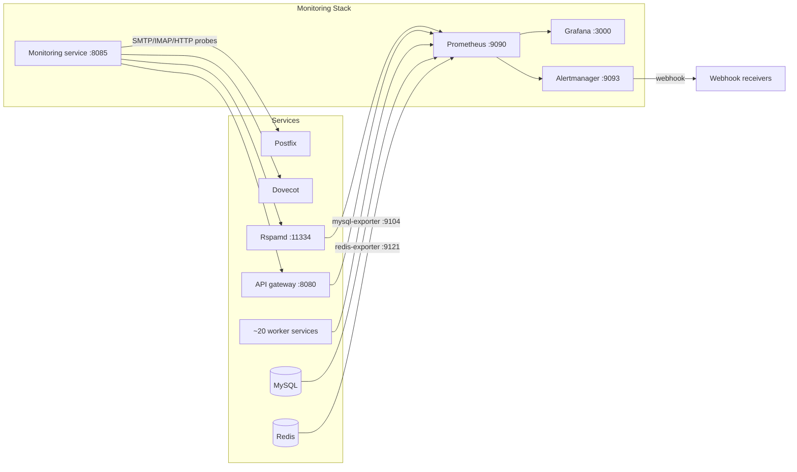

# Monitoring

Everything you need to observe, measure, and respond to what's happening inside your Mailyte email server. From real-time dashboards to automated incident response, this section covers the full monitoring stack.

---

Mailyte ships with a monitoring stack built on **Prometheus**, **Grafana**, and a **custom monitoring service** (`worker/monitoring`). You get metrics, dashboards, alerts, and auto-healing out of the box — no third-party setup required.

## Architecture at a Glance



## The Three Pillars

| Pillar | Tool | What It Gives You |
|--------|------|-------------------|
| **Metrics** | Prometheus | Time-series data from every worker's `/metrics` endpoint plus the MySQL and Redis exporters |
| **Visualization** | Grafana | Two provisioned dashboards (mail overview, security) |
| **Alerting** | Alertmanager + webhooks | Alert rules for queue depth, bounce rate, resource limits, and backup freshness |

!!! warning "Not every scrape target is deployed"
    `monitoring/prometheus/prometheus.yml` defines scrape jobs for a `postfix-exporter` (:9154) and a `dovecot-exporter` (:9166), but **no such containers exist in any compose file** — those two jobs show as `DOWN` in Prometheus, and every dashboard panel or alert built on `postfix_*` / `dovecot_*` / `node_*` series has no data until those exporters are added. What *is* live: every FastAPI worker's own `/metrics`, `rspamd:11334`, `mysql-exporter`, and `redis-exporter`. Postfix and Dovecot health is covered by the monitoring service's direct SMTP/IMAP probes instead.

## In This Section

<div class="grid cards" markdown>

-   :material-binoculars:{ .lg .middle } **Overview**

    ---

    The three pillars of observability and how they fit together in Mailyte.

    [:octicons-arrow-right-24: Overview](overview.md)

-   :material-chart-bar:{ .lg .middle } **Prometheus**

    ---

    Metrics collection, scrape configuration, and retention settings.

    :octicons-arrow-right-24: Prometheus (Enterprise Edition)

-   :material-view-dashboard:{ .lg .middle } **Grafana**

    ---

    The provisioned dashboards, custom panels, and visualization setup.

    :octicons-arrow-right-24: Grafana (Enterprise Edition)

-   :material-bell-alert:{ .lg .middle } **Alerting**

    ---

    Alert rules, severity levels, and notification routing.

    [:octicons-arrow-right-24: Alerting](alerting.md)

-   :material-heart-pulse:{ .lg .middle } **Health Checks**

    ---

    The monitoring service on `:8085` — what it checks and how to use it.

    [:octicons-arrow-right-24: Health Checks](health-checks.md)

-   :material-office-building:{ .lg .middle } **Enterprise Metrics**

    ---

    Business-level metrics — delivery stats, storage usage, and SLA numbers.

    [:octicons-arrow-right-24: Enterprise Metrics](enterprise-metrics.md)

</div>

### Deep Dives

| Page | What It Covers |
|------|---------------|
| [Service Monitoring](service-monitoring.md) | Per-service health and status checks for Postfix, Dovecot, Rspamd, and workers |
| [System Monitoring](system-monitoring.md) | CPU, RAM, and disk stats collected by the monitoring service |
| [Auto-Healing](auto-healing.md) | Automatic restart of failed critical services via a scoped Docker socket proxy |
| [Webhook Notifications](webhook-notifications.md) | Push health events to any HTTP endpoint |
| [Performance](performance.md) | Response times, throughput, queue depths, and delivery latency |
| [SLA Monitoring](sla-monitoring.md) | Uptime tracking and delivery SLA numbers |
| [Troubleshooting](troubleshooting.md) | Fixing issues with the monitoring stack itself |

## Quick Start

Already have Mailyte running? Verify the monitoring stack is healthy:

=== "Monitoring service"

    ```bash
    curl http://localhost:8085/health
    ```

    Returns the monitoring service's own liveness. `curl http://localhost:8085/heartbeat` probes every mail service and returns the full status map.

=== "Prometheus"

    ```bash
    curl http://localhost:9090/-/healthy
    ```

    Open `http://localhost:9090` for the Prometheus UI.

=== "Grafana"

    ```bash
    curl http://localhost:3000/api/health
    ```

    Open `http://localhost:3000` and log in with `GRAFANA_ADMIN_USER` / `GRAFANA_ADMIN_PASSWORD` from your `.env` file.

!!! warning "If any of these fail"
    Head to [Troubleshooting](troubleshooting.md) for step-by-step diagnosis of common monitoring issues.

!!! tip "Key ports to remember"
    | Service | Port | URL |
    |---------|------|-----|
    | Monitoring service | 8085 | `http://localhost:8085/heartbeat` |
    | Prometheus | 9090 | `http://localhost:9090` |
    | Grafana | 3000 | `http://localhost:3000` |
    | Alertmanager | 9093 | `http://localhost:9093` |

    In production these are all republished on `127.0.0.1` only (`docker-compose.prod.yml`, since 2026-08-22) — reach them over SSH port-forwarding, not from the public internet.

## Related Sections

- **Configuration > Monitoring Configuration (Enterprise Edition)** — Configure scrape targets and alert rules
- **Configuration > Prometheus Setup (Enterprise Edition)** — Full `prometheus.yml` reference
- **Deployment > Monitoring Stack (Enterprise Edition)** — Deploying the monitoring infrastructure
- **Reference > Prometheus Metrics (Enterprise Edition)** — Every exposed metric with labels and types
- **[Reference > Performance Metrics](../reference/performance-metrics.md)** — Key metrics and their healthy ranges
