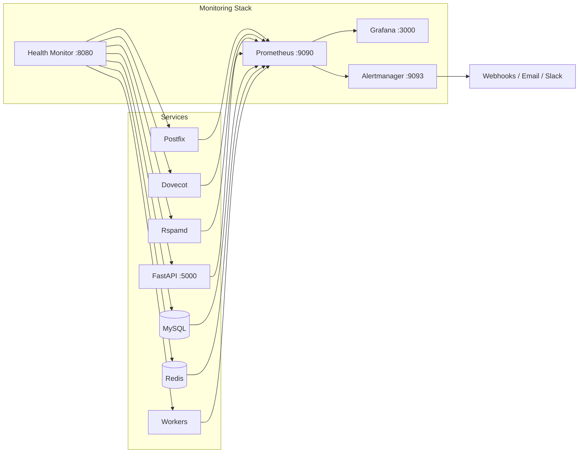

# Monitoring

Everything you need to observe, measure, and respond to what's happening inside your Mailyte email server. From real-time dashboards to automated incident response, this section covers the full monitoring stack.

---

Mailyte ships with a complete monitoring stack built on **Prometheus**, **Grafana**, and a **custom health monitor**. You get metrics, dashboards, alerts, and auto-healing out of the box — no third-party setup required.

## Architecture at a Glance



## The Three Pillars

| Pillar | Tool | What It Gives You |
|--------|------|-------------------|
| **Metrics** | Prometheus | Time-series data from every service — queue depths, delivery rates, error counts, latency |
| **Visualization** | Grafana | Pre-built dashboards with graphs, tables, and heatmaps |
| **Alerting** | Alertmanager + Webhooks | Notifications via Slack, Teams, email, or any webhook when things go wrong |

## In This Section

<div class="grid cards" markdown>

-   :material-binoculars:{ .lg .middle } **Overview**

    ---

    The three pillars of observability and how they fit together in Mailyte.

    [:octicons-arrow-right-24: Overview](overview.md)

-   :material-chart-bar:{ .lg .middle } **Prometheus**

    ---

    Metrics collection, scrape configuration, and retention settings.

    [:octicons-arrow-right-24: Prometheus](prometheus.md)

-   :material-view-dashboard:{ .lg .middle } **Grafana**

    ---

    Pre-built dashboards, custom panels, and visualization setup.

    [:octicons-arrow-right-24: Grafana](grafana.md)

-   :material-bell-alert:{ .lg .middle } **Alerting**

    ---

    Alert rules, severity levels, and notification channel configuration.

    [:octicons-arrow-right-24: Alerting](alerting.md)

-   :material-heart-pulse:{ .lg .middle } **Health Checks**

    ---

    The health monitor service on `:8080` — what it checks and how to use it.

    [:octicons-arrow-right-24: Health Checks](health-checks.md)

-   :material-office-building:{ .lg .middle } **Enterprise Metrics**

    ---

    Business-level metrics per organization — delivery rates, usage, and billing data.

    [:octicons-arrow-right-24: Enterprise Metrics](enterprise-metrics.md)

</div>

### Deep Dives

| Page | What It Covers |
|------|---------------|
| [Service Monitoring](service-monitoring.md) | Per-service health and status checks for Postfix, Dovecot, Rspamd, and workers |
| [System Monitoring](system-monitoring.md) | OS-level CPU, RAM, disk, and network stats via node exporter |
| [Auto-Healing](auto-healing.md) | Automatic restart of failed services with configurable thresholds |
| [Webhook Notifications](webhook-notifications.md) | Push alerts to Slack, Teams, PagerDuty, or any HTTP endpoint |
| [Performance](performance.md) | Response times, throughput, queue depths, and delivery latency |
| [SLA Monitoring](sla-monitoring.md) | Uptime tracking and delivery SLA compliance reporting |
| [Troubleshooting](troubleshooting.md) | Fixing issues with the monitoring stack itself |

## Quick Start

Already have Mailyte running? Verify the monitoring stack is healthy:

=== "Health Monitor"

    ```bash
    curl http://localhost:8080/health
    ```

    Returns a JSON summary of every service's status.

=== "Prometheus"

    ```bash
    curl http://localhost:9090/-/healthy
    ```

    Open `http://your-server:9090` for the Prometheus UI.

=== "Grafana"

    ```bash
    curl http://localhost:3000/api/health
    ```

    Open `http://your-server:3000` and log in with the default credentials from your `.env` file.

!!! warning "If any of these fail"
    Head to [Troubleshooting](troubleshooting.md) for step-by-step diagnosis of common monitoring issues.

!!! tip "Key ports to remember"
    | Service | Port | URL |
    |---------|------|-----|
    | Health Monitor | 8080 | `http://localhost:8080/health` |
    | Prometheus | 9090 | `http://localhost:9090` |
    | Grafana | 3000 | `http://localhost:3000` |
    | Alertmanager | 9093 | `http://localhost:9093` |

## Related Sections

- **[Configuration > Monitoring Configuration](../configuration/monitoring-configuration.md)** — Configure scrape targets and alert rules
- **[Configuration > Prometheus Setup](../configuration/prometheus-setup.md)** — Full `prometheus.yml` reference
- **[Deployment > Monitoring Stack](../deployment/monitoring-stack.md)** — Deploying the monitoring infrastructure
- **[Reference > Prometheus Metrics](../reference/prometheus-metrics.md)** — Every exposed metric with labels and types
- **[Reference > Performance Metrics](../reference/performance-metrics.md)** — Key metrics and their healthy ranges
