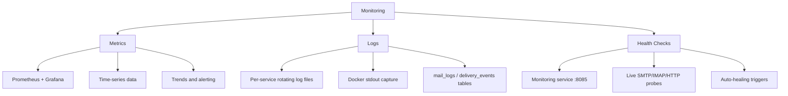

# Monitoring Overview

A healthy email server is one you can see into — Mailyte gives you three ways to look.

## The Three Pillars

Mailyte monitoring is built on three complementary approaches. Each one catches problems the others might miss.



### 1. Metrics

Metrics are numbers collected over time. They answer questions like "how many requests did the API serve in the last hour?" or "is Redis running out of memory?"

- **Collected by:** Prometheus (scrapes every 15 seconds, 30-day retention)
- **Visualized in:** Grafana dashboards
- **Used for:** Alerting, capacity planning, SLA tracking

Every FastAPI worker exposes `/metrics` via the shared collector in `shared/metrics.py`. Metric names are **prefixed with the emitting service's name** (`api_http_requests_total`, `monitoring_backup_age_seconds`, `archiver_archive_spool_depth`) — rules and queries against bare names silently match nothing.

### 2. Logs

Logs are the detailed story of what happened. When a metric spikes, logs tell you why.

- **Format:** Pipe-delimited text lines (`timestamp | service | level | module:line | message`) from `shared/logging_config.py` — not JSON
- **Sources:** Every service writes to stdout (Docker captures it) and, where the mounted log directory is writable, to rotating files under `logs/<service>/` (`<service>.log`, `<service>_errors.log`, `<service>_performance.log`)
- **Redaction:** a `RedactingFilter` scrubs anything shaped like `password=`, `secret=`, `token=`, `api_key=` before it reaches any handler
- **Mail-flow history:** since 2026-08-22 the `log_ingestor` service tails Postfix's log and produces the `mail_logs` and `delivery_events` database tables — that is where per-message delivery history lives, not in Prometheus

```bash
# View recent logs for a service
docker compose logs --tail=100 postfix

# Follow logs in real time
docker compose logs -f api

# Search across all services
docker compose logs | grep -i "error"

# On-disk rotating files (when the logs/ mount is writable by the container UID)
tail -50 logs/worker/monitoring/monitoring.log
```

### 3. Health Checks

Health checks are binary — a service is either up or it's not. The monitoring service on `:8085` probes the mail stack with real protocol checks (SMTP banner, IMAP greeting, HTTP `/health`) and reports back.

- **Frequency:** full service sweep every 5 minutes, system-resource check every 30 seconds, backup-freshness check every minute
- **Scope:** Postfix, Dovecot, Rspamd, the API gateway, and key workers (tracking, rate_limiter, webhooks, cert_manager, rag)
- **Action:** critical services that fail are auto-healed (container restart through the scoped `docker-proxy`)

```bash
curl -s http://localhost:8085/heartbeat | python3 -m json.tool
```

## What Gets Monitored

| Component | Metrics | Logs | Health Check |
|-----------|---------|------|-------------|
| Postfix | Only via monitoring-service probes (no Postfix exporter deployed) | Postfix log, tailed into `mail_logs` by log_ingestor | SMTP connection test on port 25 |
| Dovecot | Only via monitoring-service probes (no Dovecot exporter deployed) | Dovecot log; auth failures land in `failed_auth_attempts` | IMAP connection test on port 143 |
| Rspamd | None — this build's controller serves no `/metrics` (verified live 2026-08-31; scrape job commented out) | Spam filter decisions | HTTP GET `/ping` |
| MySQL | `mysql-exporter` on :9104 | Container stdout | Exporter `mysql_up` |
| Redis | `redis-exporter` on :9121 | Container stdout | Exporter `redis_up` |
| API gateway | Own `/metrics` (`api_*` series) | Access + error logs | HTTP GET `/health` |
| Workers | Each worker's own `/metrics` (`<service>_*` series) | Per-service log files | HTTP `/health` per service |

## How They Work Together

Here's a real example. Say email delivery starts failing:

1. **Health check** detects Postfix isn't answering on port 25. Auto-healing restarts the container.
2. **Metrics** show the `ServiceDown` alert firing for an affected scrape job. An alert routes through Alertmanager.
3. **Logs** reveal the root cause — `docker compose logs postfix`, and `mail_logs` shows exactly which messages deferred.

No single pillar gives you the full picture. Together, they let you detect, alert, diagnose, and recover — usually before users even notice.

## Default Ports

| Service | Port | Purpose |
|---------|------|---------|
| Monitoring service | `8085` | Service health status, dashboard, admin controls |
| Prometheus | `9090` | Metrics storage and queries |
| Grafana | `3000` | Dashboards and visualization |
| Alertmanager | `9093` | Alert routing and deduplication |
| mysql-exporter | `9104` | MySQL metrics |
| redis-exporter | `9121` | Redis metrics |

!!! note "Production binding"
    Since 2026-08-22, `docker-compose.prod.yml` republishes **every** internal port — the four above included — on `127.0.0.1` only (`ports: !override`). The previously published `0.0.0.0` ports bypassed TLS and, for several services, all authentication, and were verified reachable from the public internet. Reach these services in production via SSH port-forwarding.
