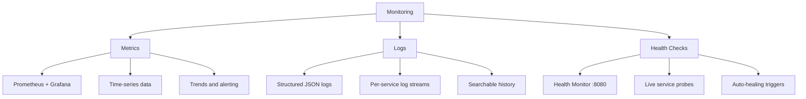

# Monitoring Overview

A healthy email server is one you can see into — Mailyte gives you three ways to look.

## The Three Pillars

Mailyte monitoring is built on three complementary approaches. Each one catches problems the others might miss.



### 1. Metrics

Metrics are numbers collected over time. They answer questions like "how many emails did we send in the last hour?" or "is the mail queue growing?"

- **Collected by:** Prometheus (scrapes every 15 seconds)
- **Visualized in:** Grafana dashboards
- **Used for:** Alerting, capacity planning, SLA tracking

Metrics are cheap to store and fast to query. You can keep months of history without breaking the bank.

### 2. Logs

Logs are the detailed story of what happened. When a metric spikes, logs tell you why.

- **Format:** Structured JSON (easy to parse, easy to search)
- **Sources:** Every service writes to stdout, Docker captures it
- **Retention:** Configurable per service via Docker log driver

```bash
# View recent logs for a service
docker compose logs --tail=100 postfix

# Follow logs in real time
docker compose logs -f api

# Search across all services
docker compose logs | grep "error"
```

### 3. Health Checks

Health checks are binary — a service is either up or it's not. The health monitor on `:8080` pings every service and reports back.

- **Frequency:** Every 30 seconds
- **Scope:** All services (Postfix, Dovecot, Rspamd, MySQL, Redis, API, workers)
- **Action:** Failed checks trigger auto-healing (container restarts)

```bash
curl -s http://localhost:8080/health | python3 -m json.tool
```

## What Gets Monitored

| Component | Metrics | Logs | Health Check |
|-----------|---------|------|-------------|
| Postfix | Queue size, delivery rate, bounce rate | Mail delivery logs | SMTP connection test |
| Dovecot | Active connections, auth attempts | IMAP/POP3 access logs | IMAP login test |
| Rspamd | Spam score distribution, action counts | Spam filter decisions | HTTP API ping |
| MySQL | Query rate, connections, replication lag | Slow query log | Connection + query test |
| Redis | Memory usage, hit rate, connections | Command log | PING/PONG test |
| FastAPI | Request rate, latency, error rate | Access + error logs | `/health` endpoint |
| Workers | Job throughput, queue depth, failures | Task execution logs | Heartbeat check |

## How They Work Together

Here's a real example. Say email delivery starts failing:

1. **Health check** detects Postfix isn't responding. Auto-healing restarts it.
2. **Metrics** show a spike in the mail queue and a drop in delivery rate. An alert fires.
3. **Logs** reveal the root cause — maybe a DNS resolution failure or a full disk.

No single pillar gives you the full picture. Together, they let you detect, alert, diagnose, and recover — usually before users even notice.

## Default Ports

| Service | Port | Purpose |
|---------|------|---------|
| Health Monitor | `8080` | Service health status |
| Prometheus | `9090` | Metrics storage and queries |
| Grafana | `3000` | Dashboards and visualization |
| Alertmanager | `9093` | Alert routing and deduplication |

> **Tip:** In production, don't expose these ports publicly. Use a reverse proxy with authentication, or bind them to `127.0.0.1` only.
