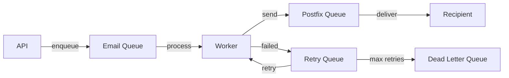

# Performance Monitoring

Track how fast things run — response times, throughput, queue depths, and database performance.

## Why Performance Monitoring

A service can be "healthy" and still be slow. Performance monitoring catches the gray area between "working fine" and "completely broken" — the zone where users start complaining.

## API Response Times

The FastAPI application tracks response time for every endpoint.

```promql
# Median response time (p50)
histogram_quantile(0.5, rate(http_request_duration_seconds_bucket[5m]))

# 95th percentile — most users' experience
histogram_quantile(0.95, rate(http_request_duration_seconds_bucket[5m]))

# 99th percentile — worst case (excluding outliers)
histogram_quantile(0.99, rate(http_request_duration_seconds_bucket[5m]))

# Average response time by endpoint
rate(http_request_duration_seconds_sum[5m])
/ rate(http_request_duration_seconds_count[5m])
```

**Target response times:**

| Endpoint Type | p50 Target | p95 Target | p99 Target |
|--------------|-----------|-----------|-----------|
| Health checks | < 10ms | < 50ms | < 100ms |
| Read operations | < 50ms | < 200ms | < 500ms |
| Write operations | < 100ms | < 500ms | < 1s |
| Email send | < 200ms | < 1s | < 2s |
| Bulk operations | < 500ms | < 2s | < 5s |

### Slow Endpoint Detection

```promql
# Endpoints where p95 > 1 second
histogram_quantile(0.95,
  sum by (endpoint, le) (rate(http_request_duration_seconds_bucket[5m]))
) > 1
```

## Throughput

How much work the system handles per unit of time.

```promql
# API requests per second
rate(http_requests_total[5m])

# Emails processed per minute
rate(postfix_delivery_total[5m]) * 60

# Emails sent via API per minute
rate(api_emails_sent_total[5m]) * 60

# Worker jobs completed per minute
rate(worker_jobs_completed_total[5m]) * 60
```

**Throughput benchmarks (single server):**

| Component | Expected Throughput |
|-----------|-------------------|
| API requests | 100-500 req/s |
| Email delivery | 50-200 emails/min |
| Worker jobs | 100-300 jobs/min |
| Rspamd scanning | 100-500 msgs/min |

## Queue Depths

Queues are the early warning system. Growing queues mean something downstream is slower than upstream.

```promql
# Postfix mail queue
postfix_queue_size

# Postfix deferred queue specifically
postfix_deferred_queue_size

# Worker job queue (Redis)
redis_list_length{key="email_queue"}

# Retry queue
redis_list_length{key="retry_queue"}

# Dead letter queue (permanently failed)
redis_list_length{key="dead_letter_queue"}
```

**Queue health indicators:**

| Queue | Healthy | Warning | Critical |
|-------|---------|---------|----------|
| Postfix active | < 50 | 50-200 | > 200 |
| Postfix deferred | < 100 | 100-500 | > 500 |
| Worker email queue | < 50 | 50-200 | > 500 |
| Retry queue | < 20 | 20-100 | > 100 |
| Dead letter queue | < 5 | 5-20 | > 20 |



## Database Query Performance

Slow database queries ripple through everything.

```promql
# Slow queries per second
rate(mysql_global_status_slow_queries[5m])

# Average query time (from application metrics)
rate(db_query_duration_seconds_sum[5m])
/ rate(db_query_duration_seconds_count[5m])

# Query rate
rate(mysql_global_status_questions[5m])

# Buffer pool hit rate (should be > 99%)
rate(mysql_global_status_innodb_buffer_pool_read_requests[5m])
/ (rate(mysql_global_status_innodb_buffer_pool_read_requests[5m])
   + rate(mysql_global_status_innodb_buffer_pool_reads[5m])) * 100
```

### Finding Slow Queries

```bash
# Enable slow query log in MySQL
docker compose exec mysql mysql -u root -p -e "
SET GLOBAL slow_query_log = 'ON';
SET GLOBAL long_query_time = 1;
SET GLOBAL log_queries_not_using_indexes = 'ON';
"

# View slow query log
docker compose exec mysql tail -50 /var/log/mysql/slow.log
```

## Redis Performance

```promql
# Command latency
redis_commands_duration_seconds_total / redis_commands_total

# Operations per second
rate(redis_commands_processed_total[5m])

# Cache hit rate
rate(redis_keyspace_hits_total[5m])
/ (rate(redis_keyspace_hits_total[5m])
   + rate(redis_keyspace_misses_total[5m])) * 100

# Memory fragmentation ratio (should be close to 1.0)
redis_memory_used_rss_bytes / redis_memory_used_bytes
```

**Redis health targets:**

| Metric | Healthy | Investigate |
|--------|---------|-------------|
| Hit rate | > 90% | < 80% |
| Ops/sec | Stable | Erratic |
| Memory fragmentation | 1.0-1.5 | > 2.0 |
| Connected clients | Stable | Climbing |

## Email Delivery Performance

```promql
# Average delivery time
rate(postfix_delivery_delay_seconds_sum[5m])
/ rate(postfix_delivery_delay_seconds_count[5m])

# Delivery time percentiles
histogram_quantile(0.5, rate(postfix_delivery_delay_seconds_bucket[5m]))
histogram_quantile(0.95, rate(postfix_delivery_delay_seconds_bucket[5m]))

# Rspamd scan time
rate(rspamd_scan_time_seconds_sum[5m])
/ rate(rspamd_scan_time_seconds_count[5m])
```

## Performance Dashboard Layout

```
+----------------------------+----------------------------+
|     API Response Time      |      Request Rate          |
|     (p50, p95, p99)        |      (requests/sec)        |
+----------------------------+----------------------------+
|     Queue Depths           |      Delivery Latency      |
|  (mail, worker, retry)     |      (p50, p95, p99)       |
+----------------------------+----------------------------+
|     DB Query Time          |      Redis Hit Rate        |
|     (avg, p95)             |      (percentage)          |
+----------------------------+----------------------------+
|          Worker Throughput (jobs/min, time series)       |
+---------------------------------------------------------+
```

## Performance Alerts

Add these to your Prometheus alert rules:

```yaml
groups:
  - name: performance
    rules:
      - alert: APISlowResponse
        expr: >
          histogram_quantile(0.95,
            rate(http_request_duration_seconds_bucket[5m])
          ) > 2
        for: 5m
        labels:
          severity: warning
        annotations:
          summary: "API p95 response time above 2 seconds"

      - alert: QueueBacklog
        expr: redis_list_length{key="email_queue"} > 200
        for: 5m
        labels:
          severity: warning
        annotations:
          summary: "Email queue has {{ $value }} pending jobs"

      - alert: SlowDelivery
        expr: >
          histogram_quantile(0.95,
            rate(postfix_delivery_delay_seconds_bucket[5m])
          ) > 300
        for: 10m
        labels:
          severity: warning
        annotations:
          summary: "Email delivery p95 above 5 minutes"

      - alert: DatabaseSlow
        expr: >
          rate(mysql_global_status_slow_queries[5m]) > 0.5
        for: 5m
        labels:
          severity: warning
        annotations:
          summary: "MySQL averaging > 0.5 slow queries/sec"
```

## Quick Performance Check

Run this when things feel slow:

```bash
#!/bin/bash
echo "=== Mailyte Performance Check ==="

echo -e "\n--- API Response Time ---"
curl -s -w "DNS: %{time_namelookup}s | Connect: %{time_connect}s | Total: %{time_total}s\n" \
  -o /dev/null http://localhost:5000/health

echo -e "\n--- Mail Queue ---"
docker compose exec -T postfix postqueue -p | tail -1

echo -e "\n--- Worker Queue ---"
docker compose exec -T redis redis-cli llen email_queue

echo -e "\n--- MySQL ---"
docker compose exec -T mysql mysqladmin -u root -p"$MYSQL_ROOT_PASSWORD" status 2>/dev/null

echo -e "\n--- Redis ---"
docker compose exec -T redis redis-cli info stats | grep instantaneous_ops_per_sec
```
