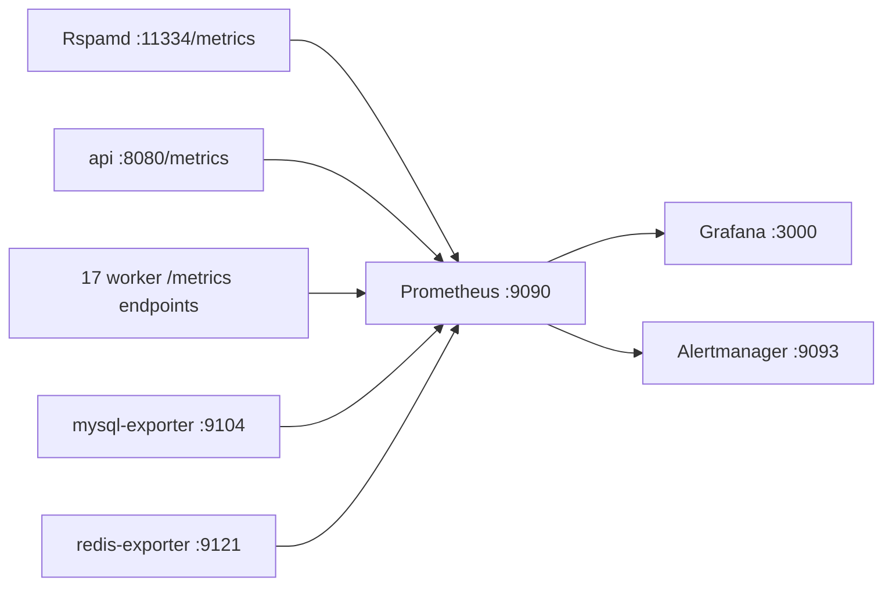

# Prometheus

Prometheus scrapes metrics from every Mailyte worker and stores them as time-series data — the foundation for dashboards and alerts.

## How It Fits In

Prometheus (`prom/prometheus:v2.51.0`) runs as a container in the main compose stack. Every 15 seconds it pulls metrics from each target's `/metrics` endpoint. Grafana reads from Prometheus. Alertmanager receives alerts from Prometheus.



## Scrape Configuration

The config lives in `monitoring/prometheus/prometheus.yml` and is mounted read-only into the container. Targets use **internal container ports**, not the host-mapped ports:

```yaml
global:
  scrape_interval: 15s
  evaluation_interval: 15s
  scrape_timeout: 10s

rule_files:
  - "/etc/prometheus/rules/*.yml"

alerting:
  alertmanagers:
    - static_configs:
        - targets: ['alertmanager:9093']

scrape_configs:
  - job_name: 'prometheus'
    static_configs:
      - targets: ['localhost:9090']

  # Mail services
  # (the rspamd job is commented out in the real file since 2026-08-31 —
  # verified live that this rspamd build's controller serves no /metrics
  # at all (404; /stat is auth-gated), so the job scraped nothing)

  # Worker services (a selection -- see the file for the full list)
  - job_name: 'api'
    metrics_path: /metrics
    static_configs:
      - targets: ['api:8080']        # container listens on 8080, host-mapped to 8083

  - job_name: 'monitoring'
    metrics_path: /metrics
    static_configs:
      - targets: ['monitoring:8085']

  - job_name: 'archiver'
    metrics_path: /metrics
    static_configs:
      - targets: ['archiver:8083']   # container listens on 8083, host-mapped to 8089

  # Infrastructure exporters
  - job_name: 'mysql'
    static_configs:
      - targets: ['mysql-exporter:9104']

  - job_name: 'redis'
    static_configs:
      - targets: ['redis-exporter:9121']
```

The full file covers 20 worker jobs: `api`, `webhooks`, `rate_limiter`, `monitoring`, `tracking`, `analytics`, `dashboard`, `archiver`, `encryption`, `queue_manager`, `rag`, `storage_usage`, `delivery_optimizer`, `jmap`, `migration`, `autoconfig`, `caldav`, `templates`, `url_protection`, and `oauth` — every target on its **container** port (the `analytics` and `rag` jobs used to point at their host-mapped ports 8087/8091 and scraped nothing; fixed 2026-08-30 to 8085/8090).

!!! warning "No Postfix/Dovecot/node exporters"
    `prometheus.yml` used to define `postfix` (`postfix-exporter:9154`) and `dovecot` (`dovecot-exporter:9166`) jobs, but **no exporter container for either exists in any compose file** — those jobs were permanently `DOWN` and are commented out as of 2026-08-30 (re-enable them when the exporters are actually deployed). Any query against `postfix_*` or `dovecot_*` series returns nothing, and the same applies to `node_*` series — there is no node-exporter. Postfix/Dovecot liveness comes from the [monitoring service's protocol probes](health-checks.md) instead, and per-message delivery data lives in the `mail_logs` / `delivery_events` tables produced by `log_ingestor` (since 2026-08-22).

## What the Workers Expose

Every FastAPI worker uses the shared collector in `shared/metrics.py`. All metric names are **prefixed with the service name**, and histograms are exposed as summaries (`_count`, `_sum`, and `quantile` series — not `_bucket`).

Common series for each service `<svc>`:

| Metric | Type | What It Tells You |
|--------|------|-------------------|
| `<svc>_info` | gauge | Service name/version labels |
| `<svc>_uptime_seconds` | counter | Seconds since process start |
| `<svc>_http_requests_total{method,path,status_code}` | counter | Requests by endpoint and status |
| `<svc>_http_errors_total{...}` | counter | Requests with status >= 400 |
| `<svc>_http_request_duration_seconds{quantile}` | summary | p50/p95/p99 response time |
| `<svc>_database_operations_total{operation,status}` | counter | DB calls by outcome |
| `<svc>_cpu_usage_percent` | gauge | Process-host CPU usage (psutil) |
| `<svc>_memory_usage_percent`, `<svc>_memory_usage_bytes` | gauge | Memory usage |

Service-specific series worth knowing:

| Metric | Emitted by | Purpose |
|--------|-----------|---------|
| `monitoring_backup_age_seconds{backup_type,host}` | monitoring | Seconds since the last successful backup — drives the absence alerts |
| `monitoring_backup_last_status` | monitoring | 1 = last run succeeded |
| `monitoring_backup_unencrypted_runs` | monitoring | Backups written without the age encryption stage |
| `archiver_archive_spool_depth` | archiver | Archived messages not yet uploaded to S3 |
| `archiver_archive_store_failures_total` | archiver | `/archive` requests that neither S3 nor the spool accepted |
| `webhooks_webhook_deliveries_total{url,status_code}` | webhooks | Outbound webhook deliveries |

### Infrastructure exporters

`mysql-exporter` and `redis-exporter` expose the standard upstream series:

| Metric | Type | What It Tells You |
|--------|------|-------------------|
| `mysql_up` | gauge | Exporter can reach MySQL |
| `mysql_global_status_threads_connected` | gauge | Current open connections |
| `mysql_global_variables_max_connections` | gauge | Connection ceiling |
| `mysql_global_status_slow_queries` | counter | Queries exceeding the slow threshold |
| `redis_up` | gauge | Exporter can reach Redis |
| `redis_memory_used_bytes` | gauge | Current memory usage |
| `redis_connected_clients` | gauge | Active client connections |
| `redis_keyspace_hits_total` / `redis_keyspace_misses_total` | counter | Cache effectiveness |

## Useful PromQL Queries

```promql
# Which targets are up right now?
up

# API request rate (per second)
rate(api_http_requests_total[5m])

# API error ratio
sum(rate(api_http_errors_total[5m])) / sum(rate(api_http_requests_total[5m]))

# API p95 response time (summary quantile -- pre-computed, no histogram_quantile needed)
api_http_request_duration_seconds{quantile="0.95"}

# MySQL connections as a fraction of max
mysql_global_status_threads_connected / mysql_global_variables_max_connections

# Redis cache hit rate
rate(redis_keyspace_hits_total[5m])
/ (rate(redis_keyspace_hits_total[5m]) + rate(redis_keyspace_misses_total[5m]))

# Backup freshness (should stay under 93600 for type="full")
monitoring_backup_age_seconds

# Archive spool backlog (should be 0)
archiver_archive_spool_depth
```

## Data Retention

The compose file pins retention to 30 days:

```yaml
prometheus:
  command:
    - '--config.file=/etc/prometheus/prometheus.yml'
    - '--storage.tsdb.path=/prometheus'
    - '--storage.tsdb.retention.time=30d'
    - '--web.enable-lifecycle'
```

`--web.enable-lifecycle` is on, so a config change can be applied without recreating the container:

```bash
curl -X POST http://localhost:9090/-/reload
```

Data lives in the `prometheus_data` named volume.

## Checking Prometheus Health

```bash
# Is Prometheus up?
curl http://localhost:9090/-/healthy

# Check scrape targets and their status
curl -s http://localhost:9090/api/v1/targets | python3 -m json.tool

# Run a quick query
curl -s 'http://localhost:9090/api/v1/query?query=up' | python3 -m json.tool
```

If a target shows as `DOWN`, first check whether it's one of the two jobs with no deployed exporter (`postfix`, `dovecot`) — that is expected. Otherwise check that the container is running and healthy. See [Troubleshooting](troubleshooting.md) for more.

!!! note "Production binding"
    In production, Prometheus is published on `127.0.0.1:9090` only (`docker-compose.prod.yml`, since 2026-08-22). It has no authentication of its own, which is exactly why it must never be reachable on a public interface.
