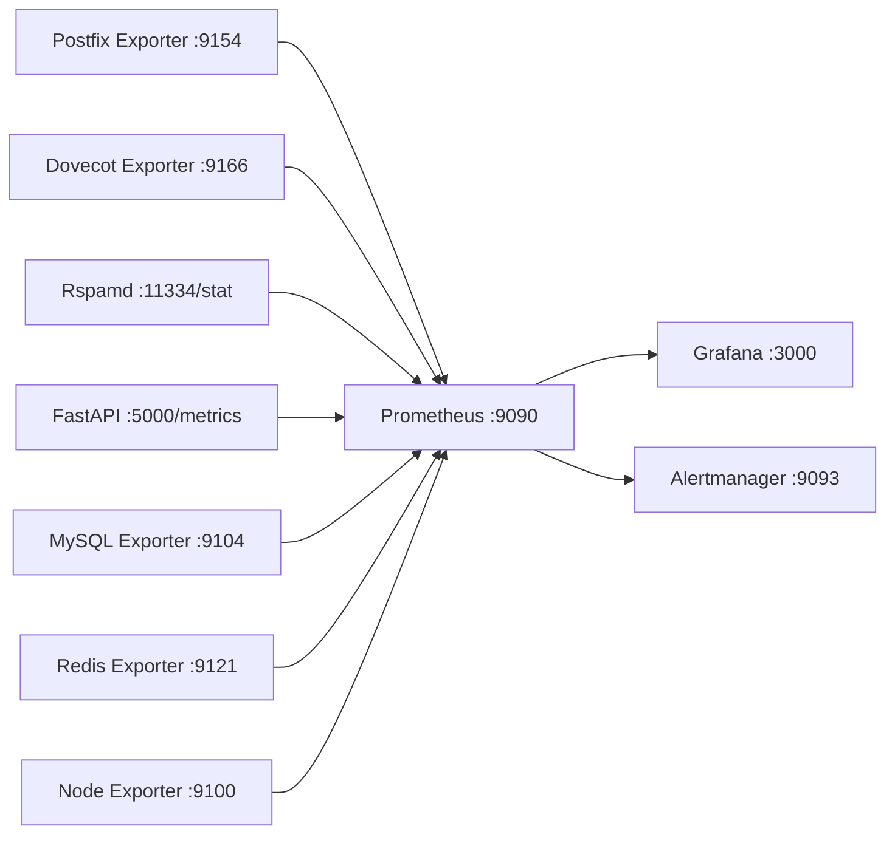

# Prometheus

> **Enterprise Edition** — This feature is available in [Mailyte Enterprise](https://mailyte.com). The Community Edition does not include this functionality.


Prometheus scrapes metrics from every Mailyte service and stores them as time-series data — the foundation for dashboards and alerts.

## How It Fits In

Prometheus runs as a container in the monitoring stack. Every 15 seconds, it pulls metrics from each service's `/metrics` endpoint (or exporter). Grafana reads from Prometheus. Alertmanager gets its rules from Prometheus.



## Scrape Configuration

The main config lives in `monitoring/prometheus/prometheus.yml`:

```yaml
global:
  scrape_interval: 15s
  evaluation_interval: 15s
  scrape_timeout: 10s

rule_files:
  - "rules/*.yml"

alerting:
  alertmanagers:
    - static_configs:
        - targets:
            - alertmanager:9093

scrape_configs:
  # Prometheus itself
  - job_name: "prometheus"
    static_configs:
      - targets: ["localhost:9090"]

  # Postfix mail server
  - job_name: "postfix"
    static_configs:
      - targets: ["postfix-exporter:9154"]
    relabel_configs:
      - source_labels: [__address__]
        target_label: service
        replacement: postfix

  # Dovecot IMAP/POP3
  - job_name: "dovecot"
    static_configs:
      - targets: ["dovecot-exporter:9166"]

  # Rspamd spam filter
  - job_name: "rspamd"
    metrics_path: /stat
    static_configs:
      - targets: ["rspamd:11334"]

  # FastAPI application
  - job_name: "api"
    static_configs:
      - targets: ["api:5000"]
    metrics_path: /metrics

  # MySQL database
  - job_name: "mysql"
    static_configs:
      - targets: ["mysql-exporter:9104"]

  # Redis cache
  - job_name: "redis"
    static_configs:
      - targets: ["redis-exporter:9121"]

  # OS-level metrics
  - job_name: "node"
    static_configs:
      - targets: ["node-exporter:9100"]

  # Health monitor
  - job_name: "health-monitor"
    static_configs:
      - targets: ["health-monitor:8080"]
    metrics_path: /metrics
```

## Metrics by Service

### Postfix

| Metric | Type | What It Tells You |
|--------|------|-------------------|
| `postfix_queue_size` | gauge | Emails waiting to be delivered |
| `postfix_delivery_total` | counter | Total emails delivered |
| `postfix_bounce_total` | counter | Total bounced emails |
| `postfix_reject_total` | counter | Emails rejected at SMTP |
| `postfix_smtp_connection_total` | counter | Inbound SMTP connections |
| `postfix_delivery_delay_seconds` | histogram | Time from queue to delivery |

### Dovecot

| Metric | Type | What It Tells You |
|--------|------|-------------------|
| `dovecot_active_connections` | gauge | Current IMAP/POP3 sessions |
| `dovecot_auth_success_total` | counter | Successful logins |
| `dovecot_auth_failure_total` | counter | Failed login attempts |
| `dovecot_mail_read_total` | counter | Emails read by users |
| `dovecot_storage_bytes` | gauge | Mailbox storage per user |

### Rspamd

| Metric | Type | What It Tells You |
|--------|------|-------------------|
| `rspamd_scanned_total` | counter | Total messages scanned |
| `rspamd_spam_total` | counter | Messages marked as spam |
| `rspamd_ham_total` | counter | Messages marked as clean |
| `rspamd_action_total` | counter | Actions taken (reject, greylist, add header) |
| `rspamd_score_histogram` | histogram | Distribution of spam scores |

### FastAPI

| Metric | Type | What It Tells You |
|--------|------|-------------------|
| `http_requests_total` | counter | Total API requests by endpoint and status |
| `http_request_duration_seconds` | histogram | Response time distribution |
| `http_requests_in_progress` | gauge | Currently processing requests |
| `api_emails_sent_total` | counter | Emails sent via API |
| `api_errors_total` | counter | API errors by type |

### MySQL

| Metric | Type | What It Tells You |
|--------|------|-------------------|
| `mysql_global_status_connections` | counter | Total connections made |
| `mysql_global_status_threads_connected` | gauge | Current open connections |
| `mysql_global_status_slow_queries` | counter | Queries exceeding threshold |
| `mysql_global_status_innodb_buffer_pool_reads` | counter | Disk reads (cache misses) |

### Redis

| Metric | Type | What It Tells You |
|--------|------|-------------------|
| `redis_connected_clients` | gauge | Active client connections |
| `redis_memory_used_bytes` | gauge | Current memory usage |
| `redis_keyspace_hits_total` | counter | Cache hits |
| `redis_keyspace_misses_total` | counter | Cache misses |
| `redis_commands_processed_total` | counter | Total commands executed |

## Useful PromQL Queries

Here are queries you'll use often:

```promql
# Email delivery rate (per minute)
rate(postfix_delivery_total[5m]) * 60

# Current mail queue size
postfix_queue_size

# API error rate (percentage)
rate(http_requests_total{status=~"5.."}[5m])
/ rate(http_requests_total[5m]) * 100

# Spam percentage
rate(rspamd_spam_total[1h])
/ rate(rspamd_scanned_total[1h]) * 100

# API 95th percentile response time
histogram_quantile(0.95, rate(http_request_duration_seconds_bucket[5m]))

# MySQL connections as percentage of max
mysql_global_status_threads_connected
/ mysql_global_variables_max_connections * 100

# Redis cache hit rate
rate(redis_keyspace_hits_total[5m])
/ (rate(redis_keyspace_hits_total[5m]) + rate(redis_keyspace_misses_total[5m])) * 100
```

## Data Retention

By default, Prometheus keeps 15 days of data. Adjust this in the Docker Compose config:

```yaml
prometheus:
  command:
    - "--config.file=/etc/prometheus/prometheus.yml"
    - "--storage.tsdb.retention.time=30d"
    - "--storage.tsdb.retention.size=10GB"
```

> **Note:** If you set both time and size retention, whichever limit is hit first wins. For most Mailyte deployments, 30 days and 10GB is a good balance.

## Checking Prometheus Health

```bash
# Is Prometheus up?
curl http://localhost:9090/-/healthy

# Check scrape targets and their status
curl http://localhost:9090/api/v1/targets | python3 -m json.tool

# Run a quick query
curl 'http://localhost:9090/api/v1/query?query=up' | python3 -m json.tool
```

If a target shows as `DOWN`, check that the exporter container is running and the network is correct. See [Troubleshooting](troubleshooting.md) for more.
