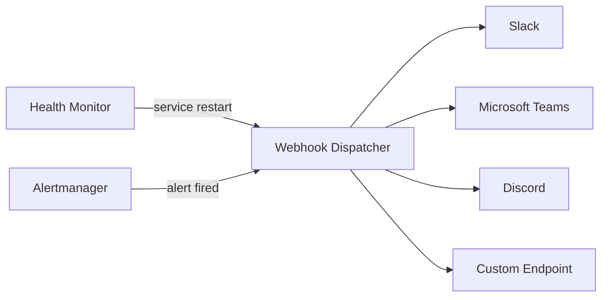

# Webhook Notifications

Push alerts to Slack, Microsoft Teams, Discord, or any HTTP endpoint when something goes wrong.

## How It Works

The health monitor and Alertmanager both support webhook notifications. When an alert fires or a service gets restarted, an HTTP POST is sent to your configured webhook URLs.



## Webhook Payload

Every webhook sends a JSON payload like this:

```json
{
  "event": "service_unhealthy",
  "timestamp": "2026-03-25T10:30:00Z",
  "severity": "critical",
  "service": "postfix",
  "message": "Postfix failed 3 consecutive health checks — restarting container",
  "details": {
    "consecutive_failures": 3,
    "last_error": "Connection refused on port 25",
    "action_taken": "container_restart",
    "host": "mail.yourdomain.com"
  }
}
```

**Event types:**

| Event | Severity | When It Fires |
|-------|----------|---------------|
| `service_unhealthy` | critical | Service failed health checks |
| `service_restarted` | warning | Auto-healing restarted a container |
| `service_recovered` | info | Service came back after being down |
| `restart_failed` | critical | Auto-healing couldn't fix the service |
| `alert_fired` | varies | Prometheus alert rule triggered |
| `alert_resolved` | info | Alert condition cleared |

## Slack

### Setup

1. Create a Slack app at [api.slack.com/apps](https://api.slack.com/apps)
2. Enable **Incoming Webhooks**
3. Add a webhook to your channel
4. Copy the webhook URL

### Alertmanager Config

```yaml
# monitoring/alertmanager/alertmanager.yml
receivers:
  - name: slack-alerts
    slack_configs:
      - api_url: "https://hooks.slack.com/services/T00/B00/xxxx"
        channel: "#mailyte-alerts"
        username: "Mailyte Alerts"
        icon_emoji: ":envelope:"
        title: '{{ .CommonAnnotations.summary }}'
        text: >-
          {{ range .Alerts }}
          *{{ .Labels.severity | toUpper }}:* {{ .Annotations.summary }}
          {{ .Annotations.description }}
          {{ end }}
        send_resolved: true
```

### Health Monitor Config

```yaml
# In the health monitor environment
health-monitor:
  environment:
    - WEBHOOK_SLACK_URL=https://hooks.slack.com/services/T00/B00/xxxx
    - WEBHOOK_SLACK_CHANNEL=#mailyte-alerts
```

## Microsoft Teams

### Setup

1. In your Teams channel, click **...** > **Connectors**
2. Add **Incoming Webhook**
3. Copy the webhook URL

### Config

```yaml
receivers:
  - name: teams-alerts
    webhook_configs:
      - url: "https://outlook.office.com/webhook/xxx/IncomingWebhook/yyy"
        send_resolved: true
```

The health monitor formats Teams messages as adaptive cards:

```json
{
  "@type": "MessageCard",
  "themeColor": "FF0000",
  "summary": "Postfix is down",
  "sections": [{
    "activityTitle": "Mailyte Alert: Service Down",
    "facts": [
      { "name": "Service", "value": "Postfix" },
      { "name": "Status", "value": "Unhealthy" },
      { "name": "Since", "value": "2026-03-25 10:30:00 UTC" }
    ]
  }]
}
```

## Discord

### Setup

1. In your Discord channel, go to **Settings** > **Integrations** > **Webhooks**
2. Create a new webhook
3. Copy the URL

### Config

```yaml
health-monitor:
  environment:
    - WEBHOOK_DISCORD_URL=https://discord.com/api/webhooks/xxx/yyy
```

## Custom Webhook

Send alerts to any HTTP endpoint:

```yaml
health-monitor:
  environment:
    - WEBHOOK_CUSTOM_URL=https://your-app.com/api/alerts
    - WEBHOOK_CUSTOM_HEADERS=Authorization:Bearer your-token,Content-Type:application/json
```

### Alertmanager Custom Webhook

```yaml
receivers:
  - name: custom-webhook
    webhook_configs:
      - url: "https://your-app.com/api/alerts"
        http_config:
          bearer_token: "your-secret-token"
        send_resolved: true
        max_alerts: 10
```

## Example: Building a Simple Webhook Receiver

Need to handle alerts in your own code? Here's a minimal receiver:

```python
from fastapi import FastAPI, Request
import json

app = FastAPI()

@app.post("/api/alerts")
async def receive_alert(request: Request):
    payload = await request.json()

    for alert in payload.get("alerts", [payload]):
        severity = alert.get("severity", alert.get("labels", {}).get("severity", "unknown"))
        message = alert.get("message", alert.get("annotations", {}).get("summary", "No message"))

        print(f"[{severity.upper()}] {message}")

        # Do something with the alert:
        # - Log to a database
        # - Send an SMS
        # - Create a PagerDuty incident
        # - Open a Jira ticket

    return {"status": "received"}
```

## Notification Throttling

Nobody wants 500 alerts in 5 minutes. Configure throttling:

### Alertmanager Grouping

```yaml
route:
  group_by: [alertname, severity]
  group_wait: 30s       # Wait 30s to batch alerts in the same group
  group_interval: 5m    # Wait 5m before sending updates for the same group
  repeat_interval: 4h   # Don't repeat the same alert more than every 4 hours
```

### Health Monitor Throttling

```yaml
health-monitor:
  environment:
    - WEBHOOK_MIN_INTERVAL=300  # At least 5 min between notifications for the same service
    - WEBHOOK_BATCH_WINDOW=30   # Batch notifications within a 30-second window
```

## Testing Webhooks

Verify your webhook setup works before waiting for a real incident:

```bash
# Test Alertmanager webhook
curl -X POST http://localhost:9093/api/v2/alerts \
  -H "Content-Type: application/json" \
  -d '[{
    "labels": {"alertname": "TestAlert", "severity": "warning"},
    "annotations": {"summary": "Test notification", "description": "Verifying webhook delivery"}
  }]'

# Test health monitor webhook
curl -X POST http://localhost:8080/admin/test-webhook

# Test a raw webhook URL
curl -X POST https://hooks.slack.com/services/T00/B00/xxxx \
  -H "Content-Type: application/json" \
  -d '{"text": "Test message from Mailyte"}'
```

> **Tip:** Set up a test channel first. Send all test notifications there, not to your production alerts channel. Your team will thank you.
