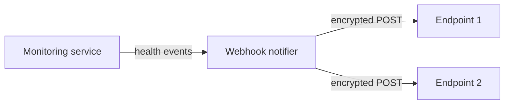

# Webhook Notifications

Push health events to any HTTP endpoint when something goes wrong — service failures, resource alerts, recovery actions, and periodic summaries.

## How It Works

The monitoring service's webhook notifier (`worker/monitoring/services/webhook_notifier.py`) POSTs an **encrypted** JSON payload to every configured endpoint whenever a health event fires. Delivery runs on a thread pool (5 workers) so a slow endpoint never blocks a health check.



This is a separate path from Alertmanager — Prometheus alerts route through Alertmanager (whose configured receiver endpoint does not exist yet, see [Alerting](alerting.md)), while the monitoring service's own probes and thresholds deliver through this notifier and do work today.

## Event Types

| Event type | Fired when | Severity |
|-----------|-----------|----------|
| `health.service.status_change` | A probed service changes status | derived from new status |
| `health.system.cpu_high` / `memory_high` / `disk_high` (and `_warning` variants) | Resource thresholds breached (80/90% CPU+memory, 75/85% disk) | warning / critical |
| `health.recovery.restart` / `health.recovery.auto_heal_all` | A restart or auto-heal ran | info on success, warning on failure |
| `health.summary.periodic` | The 5-minute sweep found anything unhealthy | — |
| `health.test.webhook` | `POST /test/webhooks` was called | — |

## Configuring Endpoints

Endpoints live in the **`webhook_urls` database table**:

| Column | Meaning |
|--------|---------|
| `url` | Where to POST |
| `event_types` | Comma-separated list, `*` for all, `health.*` matches everything here |
| `active` | 1 to enable |
| `priority` | Delivery order |
| `timeout_seconds` | Per-endpoint timeout (default 30) |
| `encryption_key` | Optional per-endpoint key identifier for payload encryption |

If the database is unreachable, the notifier falls back to the comma-separated `HEALTH_WEBHOOK_URLS` environment variable.

```sql
INSERT INTO webhook_urls (name, url, event_types, active, priority, timeout_seconds)
VALUES ('ops-receiver', 'https://your-app.com/api/mailyte-health', 'health.*', 1, 1, 30);
```

## The Payload Is Encrypted

The wire format is **not** the plain event. The event JSON is encrypted with Fernet (key derived from `WEBHOOK_SECRET` via PBKDF2-SHA256), then wrapped:

```json
{
  "encrypted_payload": "base64(fernet(event_json))",
  "timestamp": "2026-08-30T10:30:00Z",
  "event_type": "health.service.status_change",
  "source": "health_monitor"
}
```

**Request headers:**

| Header | Value |
|--------|-------|
| `X-Webhook-Signature` | `sha256=<HMAC-SHA256 of encrypted_payload, keyed with WEBHOOK_SECRET>` |
| `X-Webhook-Source` | `health-monitor` |
| `X-Webhook-Event` | the event type |
| `X-Webhook-Timestamp` | ISO-8601 UTC |

A receiver must share `WEBHOOK_SECRET` to verify the signature and decrypt the payload. The decrypted event looks like:

```json
{
  "event_type": "health.service.status_change",
  "timestamp": "2026-08-30T10:30:00Z",
  "service": {
    "name": "postfix",
    "old_status": "up",
    "new_status": "down",
    "details": {"message": "Connection refused"}
  },
  "severity": "critical",
  "source": "health_monitor"
}
```

## Example: Building a Receiver

```python
import base64, hashlib, hmac, json, os

from cryptography.fernet import Fernet
from cryptography.hazmat.primitives import hashes
from cryptography.hazmat.primitives.kdf.pbkdf2 import PBKDF2HMAC
from fastapi import FastAPI, Header, HTTPException, Request

app = FastAPI()
SECRET = os.environ["WEBHOOK_SECRET"]

kdf = PBKDF2HMAC(
    algorithm=hashes.SHA256(), length=32, salt=b"health_monitor_salt", iterations=100000
)
FERNET = Fernet(base64.urlsafe_b64encode(kdf.derive(SECRET.encode())))


@app.post("/api/mailyte-health")
async def receive(request: Request, x_webhook_signature: str = Header("")):
    body = await request.json()
    encrypted = body["encrypted_payload"]

    expected = hmac.new(SECRET.encode(), encrypted.encode(), hashlib.sha256).hexdigest()
    if not hmac.compare_digest(f"sha256={expected}", x_webhook_signature):
        raise HTTPException(status_code=401, detail="bad signature")

    event = json.loads(FERNET.decrypt(base64.b64decode(encrypted)))
    print(f"[{event.get('severity', '?').upper()}] {event['event_type']}")
    # Log to a database, page someone, open a ticket, ...
    return {"status": "received"}
```

Return `200` — anything else is recorded as a failed delivery.

## Forwarding to Slack / Teams / Discord

There is no built-in Slack, Teams, or Discord formatting — those integrations expect their own payload shapes and cannot consume the encrypted envelope directly. Run a small receiver like the one above that decrypts the event and re-posts a formatted message to your chat webhook.

## Testing Webhooks

```bash
# Fire a test event at every configured endpoint (needs the monitoring admin token)
curl -X POST http://localhost:8085/test/webhooks \
  -H "X-Admin-Token: $TOKEN"

# Or through the API gateway (platform credential, operator role)
curl -X POST https://<api-host>/api/v1/monitoring/webhooks/test \
  -H "X-API-Key: $KEY" -H "X-Admin-Token: $TOKEN"
```

The response reports per-endpoint success/failure and delivery times.

## Throttling and Noise Control

- Health-summary webhooks only fire when something is actually unhealthy — a clean 5-minute sweep sends nothing.
- The heartbeat endpoint sends its summary **after** responding (FastAPI background task), so callers never wait on webhook delivery.
- Per-endpoint `timeout_seconds` caps how long a dead receiver can hold a delivery thread.

> **Tip:** Set up a test endpoint first (webhook.site works for shape inspection — remember payloads are encrypted, so you'll see the envelope, not the event). Point production events at your real receiver only once signature verification works.
