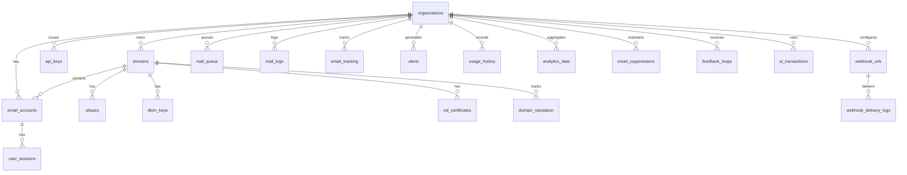

# Database Schema

Mailyte uses MySQL 8.0 with InnoDB and utf8mb4 encoding. The schema is managed by Alembic migrations (see `alembic/versions/`), but the initial bootstrap is in `database/migrations/sql/001_init_schema.sql`.

## Entity Relationship Diagram



## System Tables

### system_config

Global configuration key-value store.

```sql
CREATE TABLE IF NOT EXISTS system_config (
    `key` VARCHAR(255) NOT NULL PRIMARY KEY,
    `value` JSON NULL,
    description TEXT NULL,
    category VARCHAR(100) NULL,
    created_at DATETIME NOT NULL DEFAULT CURRENT_TIMESTAMP,
    updated_at DATETIME NOT NULL DEFAULT CURRENT_TIMESTAMP ON UPDATE CURRENT_TIMESTAMP,
    INDEX idx_system_config_category (category)
) ENGINE=InnoDB DEFAULT CHARSET=utf8mb4 COLLATE=utf8mb4_unicode_ci;
```

### health_checks

Service health check history.

| Column | Type | Description |
|--------|------|-------------|
| `id` | BIGINT PK | Auto-increment ID |
| `service_name` | VARCHAR(100) | Service identifier |
| `status` | VARCHAR(50) | Health status |
| `response_time` | FLOAT | Response time in ms |
| `error_message` | TEXT | Error details (if unhealthy) |
| `metadata` | JSON | Additional health data |
| `timestamp` | DATETIME | Check timestamp |

### service_metrics

Time-series metrics from internal services.

| Column | Type | Description |
|--------|------|-------------|
| `id` | BIGINT PK | Auto-increment ID |
| `service_name` | VARCHAR(100) | Service identifier |
| `metric_name` | VARCHAR(100) | Metric name |
| `metric_value` | FLOAT | Metric value |
| `timestamp` | DATETIME | Measurement time |

## Core Tables

### organizations

Top-level tenant container.

```sql
CREATE TABLE IF NOT EXISTS organizations (
    id VARCHAR(100) NOT NULL PRIMARY KEY,
    external_id VARCHAR(255) NULL UNIQUE,
    name VARCHAR(255) NOT NULL,
    description TEXT NULL,
    active BOOLEAN NOT NULL DEFAULT TRUE,
    admin_email VARCHAR(255) NULL,
    admin_name VARCHAR(255) NULL,
    settings JSON NULL,
    rate_limits JSON NULL,
    storage_quotas JSON NULL,
    webhook_urls JSON NULL,
    webhook_secret VARCHAR(255) NULL,
    created_at DATETIME NOT NULL DEFAULT CURRENT_TIMESTAMP,
    updated_at DATETIME NOT NULL DEFAULT CURRENT_TIMESTAMP ON UPDATE CURRENT_TIMESTAMP
) ENGINE=InnoDB DEFAULT CHARSET=utf8mb4 COLLATE=utf8mb4_unicode_ci;
```

The `id` is a string you choose (e.g., `acme-corp`). The `external_id` maps to your billing system.

### domains

Email domains belonging to organizations.

| Column | Type | Description |
|--------|------|-------------|
| `id` | INT PK | Auto-increment ID |
| `domain` | VARCHAR(255) UNIQUE | Domain name (e.g., `example.com`) |
| `external_id` | VARCHAR(255) UNIQUE | External system mapping |
| `organization_id` | VARCHAR(100) FK | Owning organization |
| `active` | BOOLEAN | Whether the domain is active |
| `max_quota` | BIGINT | Max quota per mailbox (bytes) |
| `max_users` | INT | Max mailboxes allowed |
| `dkim_enabled` | BOOLEAN | DKIM signing enabled |
| `dkim_selector` | VARCHAR(100) | DKIM selector name |
| `rate_limits` | JSON | Domain-level rate limits |
| `storage_quotas` | JSON | Domain-level storage quotas |
| `total_storage_used` | BIGINT | Calculated storage usage (bytes) |
| `total_email_accounts` | INT | Number of mailboxes |
| `total_emails` | BIGINT | Total emails stored |

### email_accounts

Individual mailboxes.

| Column | Type | Description |
|--------|------|-------------|
| `id` | INT PK | Auto-increment ID |
| `email` | VARCHAR(255) UNIQUE | Full email address |
| `external_id` | VARCHAR(255) UNIQUE | External system mapping |
| `local_part` | VARCHAR(255) | Part before `@` |
| `domain_id` | INT FK | Parent domain |
| `organization_id` | VARCHAR(100) FK | Parent organization |
| `password` | VARCHAR(255) | Hashed password |
| `name` | VARCHAR(255) | Display name |
| `status` | ENUM | `active`, `inactive`, `suspended` |
| `storage_quota` | BIGINT | Quota in bytes (default 1 GB) |
| `storage_used` | BIGINT | Current storage usage |
| `forward_enabled` | BOOLEAN | Forwarding active |
| `forward_destination` | VARCHAR(255) | Forward target |
| `vacation_enabled` | BOOLEAN | Auto-reply active |
| `vacation_message` | TEXT | Auto-reply message |
| `last_login` | DATETIME | Last IMAP/POP3 login |

### aliases

Email aliases (forwarding rules).

| Column | Type | Description |
|--------|------|-------------|
| `id` | INT PK | Auto-increment ID |
| `domain_id` | INT FK | Parent domain |
| `organization_id` | VARCHAR(100) FK | Parent organization |
| `source` | VARCHAR(255) | Source address (e.g., `info@example.com`) |
| `destination` | TEXT | Comma-separated destinations |
| `active` | BOOLEAN | Whether the alias is active |

## Mail Flow Tables

### mail_queue

Outbound email queue managed by the queue manager worker.

| Column | Type | Description |
|--------|------|-------------|
| `id` | BIGINT PK | Auto-increment ID |
| `sender` | VARCHAR(255) | Sender address |
| `recipient` | VARCHAR(255) | Recipient address |
| `organization_id` | VARCHAR(100) FK | Sending organization |
| `subject` | TEXT | Email subject |
| `body` | TEXT | Email body |
| `headers` | JSON | Custom headers |
| `priority` | INT | 1 (highest) to 10 (lowest) |
| `status` | ENUM | `queued`, `sending`, `sent`, `delivered`, `bounced`, `rejected`, `deferred` |
| `attempts` | INT | Delivery attempts so far |
| `max_attempts` | INT | Max delivery attempts |
| `scheduled_at` | DATETIME | When to send |
| `processed_at` | DATETIME | When it was processed |
| `error_message` | TEXT | Last error |

### mail_logs

Historical log of all mail transactions.

| Column | Type | Description |
|--------|------|-------------|
| `id` | BIGINT PK | Auto-increment ID |
| `timestamp` | DATETIME | When it happened |
| `sender` | VARCHAR(255) | Sender |
| `recipient` | VARCHAR(255) | Recipient |
| `status` | ENUM | Same statuses as mail_queue |
| `message_id` | VARCHAR(255) | RFC Message-ID |
| `size` | INT | Message size in bytes |
| `relay` | VARCHAR(255) | Relay host used |
| `dsn` | VARCHAR(10) | DSN status code |
| `bounce_reason` | TEXT | Bounce explanation |
| `spam_score` | FLOAT | Rspamd spam score |

## Tracking Tables

### email_tracking

Individual tracking events (opens, clicks, bounces).

| Column | Type | Description |
|--------|------|-------------|
| `id` | BIGINT PK | Auto-increment ID |
| `email_id` | VARCHAR(255) | Tracked email identifier |
| `recipient` | VARCHAR(255) | Recipient address |
| `organization_id` | VARCHAR(100) FK | Organization |
| `domain_id` | INT FK | Domain |
| `event_type` | ENUM | `delivered`, `opened`, `clicked`, `bounced`, `complained`, `unsubscribed` |
| `timestamp` | DATETIME | Event time |
| `user_agent` | TEXT | Client user agent |
| `ip_address` | VARCHAR(45) | Client IP |
| `device_type` | VARCHAR(100) | Detected device type |
| `browser` | VARCHAR(100) | Detected browser |
| `country` | VARCHAR(100) | GeoIP country |
| `city` | VARCHAR(100) | GeoIP city |

### tracking_statistics

Aggregated tracking stats per email.

| Column | Type | Description |
|--------|------|-------------|
| `email_id` | VARCHAR(255) | Tracked email |
| `event_type` | ENUM | Event type |
| `total_count` | INT | Total event count |
| `unique_count` | INT | Unique event count |
| `unique_ips` | INT | Unique IP count |
| `first_event` | DATETIME | First occurrence |
| `last_event` | DATETIME | Most recent occurrence |

## Security Tables

### api_keys

API authentication keys.

| Column | Type | Description |
|--------|------|-------------|
| `id` | INT PK | Auto-increment ID |
| `key_id` | VARCHAR(100) UNIQUE | Public key identifier |
| `key_hash` | VARCHAR(255) | SHA-256 hash of the key |
| `name` | VARCHAR(255) | Human-readable name |
| `permissions` | JSON | Allowed operations |
| `organization_id` | VARCHAR(100) FK | Scoped to organization (null = global) |
| `active` | BOOLEAN | Whether the key is active |
| `rate_limit` | INT | Per-key rate limit |
| `expires_at` | DATETIME | Expiry time (null = never) |
| `ip_whitelist` | JSON | Allowed IP addresses |
| `usage_count` | BIGINT | Total API calls made |

### ssl_certificates

Managed SSL certificates.

| Column | Type | Description |
|--------|------|-------------|
| `domain_id` | INT FK | Associated domain |
| `certificate_path` | VARCHAR(500) | Cert file path |
| `private_key_path` | VARCHAR(500) | Key file path |
| `status` | ENUM | `active`, `expired`, `revoked`, `pending` |
| `valid_from` | DATETIME | Certificate start date |
| `valid_until` | DATETIME | Certificate end date |
| `auto_renew` | BOOLEAN | Auto-renewal enabled |

### dkim_keys

DKIM signing keys per domain.

| Column | Type | Description |
|--------|------|-------------|
| `domain_id` | INT FK | Associated domain |
| `selector` | VARCHAR(100) | DKIM selector |
| `private_key` | TEXT | RSA private key (PEM) |
| `public_key` | TEXT | RSA public key (PEM) |
| `active` | BOOLEAN | Currently in use |

## Webhook Tables

### webhook_urls

Registered webhook endpoints.

| Column | Type | Description |
|--------|------|-------------|
| `id` | INT PK | Auto-increment ID |
| `organization_id` | VARCHAR(100) FK | Scoped to organization |
| `name` | VARCHAR(255) | Endpoint name |
| `url` | VARCHAR(1000) | Webhook URL |
| `event_types` | JSON | Which events to send |
| `service_types` | JSON | Which services (smtp, imap, pop3) |
| `encryption_key` | VARCHAR(255) | Payload encryption key |
| `webhook_secret` | VARCHAR(255) | HMAC signing secret |
| `active` | BOOLEAN | Whether endpoint is active |
| `retry_attempts` | INT | Max retries on failure |
| `success_count` | BIGINT | Successful deliveries |
| `failure_count` | BIGINT | Failed deliveries |

### webhook_delivery_logs

Delivery history for webhook events.

| Column | Type | Description |
|--------|------|-------------|
| `id` | BIGINT PK | Auto-increment ID |
| `webhook_url_id` | INT FK | Target endpoint |
| `event_type` | VARCHAR(100) | Event type |
| `event_data` | JSON | Full event payload |
| `delivery_status` | ENUM | `pending`, `delivered`, `failed`, `retrying`, `abandoned` |
| `attempts` | INT | Delivery attempts |
| `http_status_code` | INT | Response code |
| `request_duration_ms` | INT | Round-trip time |
| `error_message` | TEXT | Last error |

## Analytics Tables

### domain_reputation

Reputation scores per domain over time.

| Column | Type | Description |
|--------|------|-------------|
| `domain_id` | INT FK | Domain |
| `overall_score` | INT | 0-100 reputation score |
| `deliverability_score` | INT | Delivery success score |
| `engagement_score` | INT | Open/click engagement score |
| `emails_sent` | BIGINT | Sent count for period |
| `emails_bounced` | BIGINT | Bounce count for period |
| `period_type` | ENUM | `HOURLY`, `DAILY`, `WEEKLY`, `MONTHLY` |

### email_suppressions

Addresses that should not receive email.

| Column | Type | Description |
|--------|------|-------------|
| `email` | VARCHAR(255) | Suppressed address |
| `organization_id` | VARCHAR(100) FK | Organization scope |
| `suppression_type` | ENUM | `BOUNCE`, `COMPLAINT`, `UNSUBSCRIBE`, `MANUAL` |
| `bounce_type` | ENUM | `HARD`, `SOFT`, `BLOCK` |
| `bounce_count` | INT | Number of bounces |
| `active` | BOOLEAN | Currently suppressed |
| `expires_at` | DATETIME | Auto-expiry (null = permanent) |

### analytics_data

Generic metrics aggregation table.

| Column | Type | Description |
|--------|------|-------------|
| `organization_id` | VARCHAR(100) FK | Organization |
| `metric_name` | VARCHAR(100) | Metric identifier |
| `metric_value` | DECIMAL(15,4) | Metric value |
| `dimensions` | JSON | Grouping dimensions |
| `timestamp` | DATETIME | Measurement time |
| `period` | VARCHAR(20) | Aggregation period |

## Additional Migration Tables

Later migrations add:

- **`shared_mailboxes`** — shared mailbox access (migration 003)
- **`transport_rules`** — custom mail routing (migration 004)
- Security hardening columns (migration 002, 006)
- Scalability indexes (migration 005)

Check `database/migrations/sql/` for the complete set.
