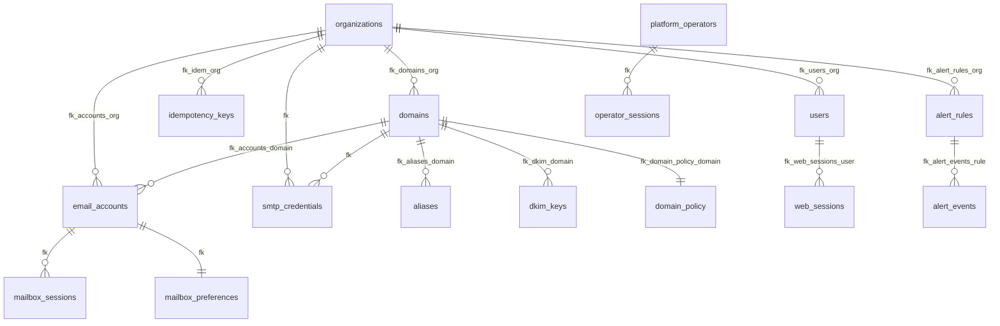

# Database Schema

Mailyte uses MySQL 8.0 with InnoDB and `utf8mb4` / `utf8mb4_unicode_ci`. The schema is owned entirely by Alembic (`alembic/versions/`, currently `0001_baseline` → `0018_mail_logs_sasl_username`) and applied by the `migrate` compose service on every `docker compose up` — the frozen SQL under `database/migrations/sql/` is only the historical source the baseline was generated from (and the Community Edition's first-boot path).

Primary keys are **CHAR(26) ULIDs** for most application tables; a minority use `INT`/`BIGINT AUTO_INCREMENT` (noted below). No migration has ever dropped or renamed a table — all 18 revisions are additive. The current head holds **83 tables plus one view** (`audit_log`, a compatibility view over `audit_logs`).

## Entity Relationship Diagram

Real foreign-key constraints only (most cross-table references are by convention + index, without FK constraints):



## Core Tenancy Tables

### organizations

Top-level tenant container. PK `id` CHAR(26).

| Column | Type | Description |
|--------|------|-------------|
| `id` | CHAR(26) PK | ULID |
| `parent_organization_id` | VARCHAR(100) | Reseller hierarchy (null = top level) |
| `external_id` | VARCHAR(255) UNIQUE | Mapping to an external/billing system |
| `name` / `description` | VARCHAR(255) / TEXT | |
| `active` | BOOL, default 1 | |
| `admin_email` / `admin_name` | VARCHAR(255) | |
| `settings` | JSON | Includes `spam_policy` consumed by the Rspamd settings sync |
| `rate_limits` / `storage_quotas` | JSON | Org-level overrides |
| `webhook_urls` / `webhook_secret` | JSON / VARCHAR(255) | Per-org webhook endpoints |
| `whitelabel_domain` | VARCHAR(255) | White-label console domain |
| `quota_override` / `quota_override_at` / `quota_override_by` | BOOL / DATETIME / VARCHAR(255) | Added in migration 0009; `quota_override_by` stores the operator's email |
| `created_at` / `updated_at` | DATETIME | |

### domains

| Column | Type | Description |
|--------|------|-------------|
| `id` | CHAR(26) PK | ULID |
| `domain` | VARCHAR(255) UNIQUE | e.g. `example.com` |
| `external_id` | VARCHAR(255) UNIQUE | |
| `organization_id` | CHAR(26) FK → organizations | ON DELETE CASCADE |
| `active` | BOOL | Postfix accepts mail only for `active = 1` |
| `max_quota` | BIGINT, default 10737418240 | Per-mailbox cap, bytes (10 GB) |
| `max_users` | INT, default 1000 | |
| `dkim_enabled` / `dkim_selector` | BOOL / VARCHAR(100), default `default` | |
| `rate_limits` / `storage_quotas` | JSON | |
| `total_storage_used`, `total_attachment_storage`, `total_email_storage` | BIGINT | Maintained by storage_usage |
| `total_email_accounts`, `total_emails`, `total_attachments` | INT / BIGINT | Counters |
| `rate_usage_data` | JSON | |
| `last_storage_calculation` / `storage_calculation_time_ms` | DATETIME / INT | |
| `created_at` / `updated_at` | DATETIME | |

### email_accounts

Individual mailboxes — the table Dovecot authenticates against (`status = 'active'`, bcrypt in `password`).

| Column | Type | Description |
|--------|------|-------------|
| `id` | CHAR(26) PK | ULID |
| `email` | VARCHAR(255) UNIQUE | Full address |
| `external_id` | VARCHAR(255) UNIQUE | |
| `local_part` | VARCHAR(255) | Part before `@` |
| `domain_id` / `organization_id` | CHAR(26) FKs | ON DELETE CASCADE |
| `password` | VARCHAR(255) | bcrypt (`BLF-CRYPT`) |
| `name` | VARCHAR(255) | Display name |
| `status` | ENUM `active`,`inactive`,`suspended` | |
| `mailbox_type` | ENUM `personal`,`shared` | Shared mailboxes are rows here, membership in `shared_mailbox_members` |
| `storage_quota` | BIGINT, default 1073741824 | Bytes (1 GB); flows into Dovecot's quota rule |
| `storage_used`, `attachment_storage_used`, `email_storage_used` | BIGINT | |
| `total_files`, `total_attachments`, `total_emails` | INT | |
| `rate_usage_data`, `rate_limits`, `storage_quotas` | JSON | |
| `forward_enabled` / `forward_destination` | BOOL / VARCHAR(255) | |
| `vacation_enabled` / `vacation_message` | BOOL / TEXT | |
| `last_login` / `last_activity` | DATETIME | |
| `created_at` / `updated_at` | DATETIME | |

### aliases

| Column | Type | Description |
|--------|------|-------------|
| `id` | CHAR(26) PK | |
| `domain_id` | CHAR(26) FK → domains | ON DELETE CASCADE |
| `organization_id` | CHAR(26) | indexed, no FK |
| `source` | VARCHAR(255) | e.g. `info@example.com` |
| `destination` | TEXT | Comma-separated destinations |
| `active` | BOOL | |

## SMTP Credentials (migrations 0008 / 0017 / 0018 — live since 2026-08-27)

### smtp_credentials

Domain-scoped SMTP API keys, enforced by Dovecot's SMTP-only passdb.

| Column | Type | Added | Description |
|--------|------|-------|-------------|
| `id` | CHAR(26) PK | 0008 | |
| `organization_id` | CHAR(26) FK → organizations | 0008 | |
| `domain_id` | CHAR(26) FK → domains | 0008 | Key may send as any address in this domain |
| `username` | VARCHAR(255) UNIQUE | 0008 | Shape `{domain-slug}-smtp-{8 hex}` |
| `password` | VARCHAR(255) | 0008 | bcrypt; the secret is shown exactly once at create/rotate |
| `allowed_ips` | JSON | 0008 | CIDR list, emitted as Dovecot `allow_nets` |
| `active` | BOOL, default 1 | 0008 | Revoked keys are `active = 0` |
| `name` / `prefix` / `created_by` | VARCHAR | 0017 | `prefix` = 8-char display prefix of the secret |
| `ip_allowlist_enabled` | BOOL, default 0 | 0017 | Must have ≥1 entry when enabled |
| `expires_at` | DATETIME NULL | 0017 | Enforced inside the Dovecot passdb query |
| `hourly_limit` / `daily_limit` | INT NULL | 0017 | NULL = inherit org limits |
| `last_used_at` | DATETIME NULL | 0017 | Written only by the log ingestor (throttled) |
| `created_at` / `updated_at` | DATETIME | 0008 | |

### smtp_credential_events

Append-only audit trail — deliberately **FK-free** so rows survive credential and organization deletion.

| Column | Type | Description |
|--------|------|-------------|
| `id` | CHAR(26) PK | |
| `credential_id` / `organization_id` | CHAR(26), indexed | Plain ids, no FK |
| `username` | VARCHAR(255) | Denormalized for post-deletion display |
| `event` | VARCHAR(32) | `created`, `updated`, `rotated`, `revoked`, `enabled`, `deleted`, `suspended` |
| `actor` | VARCHAR(255) | `operator:<id>`, `platform-api-key`, `api-key:<org>`, `log_ingestor:auto-suspend` |
| `source_ip` | VARCHAR(45) | |
| `detail` | JSON | e.g. changed fields, auto-suspend stats |
| `created_at` | DATETIME | |

## Mail Flow Tables

### mail_logs (written by the log ingestor since 2026-08-22)

| Column | Type | Description |
|--------|------|-------------|
| `id` | CHAR(26) PK | Deterministic hash of (queue_id, recipient, status, ts) — dedupes re-reads |
| `timestamp` | DATETIME | Log-line time |
| `sender` / `recipient` | VARCHAR(255) | |
| `organization_id` | VARCHAR(100), indexed | Resolved from the recipient/sender domain |
| `subject` | TEXT | RFC-2047-decoded, truncated to 1000 chars |
| `status` | ENUM `queued`,`sending`,`sent`,`delivered`,`bounced`,`rejected`,`deferred` | Ingestor writes only `delivered`/`bounced`/`deferred`/`rejected` |
| `message_id` | VARCHAR(255) | RFC Message-ID |
| `size` | INT | Bytes |
| `relay` | VARCHAR(255) | Relay host used |
| `delays` | VARCHAR(100) | Postfix `delays=` breakdown |
| `dsn` | VARCHAR(10) | DSN status code |
| `bounce_reason` | TEXT | Remote server response for bounced/deferred/rejected |
| `sasl_username` | VARCHAR(255) | Authenticated sender — mailbox or SMTP credential (migration 0018); indexed with timestamp |

### email_bodies (migration 0012)

Short-lived capture of outbound bodies, written by the tracking injector, joined into delivery webhooks, pruned by `expires_at`.

`id` VARCHAR(26) PK · `message_id` (indexed, non-unique) · `organization_id` · `sender` · `subject` · `html` MEDIUMTEXT · `text` MEDIUMTEXT · `has_attachments` · `captured_at` · `expires_at`

### mail_queue

Application-level outbound queue (the queue_manager worker; distinct from Postfix's own on-disk queue).

`id` CHAR(26) PK · `sender` · `recipient` · `organization_id` · `subject` · `body` · `headers` JSON · `priority` INT default 5 · `status` (same enum as mail_logs, default `queued`) · `attempts` / `max_attempts` (default 3) · `scheduled_at` · `processed_at` · `error_message` · `worker_id` · `processing_time`

### bounce_events / suppression_list / email_suppressions

- `bounce_events` — one row per bounce: `message_id`, `sender`, `recipient`, `bounce_type` ENUM(`hard`,`soft`,`complaint`,`unsubscribe`), `bounce_code`, `bounce_reason`, `domain`, `suppressed`.
- `suppression_list` (migration 0002, owned by delivery_optimizer) — UNIQUE(`organization_id`,`email`), `reason` ENUM(`hard_bounce`,`complaint`,`unsubscribe`,`manual`), `bounce_count`.
- `email_suppressions` — the tracking-side suppression store: UNIQUE(`email`,`organization_id`,`suppression_type`), `suppression_type` ENUM(`BOUNCE`,`COMPLAINT`,`UNSUBSCRIBE`,`MANUAL`), `bounce_type` ENUM(`HARD`,`SOFT`,`BLOCK`), `expires_at`, `active`.

## Auth & Security Tables

### api_keys

| Column | Type | Description |
|--------|------|-------------|
| `id` | CHAR(26) PK | |
| `key_id` | VARCHAR(100) UNIQUE | Public identifier |
| `key_hash` | VARCHAR(255) | Hash of the secret |
| `name` | VARCHAR(255) | |
| `permissions` | JSON | |
| `organization_id` | CHAR(26) | null only for platform-scope keys |
| `scope` | ENUM `platform`,`organization` (migration 0005) | CHECK constraint ties scope to `organization_id` nullability |
| `active` / `rate_limit` / `last_used` / `expires_at` / `ip_whitelist` / `usage_count` | | |

### Operator & session tables (migrations 0006 / 0015 / 0016)

- `platform_operators` — staff identities: `email` UNIQUE, `password_hash`, `role` (`support`/`operator`/`admin`/`owner`, enforced in app code), `mfa_required`, `is_active`, self-FK `created_by`.
- `operator_sessions` — `token_hash` CHAR(64) UNIQUE, idle `expires_at` + `absolute_expiry`, `revoked_at`, `mfa_satisfied`; FK → platform_operators CASCADE.
- `operator_audit` — append-only, FK-free: `operator_id`, `operator_email`, `caller_scope`, `action`, `target_type`/`target_id`, `organization_id`, `request_body` JSON, `result`, `ip_address`, `correlation_id`.
- `mailbox_sessions` (0015) — webmail sessions: `email_account_id` FK CASCADE, `organization_id`, `token_hash` UNIQUE, `expires_at`/`absolute_expiry`/`revoked_at`, `mfa_satisfied`.
- `mailbox_preferences` (0016) — one row per mailbox (UNIQUE `email_account_id`, FK CASCADE): `signature_html`, `signature_on_reply`, `display_density`, `undo_send_enabled`, `undo_send_seconds`.
- `users` / `web_sessions` — tenant-dashboard admins and their sessions (`users` UNIQUE(`organization_id`,`email`), FK → organizations; `web_sessions.token_hash` UNIQUE, FK → users).
- `failed_auth_attempts` — brute-force ledger; `service` ENUM grew to (`smtp`,`imap`,`pop3`,`api`,`sieve`,`api_key`,`operator`,`webmail`) across migrations 0004/0007/0015.
- `totp_secrets` — INT PK, `user_email` UNIQUE, `secret`, `backup_codes` JSON, `enabled`, `verified`.
- `idempotency_keys` — UNIQUE(`organization_id`,`idempotency_key`), request hash + cached response, `state`, `expires_at`; FK → organizations.
- `ip_access_rules`, `ip_reputation`, `user_logins`, `audit_logs` (+ the `audit_log` view) — access rules, per-IP reputation, login history, audit trail.

## Certificates & Keys

- `dkim_keys` — `domain_id` FK CASCADE, `selector` (default `default`), `public_key`, and since migration 0003 the private key is envelope-encrypted: `private_key_ciphertext` BLOB + `private_key_nonce` + `key_version` (plaintext `private_key` column retained but nullable/legacy).
- `ssl_certificates` — cert_manager's ledger: `domain_id`, `certificate_path`, `private_key_path`, `status` ENUM(`active`,`expired`,`revoked`,`pending`), `valid_from`/`valid_until`, `auto_renew`, `last_renewed`.
- `acme_account_stats` (0002) — per-ACME-account issuance counters.
- `pgp_keys` / `smime_certs` — user encryption keys; private material envelope-encrypted since 0003 (`private_key_ciphertext`/`nonce`/`key_version`; `smime_certs.fingerprint` UNIQUE).

## Webhook Tables

- `webhook_urls` — per-endpoint config: `organization_id`, `url`, `event_types` JSON, `service_types` JSON, `webhook_secret`, `encryption_key`, `priority`, `timeout_seconds` (default 30), `retry_attempts` (default 3), `retry_delay_seconds`, `rate_limit_per_minute`, `custom_headers`, `success_count`/`failure_count`, `last_success`/`last_failure`.
- `webhook_delivery_logs` — one row per delivery outcome: `event_type`, `event_data` JSON (truncated at 100 KB), `webhook_url`, `delivery_status` ENUM(`pending`,`delivered`,`failed`,`retrying`,`abandoned`), `attempts`, `http_status_code`, `request_duration_ms`, `error_message`, timing columns.
- `webhook_dead_letters` — events that exhausted all retries: `event_type`, `endpoint_url`, `payload` JSON (truncated at 1 MB), `last_error`, `attempt_count`, `status` ENUM(`pending`,`retrying`,`resolved`,`abandoned`).

## Alerting (migration 0010)

- `alert_channels` — `type` (`email`/`webhook`), `target`, envelope-encrypted signing secret, `enabled`, `last_used_at`/`last_error`.
- `alert_rules` — `metric`, `comparator`, `threshold`, `for_seconds`, `severity` (`critical`/`warning`/`info`), `channel_ids` JSON, `organization_id` (null = platform-wide; FK CASCADE).
- `alert_events` — firing history; FK → alert_rules SET NULL; `state` (`firing`/`resolved`).
- `alerts` (baseline) — the older quota/rate-limit alert table (`alert_type` ENUM(`rate_limit`,`storage_quota`), webhook delivery bookkeeping).

## Analytics & Tracking Tables

- `email_tracking` — individual events: `email_id`, `recipient`, `organization_id`, `event_type` ENUM(`delivered`,`opened`,`clicked`,`bounced`,`complained`,`unsubscribed`), UA/IP/geo columns (`device_type`, `browser`, `operating_system`, `country`, `region`, `city`), `additional_data` JSON.
- `tracking_statistics` — per-email aggregates: `total_count`, `unique_count`, `unique_ips`, `first_event`/`last_event`.
- `analytics_data` — generic metric rows: `metric_name`, `metric_value` DECIMAL(15,4), `dimensions` JSON, `period`.
- `domain_reputation` — periodized scores: `overall_score`/`deliverability_score`/`engagement_score` (default 50), sent/delivered/bounced/complained/opened/clicked counters, `period_type` ENUM(`HOURLY`,`DAILY`,`WEEKLY`,`MONTHLY`), `isp_data` JSON.
- `usage_history`, `feedback_loops`, `ai_transactions` (AI usage/cost ledger, UNIQUE `transaction_id`).

## Remaining Tables (by owner)

| Area | Tables |
|------|--------|
| System | `system_config` (PK is `key`, JSON `value`), `health_checks`, `service_metrics`, `queue_statistics`, `backup_history` (+ 0013's `backup_id`, `hostname`, `checksum`, `encrypted` columns) |
| Compliance | `consent_records`, `data_export_requests`, `data_erasure_requests`, `legal_holds`, `retention_policies` |
| Archive | `email_archive` (`storage_type` ENUM incl. `spool` since 0014, `content_hash`, UNIQUE(`message_id`,`recipient`)) |
| Groups / shared mailboxes | `distribution_groups`, `distribution_group_members`, `shared_mailbox_members` |
| Security services | `dlp_policies`, `dlp_violations`, `geo_policies`, `quarantine` |
| Templates | `email_templates` (UNIQUE(org,name)), `email_template_versions`, `template_render_log` |
| URL protection | `url_clicks`, `url_blocklist` |
| OAuth / JMAP | `oauth_clients`, `oauth_grants`, `jmap_states` |
| Migration jobs | `migration_jobs` (**PK is `job_id` VARCHAR(36)** — there is no `id` column), `migration_errors` |
| Rate limiting | `rate_limit_configs`, `rate_limit_alerts`, `api_rate_limits` |
| Storage | `storage_usage`, `storage_alerts` |
| Kafka | `kafka_dead_letters` |
| Per-domain policy | `domain_policy` (PK is `domain`, FK → `domains.domain` CASCADE; columns `created`/`modified`, not `*_at`) |

!!! note "ORM models lag the migrations"
    `database/models/` covers only ~50 of the 83 tables and has known drift (stale `failed_auth_attempts.service` enum, INT-vs-ULID mismatches on several `*_id` columns, FKs declared that don't exist in the DB). **The migrations are the source of truth** — verify against `alembic/versions/`, not the models, when writing queries.

## Useful Queries

```sql
-- Entity counts
SELECT
  (SELECT COUNT(*) FROM organizations) AS orgs,
  (SELECT COUNT(*) FROM domains) AS domains,
  (SELECT COUNT(*) FROM email_accounts) AS mailboxes,
  (SELECT COUNT(*) FROM aliases) AS aliases,
  (SELECT COUNT(*) FROM smtp_credentials) AS smtp_keys;

-- Recent bounces
SELECT sender, recipient, bounce_reason, timestamp
FROM mail_logs WHERE status = 'bounced'
ORDER BY timestamp DESC LIMIT 10;

-- Delivery by SMTP credential (last 24 h)
SELECT sasl_username, status, COUNT(*)
FROM mail_logs
WHERE timestamp > NOW() - INTERVAL 1 DAY AND sasl_username IS NOT NULL
GROUP BY sasl_username, status;

-- Current Alembic revision
SELECT * FROM alembic_version;
```
