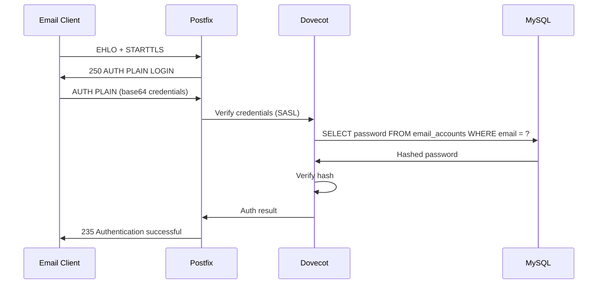

# Authentication

Mailyte has three authentication mechanisms for different access patterns.

## API Key Authentication

All API requests require an `X-API-Key` header.

### How API Keys Work

1. An admin generates a key using the admin password
2. The API hashes the key with SHA-256 and stores the hash in the `api_keys` table
3. On each request, the API hashes the provided key and looks up the hash
4. If found and active, the request proceeds

```bash
# Generate a key
curl -X POST http://mail.yourdomain.com:8083/api/v1/admin/api-keys \
  -H "X-Admin-Password: YOUR_ADMIN_PASSWORD" \
  -H "Content-Type: application/json" \
  -d '{
    "description": "Production API Key",
    "read_only": false
  }'
```

The response includes the raw API key. **Store it securely — it's only shown once.**

### Key Properties

| Property | Description |
|----------|-------------|
| `key_id` | Public identifier (safe to log) |
| `key_hash` | SHA-256 hash of the key (stored in DB) |
| `permissions` | JSON array of allowed operations |
| `organization_id` | Scoped to org (null = global access) |
| `rate_limit` | Per-key rate limit |
| `ip_whitelist` | JSON array of allowed IPs |
| `expires_at` | Optional expiry timestamp |

### Key Security

- Keys are hashed before storage — the raw key is never stored
- Keys can be scoped to a specific organization
- Keys can be restricted to specific IPs via `ip_whitelist`
- Keys can have expiry dates
- Keys can be revoked instantly

```bash
# Revoke a key
curl -X DELETE http://mail.yourdomain.com:8083/api/v1/admin/api-keys/KEY_ID \
  -H "X-Admin-Password: YOUR_ADMIN_PASSWORD"
```

### Best Practices

- **Rotate keys regularly** — at least every 90 days
- **Use scoped keys** — don't give global access unless necessary
- **Set IP whitelists** — restrict keys to known server IPs
- **Set expiry dates** — for temporary access
- **Use separate keys** per application or environment
- **Never commit keys** to version control

## Admin Password Authentication

Admin operations (creating API keys, system-wide settings) require the `X-Admin-Password` header.

```bash
curl -H "X-Admin-Password: YOUR_ADMIN_PASSWORD" \
  http://mail.yourdomain.com:8083/api/v1/admin/api-keys
```

The admin password is set via the `ADMIN_PASSWORD` environment variable. It's compared directly (not hashed against a stored value) since it lives only in the environment.

!!! warning "Use a strong admin password"
    The admin password grants full access to the system. Use at least 32 random characters. Do not reuse it anywhere else.

## SMTP SASL Authentication

When users send email through Mailyte (port 587/465), they authenticate via SASL. Dovecot handles the authentication against the MySQL database.

### How It Works



### Password Storage

Passwords are stored as bcrypt hashes in the `email_accounts` table:

```sql
-- Passwords look like this in the database
-- $2b$12$LJ3m.../... (bcrypt hash)
SELECT email, password FROM email_accounts WHERE email = 'user@example.com';
```

Dovecot's `passdb` driver is configured to use the `BLF-CRYPT` scheme (bcrypt).

### SASL Mechanisms

Mailyte supports these SASL mechanisms:

| Mechanism | Security | Notes |
|-----------|----------|-------|
| PLAIN | Secure over TLS | Most common, works everywhere |
| LOGIN | Secure over TLS | Legacy, for older clients |

Both require TLS — Postfix rejects PLAIN/LOGIN authentication over unencrypted connections.

## Token-Based Auth (Internal)

Workers and internal services use JWT tokens for service-to-service communication.

### Token Structure

```json
{
  "sub": "service:tracking",
  "iat": 1711360200,
  "exp": 1711363800,
  "iss": "mailyte"
}
```

Tokens are signed with `ADMIN_TOKEN_SECRET` (HMAC-SHA256). They expire after 1 hour and are refreshed automatically.

### Where Tokens Are Used

- Worker-to-API communication
- Webhook signing verification
- Internal health check coordination

## Authentication Failures

### API

- Missing key: `401 Unauthorized`
- Invalid key: `401 Unauthorized`
- Expired key: `401 Unauthorized`
- IP not whitelisted: `403 Forbidden`
- Rate limited: `429 Too Many Requests`

### SMTP

- Wrong password: `535 5.7.8 Authentication credentials invalid`
- Account suspended: `535 5.7.8 Account suspended`
- TLS required: `530 5.7.0 Must issue a STARTTLS command first`

Failed SMTP auth attempts are logged and tracked by Fail2ban. After 5 failures from the same IP within 10 minutes, the IP is banned for 1 hour. See [Intrusion Detection](intrusion-detection.md).
