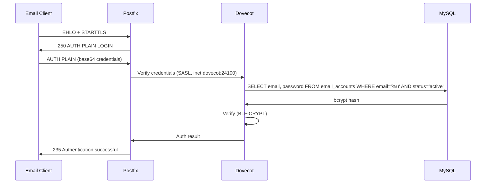

# Authentication

Mailyte has several authentication mechanisms for different access patterns: HTTP API credentials, browser sessions, mailbox SASL passwords, and SMTP API-key credentials.

## API Key Authentication

API requests carry an `X-API-Key` header, validated by `worker/api/utils/auth.py`.

### How API Keys Work

1. A key is generated server-side (`secrets.token_urlsafe(32)`) — for example during bootstrap, which returns it exactly once
2. Only its SHA-256 digest is stored; each request is looked up by the digest of the presented key: `SELECT ... FROM api_keys WHERE key_hash = %s AND active = 1`. `key_id` holds a non-secret display identifier (first 8 characters + row ULID)
3. If found, active, and not past `expires_at` (expired keys get `401 API key expired`, without a brute-force strike), permissions and organization scope are attached to the request

!!! note "Hash-based verification since 2026-08-30"
    Before 2026-08-30, `key_id` held the raw key and verification matched on it directly, so a database read yielded usable credentials. Verification now uses `key_hash` only, and migration `0019_api_key_hash_only` redacts the raw values from `key_id`. Until 0019 has run, the auth path keeps a legacy fallback that matches un-migrated rows by `key_id` and backfills their hash; after 0019, raw keys exist nowhere. Keys issued before the change keep working unchanged. If your database may have been exposed **before** 0019 ran, rotate keys — the old rows were readable as credentials.

### Brute-force protection on the API-key check

Invalid-key attempts are rate-limited per source IP: **20 invalid keys per 5 minutes**, with exponential backoff from the 5th failure, returning `429` once blocked. The limiter is checked *before* the key lookup, so a locked-out client gets no free guesses.

### Key Properties

| Property | Description |
|----------|-------------|
| `key_id` | Non-secret display identifier (key prefix + row ULID) |
| `key_hash` | SHA-256 of the key — the verification value |
| `permissions` | JSON: `{"read": true, "write": true}`, optionally `read_only`, `admin_access` |
| `organization_id` | Scoped to an org; platform-scope credentials have none |
| `active` | Revocation flag — set 0 to kill the key immediately |

### Scope and roles (ADR-002)

Every route declares a scope, and the two scopes never mix:

- **`organization`** — tenant credentials. Queries are forcibly filtered to the credential's own `organization_id`.
- **`platform`** — staff. A tenant credential can never reach a platform route regardless of its permission flags. Platform identities (`platform_operators`) carry a role — `support` < `operator` < `admin` < `owner` — and routes gate on the minimum role (e.g. monitoring reads need `support`; service restarts need `operator`).

### Best Practices

- **Rotate keys regularly** — at least every 90 days
- **Use org-scoped keys** — don't hand out platform scope
- **Use separate keys** per application or environment
- **Never commit keys** to version control
- **Deactivate unused keys** — `active = 0` takes effect on the next request

## Session Authentication

Browser surfaces (dashboard, console, webmail) use session cookies rather than long-lived keys in the client:

| Session | Table | Notes |
|---------|-------|-------|
| Tenant dashboard | `web_sessions` | Token stored as SHA-256 hash; same downstream context as an API key |
| Platform operators | `operator_sessions` + `platform_operators` | Individually revocable staff identities with roles — this replaced the old shared `X-Admin-Password` admin surface on the API |
| Webmail / mailbox | `mailbox_sessions` | Login verified **against Dovecot over IMAP** (not a stored copy of the password), and the session holds the SMTP credential for sending — fixed 2026-08-21 after a stale-password-copy incident. Lifetimes are platform-aware: browsers get 8 h idle / 7 d absolute, native clients that send `X-Client-Platform: ios\|android\|macos\|windows\|linux` get 30 d / 180 d (env-overridable), and each session's idle window is stored on its own row. A mailbox carrying a temporary password gets a session that can only change the password or sign out (`403 password_change_required`). Details: [Mailbox Authentication](../api/mailbox-auth.md) |

Passwords for users and mailboxes are bcrypt-hashed (`hash_password` / `verify_password`); legacy SHA-256 hashes are rejected and force a reset. Login checks against a dummy bcrypt hash when the account doesn't exist, so response timing doesn't reveal account existence.

Mailbox holders change their own password with `POST /api/v1/mailbox/security/password`: the current password is re-verified against Dovecot (never against the stored hash), the new one must pass the shared 12-character policy, every *other* session of the mailbox is revoked, and Dovecot's auth cache is flushed so IMAP/SMTP honour the change at once. Administrators reset with `POST /api/v1/mailboxes/email-accounts/{id}/reset-password`, optionally as a **temporary** password that forces the holder to choose their own at next sign-in; an admin reset revokes all of the mailbox's sessions.

## SMTP SASL Authentication (mailbox passwords)

When users send email through Mailyte (port 587/465), they authenticate via SASL. Postfix hands the check to Dovecot (`smtpd_sasl_type = dovecot`), which queries MySQL.

### How It Works



### Password Storage

Mailbox passwords are bcrypt hashes (`$2b$...`); Dovecot's passdb uses `default_pass_scheme = BLF-CRYPT`. Only `status = 'active'` accounts can authenticate.

### TLS is mandatory for auth

- Postfix: `smtpd_tls_auth_only = yes` — AUTH is not even offered before TLS
- Dovecot: `disable_plaintext_auth = yes`, `ssl = required`

Supported SASL mechanisms: `PLAIN` and `LOGIN` (both only ever inside TLS).

### The Dovecot auth cache delays revocation

Dovecot caches successful authentications for **up to 1 hour** (`auth_cache_ttl = 1 hour`; negative results 1 minute). A deleted, suspended, or password-changed mailbox **keeps authenticating from cache** until the TTL expires or the cache is flushed:

```bash
docker compose exec dovecot doveadm auth cache flush user@domain.com
```

A doveadm HTTP API (port 24180, internal network only, keyed by `DOVEADM_API_KEY`) exists for programmatic flushes. SMTP-credential mutations use it automatically, and since 2026-08-30 so do the API's mailbox mutations: password change, status change (suspend/deactivate), and delete — both the `/email-accounts` CRUD routes and the legacy `/mailboxes/edit` / `/mailboxes/delete` paths — flush the cache for the affected address, so revocation bites on the next login attempt. The flush is best-effort: if doveadm is unreachable the mutation still succeeds and the change degrades to the cache-TTL window (logged by the API).

The legacy domain cascade delete (`POST /api/v1/domains/delete`) also flushes each removed mailbox since 2026-08-30. The 1-hour window **still applies** to changes made any other way: direct SQL edits, migration/restore scripts, or anything else that alters credentials outside the API — flush manually in those cases.

## SMTP API-Key Credentials

Live since 2026-08-27 (`/api/v1/smtp-credentials`). Domain-scoped send credentials, distinct from mailbox passwords:

- **Generated server-side**, returned exactly once; stored only as a **bcrypt hash** plus a short display prefix
- Username shape: `{domain-slug}-smtp-{random}`
- **Protocol-scoped**: a dedicated Dovecot passdb applies only to `protocol smtp` — these credentials cannot log in to IMAP/POP3
- May send as **any address at their domain** (they're wired into `smtpd_sender_login_maps`)
- `active`, `expires_at`, and `allowed_ips` are enforced inside the Dovecot passdb query itself
- Every auth-affecting mutation (revoke, rotate, update, delete) **flushes Dovecot's auth cache** for that username via the doveadm API — verified live that without the flush a revoked key keeps working for up to an hour
- Per-key usage and event history: `/api/v1/smtp-credentials/{id}/events` and `/{id}/usage`
- `AUTO_SUSPEND_ENABLED` (automatic suspension of abusive keys by `log_ingestor`) exists but is **off by default**

## Authentication Failures

### API

- Missing key: `401 Unauthorized`
- Invalid key: `401 Unauthorized` (and counts toward the per-IP attempt limit)
- Too many invalid attempts: `429 Too Many Requests`
- Insufficient permission/scope/role: `403 Forbidden`

### SMTP / IMAP

- Wrong password: `535 5.7.8` (SMTP) / `NO [AUTHENTICATIONFAILED]` (IMAP)
- TLS required: AUTH is simply not offered on plaintext connections

Failed SMTP/IMAP auth attempts are recorded in the `failed_auth_attempts` table and fed to the **Dovecot auth-policy server**, which applies progressive delays (2s → 32s) and blocks repeat-offender IPs — see [Intrusion Detection](intrusion-detection.md). Fail2ban is *not* part of the deployed stack.
