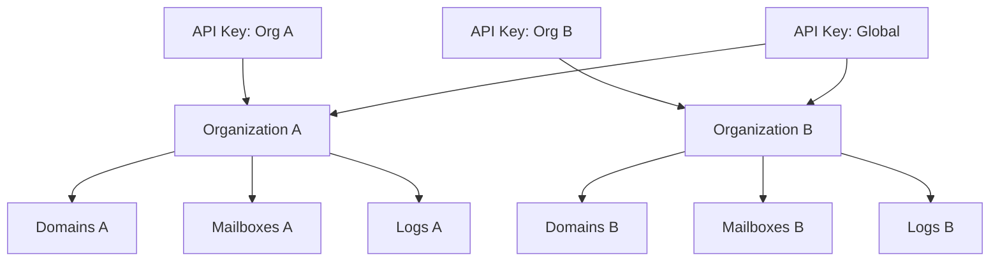

# Authorization

Authentication tells us *who* you are. Authorization tells us *what you can do*. Mailyte uses a multi-tenant model where every piece of data belongs to an organization, and access is strictly scoped.

## Multi-Tenant Isolation



### How Isolation Works

Every database table that holds tenant data includes an `organization_id` column. Every query is filtered by this column.

When an API key is scoped to an organization:

- `GET /api/v1/get/domain/all` only returns domains for that org
- `POST /api/v1/add/mailbox` can only create mailboxes under that org's domains
- `GET /api/v1/get/tracking/stats/...` only shows that org's tracking data
- Queue, logs, analytics — all scoped to the org

There's no API endpoint that returns data across organizations unless you're using a global (unscoped) key.

### Database-Level Enforcement

Every tenant-scoped query includes the org filter:

```sql
-- API key scoped to "acme-corp"
SELECT * FROM domains WHERE organization_id = 'acme-corp' AND active = 1;

-- Even if you pass a domain_id from another org, it returns nothing
SELECT * FROM email_accounts WHERE domain_id = 42 AND organization_id = 'acme-corp';
-- Returns 0 rows if domain 42 belongs to a different org
```

This is enforced at the application layer. The API never constructs a query without the org filter when the key is scoped.

## Access Levels

### Global Admin

- Uses `X-Admin-Password` header
- Full access to everything
- Can create API keys, manage all organizations
- Not scoped to any organization
- Should only be used for system administration

### Global API Key

- API key with `organization_id = NULL`
- Can access all organizations
- Used for management dashboards, billing integrations
- Should be very carefully protected

### Organization-Scoped API Key

- API key with `organization_id = "some-org"`
- Can only access that organization's data
- Can create/read/update/delete domains, mailboxes, aliases within the org
- Cannot see other organizations or their data
- This is what you give to customers

### Read-Only API Key

- API key with `read_only = true`
- Can only call GET endpoints
- Cannot create, update, or delete anything
- Useful for monitoring dashboards and reporting

## Permission Model

The `permissions` JSON field on API keys controls granular access:

```json
{
  "permissions": [
    "domain:read",
    "domain:write",
    "mailbox:read",
    "mailbox:write",
    "alias:read",
    "alias:write",
    "stats:read",
    "tracking:read",
    "webhook:read",
    "webhook:write"
  ]
}
```

### Permission Types

| Permission | Grants |
|-----------|--------|
| `domain:read` | List and view domains |
| `domain:write` | Create, update, delete domains |
| `mailbox:read` | List and view mailboxes |
| `mailbox:write` | Create, update, delete mailboxes |
| `alias:read` | List and view aliases |
| `alias:write` | Create, update, delete aliases |
| `dkim:read` | View DKIM keys |
| `dkim:write` | Generate DKIM keys |
| `stats:read` | View statistics and analytics |
| `tracking:read` | View tracking events |
| `webhook:read` | View webhook configuration |
| `webhook:write` | Create, update, delete webhooks |
| `queue:read` | View mail queue |
| `queue:write` | Flush or delete queue messages |
| `send:email` | Send emails via the API |

When `permissions` is `NULL`, the key has all permissions (backward compatible).

## SMTP Authorization

SMTP authorization works differently. When a user authenticates via SASL:

- They can only send email from addresses they own or aliases pointing to their mailbox
- They can only access their own mailbox via IMAP/POP3
- Dovecot enforces this through its `userdb` configuration

### Sender Restrictions

Postfix checks that the authenticated user matches the sender address:

```
# In Postfix config
smtpd_sender_restrictions =
    reject_sender_login_mismatch
```

This prevents `user@example.com` from sending as `admin@example.com`.

## Webhook Data Isolation

Each organization can have its own webhook endpoints. Events are only sent to:

1. The organization's registered webhook URLs
2. Global webhook URLs (if any)

An event from Organization A is never sent to Organization B's webhook endpoint.

## Best Practices

1. **Use org-scoped keys** for customer-facing integrations
2. **Use read-only keys** for dashboards and reporting
3. **Set permissions explicitly** instead of relying on defaults
4. **Audit API key usage** — check the `usage_count` and `last_used` fields
5. **Delete unused keys** — stale keys are a security risk
6. **Never share global keys** with external parties
