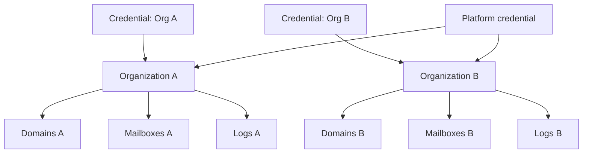

# Authorization

Authentication tells us *who* you are. Authorization tells us *what you can do*. Mailyte uses a multi-tenant model where every piece of tenant data belongs to an organization, and access is strictly scoped.

## Multi-Tenant Isolation



### How Isolation Works

Every tenant-data table carries an `organization_id` column, and the API forces that filter server-side. When a credential is organization-scoped:

- Domain, mailbox, alias, analytics, queue, and log listings return only that org's rows
- The requested `organization_id` in a query parameter is ignored — the credential's own org always wins
- Cross-org lookups of a specific resource return **404, never 403** — the API does not leak the existence of other tenants' resources

### Two scopes, never mixed (ADR-002)

| Scope | Who | What it can reach |
|-------|-----|-------------------|
| `organization` | Tenant credentials and dashboard sessions | Tenant routes only, filtered to their own org |
| `platform` | Staff (platform operators, platform API keys) | Platform routes — monitoring, queue control, security administration, cross-org reads |

The load-bearing property: **a tenant credential can never reach a platform-scope route, regardless of its own permission flags**. Routes like service restart, auto-heal, security administration, and infrastructure monitoring are declared `scope="platform"` in the route decorator and reject organization credentials outright.

### Roles on platform scope

Platform operators carry an ordered role: `support` < `operator` < `admin` < `owner`. Routes gate on the minimum tier:

| Role | Examples of what it unlocks |
|------|---------------------------|
| `support` | Read health, service status, metrics, security listings |
| `operator` | Restart services, trigger auto-heal, test webhooks, flush queues |
| `admin` / `owner` | Operator management, destructive platform operations |

A missing or unrecognised role fails **closed** — it satisfies no role gate.

## Permission Model

The `permissions` JSON field on API keys is coarse, not per-resource:

```json
{"read": true, "write": true}
```

| Flag | Effect |
|------|--------|
| `read_only: true` | Write-level routes return `403` |
| `admin_access: true` | Required for routes declared with `permission_level="admin"` |

There is no per-resource permission list (`domain:read`-style grants do not exist). Scoping is done by organization and by the platform/organization scope split, not by fine-grained permission strings.

## SMTP Authorization

SMTP authorization works differently. When a user authenticates via SASL:

- They can only access their own mailbox via IMAP/POP3 (Dovecot `userdb`)
- On the submission ports, they can only send as addresses they own (`smtpd_sender_login_maps`, backed by MySQL)
- SMTP API-key credentials may send as any address **at their own domain** — that's their defined scope

### Sender Restrictions — enforced on 587/465 only, deliberately

`reject_sender_login_mismatch` is applied as a per-service override in `master.cf`, **first** in the restriction list so `permit_sasl_authenticated` cannot short-circuit it:

```
# master.cf
submission (587) -o smtpd_sender_restrictions=reject_sender_login_mismatch,permit_sasl_authenticated,reject
smtps      (465) -o smtpd_sender_restrictions=reject_sender_login_mismatch,permit_sasl_authenticated,reject
```

This prevents an authenticated `user@example.com` from sending as `admin@example.com`.

!!! danger "Never move this into the global `smtpd_sender_restrictions`"
    Port 25 inherits the global value and carries *unauthenticated* mail from the internet by definition. With the mismatch check global, any inbound message whose envelope sender owns a mailbox on this server is rejected with `553 5.7.1 ... not logged in` — which **broke all inter-domain inbound mail in production on 2026-08-22**. The global `smtpd_sender_restrictions` in `main.cf` deliberately contains only `permit_mynetworks, permit_sasl_authenticated, reject_non_fqdn_sender, reject_unknown_sender_domain`, and the `main.cf` comment block documents the incident. Read it before touching sender restrictions.

### Per-organization IP allowlists at SMTP

Organizations can restrict which client IPs may relay for their domains. This is enforced live in the Postfix submission path by a policy service (`check_policy_service unix:private/policy-ip-access` → `ip_access_policy.py`), reading the `ip_access_rules` table that `/api/v1/security/ip-rules` manages. No rules for an org = all IPs allowed; any whitelist rules = only those IPs.

## Webhook Data Isolation

Organization event webhooks are delivered only to that organization's registered endpoints (plus global endpoints). An event from Organization A is never sent to Organization B's webhook.

## Revocation Caveats

- **API keys:** `active = 0` takes effect on the next request — there is no cache in front of the lookup.
- **Mailbox and SMTP-credential auth:** Dovecot's auth cache keeps a revoked/changed credential working for up to **1 hour** unless flushed. SMTP-credential mutations flush automatically; mailbox mutations do not — see [Authentication](authentication.md#the-dovecot-auth-cache-delays-revocation).

## Best Practices

1. **Use org-scoped credentials** for customer-facing integrations — never hand out platform scope
2. **Use `read_only` keys** for dashboards and reporting
3. **Audit access** — auth events and key lifecycle land in `audit_logs` (`/api/v1/compliance/audit-log`)
4. **Deactivate unused keys** — stale keys are a security risk
5. **Flush the Dovecot auth cache** whenever a mailbox suspension or password change must bite immediately
