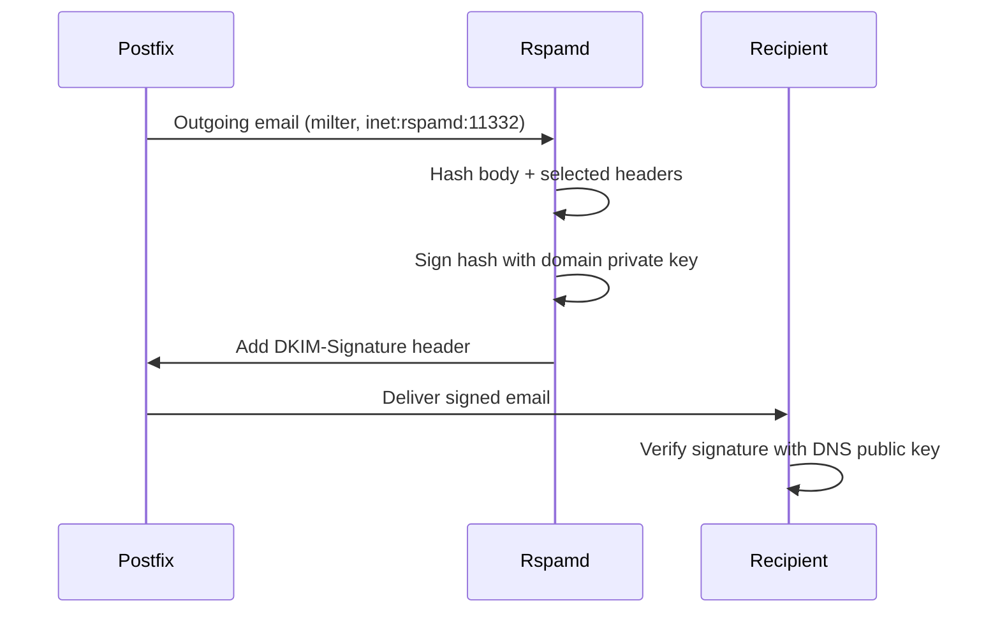

# Encryption

Mailyte encrypts data in transit and at rest. This page covers every encryption layer that is actually deployed.

## Transport Encryption (TLS)

### SMTP (Postfix)

| Port | Mode | Requirement |
|------|------|-------------|
| 25 | STARTTLS | Opportunistic (`smtpd_tls_security_level = may`) |
| 587 | STARTTLS | AUTH only offered after TLS |
| 465 | Implicit TLS | Always encrypted |

The deployed directives (`mailer/postfix/config/main.cf`):

```
smtpd_tls_security_level = may
smtpd_tls_auth_only = yes
smtpd_tls_protocols = !SSLv2,!SSLv3,!TLSv1,!TLSv1.1
smtp_tls_protocols  = !SSLv2,!SSLv3,!TLSv1,!TLSv1.1
smtpd_tls_ciphers = high
smtpd_tls_exclude_ciphers = aNULL, MD5, DES, RC4, 3DES, ADH, EXPORT, LOW
```

**`security_level = may`** on port 25 is correct for an internet-facing MX — mandatory TLS there would bounce mail from legacy servers. What matters is `smtpd_tls_auth_only = yes`: credentials can never cross the wire in plaintext, because AUTH is not offered before TLS.

### IMAP/POP3 (Dovecot)

| Port | Protocol | Mode |
|------|----------|------|
| 143 | IMAP | STARTTLS (required before login) |
| 993 | IMAPS | Implicit TLS |
| 110 | POP3 | STARTTLS (required before login) |
| 995 | POP3S | Implicit TLS |

```
ssl = required
ssl_min_protocol = TLSv1.2
disable_plaintext_auth = yes
```

`ssl = required` means no plaintext logins, ever — including on 143/110, where STARTTLS must complete first.

### HTTP APIs

Web traffic terminates TLS at **Traefik** (ports 80/443); backend workers are reached over the internal Docker network and, in production, publish only loopback host ports. Do not put another proxy in front — Traefik also handles ACME and per-host routing.

## Certificate Management

The `cert_manager` service (`mailer/cert_manager`) obtains and renews Let's Encrypt certificates.

- **Challenge:** HTTP-01 via a webroot shared with the `acme_webroot` service, which Traefik routes `/.well-known/acme-challenge/` to
- **Renewal:** automatic, 30 days before expiry (`CERT_RENEWAL_DAYS`)
- **Storage:** `storage/ssl_certs/` and `storage/ssl_private/` on the host (bind-mounted — these directories survive deployments; `config/` does not)
- **SNI:** cert_manager writes SNI maps so Postfix/Dovecot/Traefik serve per-domain certificates on one IP
- Certbot runs are serialized with a lock — parallel invocations used to collide on Let's Encrypt's lock file

### TLS Versions

| Version | Status |
|---------|--------|
| SSLv2 / SSLv3 | Disabled |
| TLS 1.0 / 1.1 | Disabled |
| TLS 1.2 | Enabled (minimum) |
| TLS 1.3 | Enabled (preferred where supported) |

## DKIM Signing

DKIM adds a cryptographic signature to outgoing emails. Rspamd signs using per-domain keys.

### Key Management

- Keys are generated per domain via the API (`/api/v1/domains` DKIM operations) or `scripts/generate_dkim.py`
- **Private keys are envelope-encrypted at rest** (see below) in the `dkim_keys` table; key files under `storage/dkim_keys/` feed Rspamd
- Public keys are published as DNS TXT records
- Rspamd's `dkim_signing` module signs outgoing mail automatically

### Signature Process



## At-Rest Encryption

Three distinct mechanisms are live.

### 1. Mailbox content: Dovecot mail_crypt

All stored mail is encrypted on disk by Dovecot's `mail_crypt` plugin with a **global EC key pair** (`config/mailer/dovecot/local.conf`):

```
mail_plugins = $mail_plugins mail_crypt zlib
plugin {
  mail_crypt_global_private_key = </etc/dovecot/mail_crypt/ecprivkey.pem
  mail_crypt_global_public_key  = </etc/dovecot/mail_crypt/ecpubkey.pem
  mail_crypt_save_version = 2      # new mail is encrypted too, not just migrated mail
}
```

This matches how the mail was encrypted on the previous (mailcow) system, so migrated messages stay readable. The `zlib` plugin is loaded alongside because migrated messages are also LZ4-compressed — with only `mail_crypt` loaded, message counts look right but content is unreadable.

!!! danger "The mail_crypt private key is the mailbox data"
    Without `secrets/mail_crypt/ecprivkey.pem`, every message on disk is ciphertext. The key is escrowed offsite (encrypted with age) — see the [disaster recovery runbook](../operations/disaster-recovery.md). A backup of the Maildir without this key restores nothing readable.

### 2. Private-key columns: envelope encryption

DKIM (`dkim_keys.private_key`), PGP (`pgp_keys`), and S/MIME (`smime_certs`) private-key columns are encrypted with **AES-256-GCM** (`shared/envelope_encryption.py`):

- One Key Encryption Key (KEK), held in a **mounted file** (`/run/secrets/encryption_kek`, generated by `scripts/generate_dkim_kek.sh`) — never an environment variable, never a database row
- GCM's authentication tag means a ciphertext tampered with in the database fails to decrypt instead of feeding garbage to a signer
- A `key_version` column supports KEK rotation without an atomic re-encrypt of every row
- **Fail-closed:** if the KEK file is missing, encryption/decryption raises — callers cannot fall back to storing plaintext

The practical consequence: a database dump alone (SQL injection, stolen backup, compromised replica) does not yield usable signing keys. The dump **plus** the KEK file does — which is why backups of `secrets/encryption_kek` must be stored separately from database dumps (see `SECURITY.md`).

### 3. Backups and archives

Every backup artifact and archived message uploaded to S3 is encrypted with **age** before leaving the host; the decryption identity exists only in offline escrow. See the [disaster recovery runbook](../operations/disaster-recovery.md).

### What is *not* encrypted at rest

- **MySQL tablespaces** — InnoDB tablespace encryption is not enabled. The sensitive columns are covered by envelope encryption instead; enable keyring-based tablespace encryption yourself if your threat model requires it.
- **Redis** — cache and counters only; no at-rest encryption.
- Full-disk encryption (LUKS) of the host is a deployment choice outside the compose stack.

## User-Facing Encryption (PGP / S/MIME)

The `encryption` worker (`worker/encryption`) provides PGP key generation/import/encrypt/decrypt/sign/verify, WKD lookups (`/.well-known/openpgpkey/`), and S/MIME certificate import. Imported S/MIME private keys are envelope-encrypted before storage; public material is stored as-is.

## Verifying Encryption

### Check TLS on SMTP

```bash
openssl s_client -connect mail.yourdomain.com:587 -starttls smtp < /dev/null 2>/dev/null | grep -E "Protocol|Cipher|Verify"
```

### Check TLS on IMAP

```bash
openssl s_client -connect mail.yourdomain.com:993 < /dev/null 2>/dev/null | grep -E "Protocol|Cipher|Verify"
```

### Check DKIM

Send an email to Gmail and view the message headers. Look for:

```
Authentication-Results: mx.google.com;
    dkim=pass header.i=@example.com
```

### Check mail_crypt is active

```bash
# Content must be readable THROUGH Dovecot...
docker compose exec dovecot doveadm fetch -u user@domain.com text mailbox INBOX | head -5

# ...while the raw file on disk is ciphertext
head -c 200 storage/mail_data/domain.com/user/Maildir/cur/* | xxd | head -5
```

### Check Certificate Details

```bash
echo | openssl s_client -connect mail.yourdomain.com:993 2>/dev/null | openssl x509 -noout -dates -subject -issuer
```
